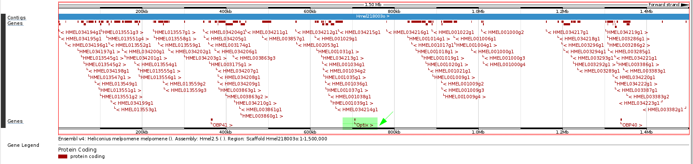
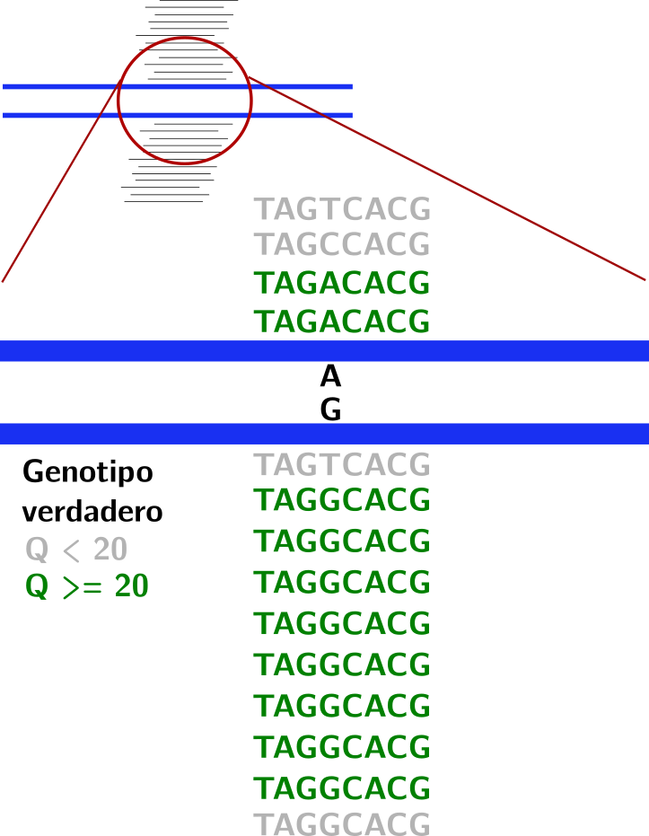
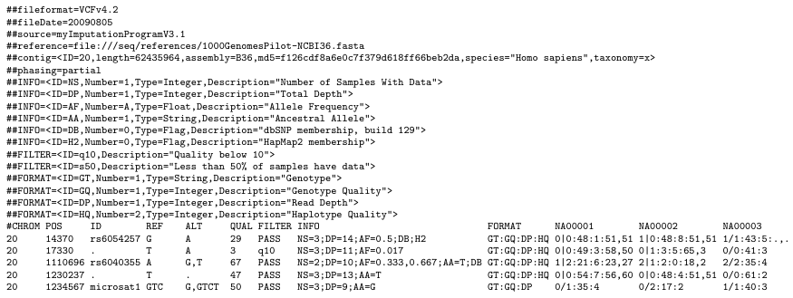
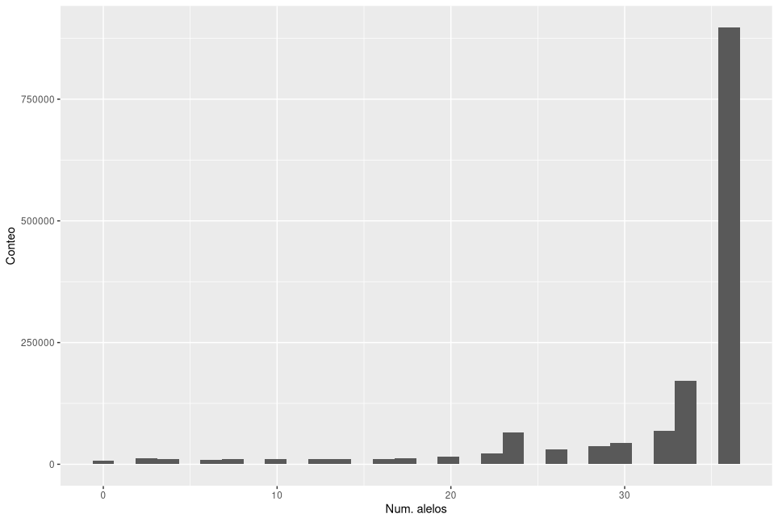
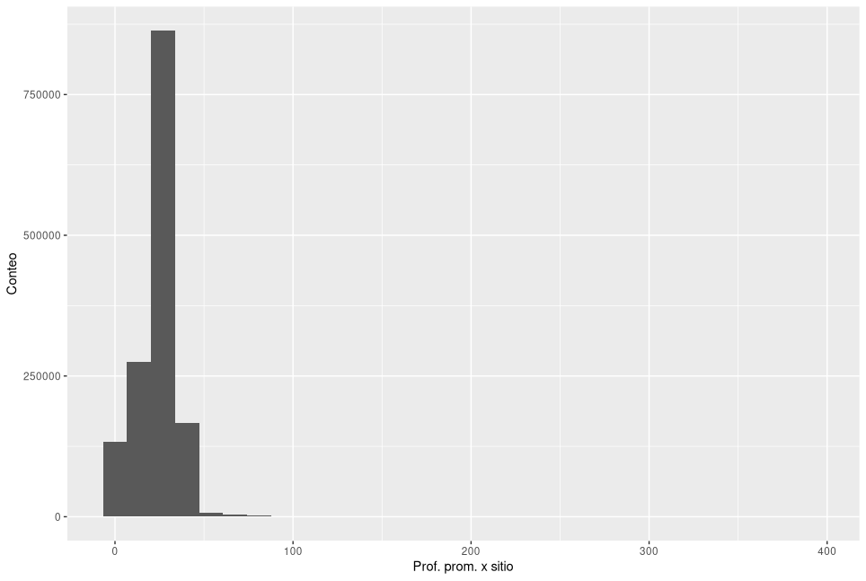
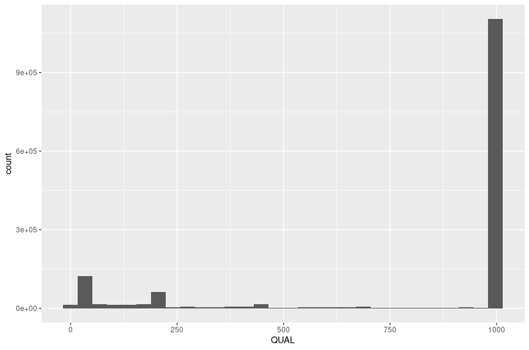
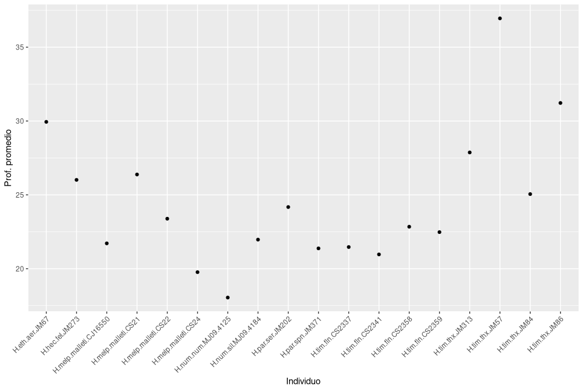
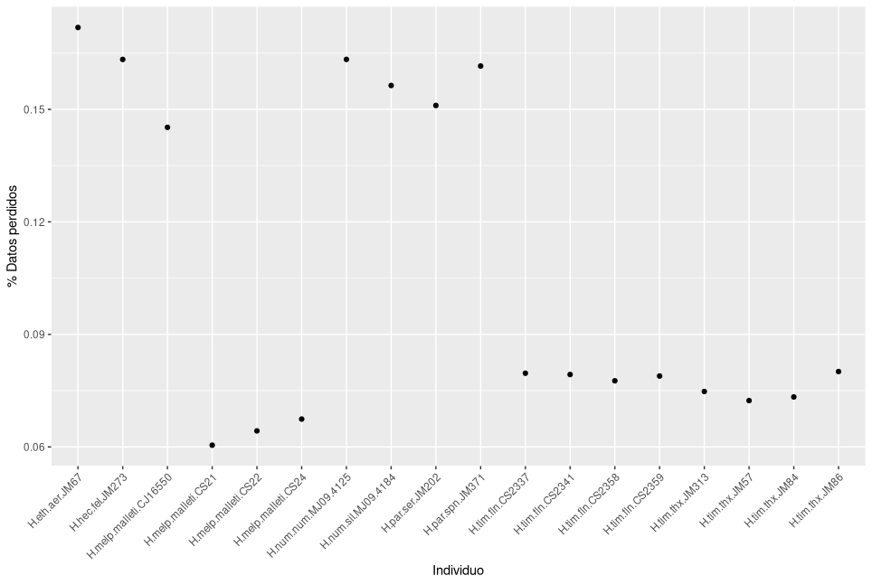

<!-- markdown-toc start - Don't edit this section. Run M-x markdown-toc-refresh-toc -->
# Índice

- [Sub-muestreando los alineamientos](#sub-muestreando-los-alineamientos)
    - [Extrayendo una región específica de los alineamientos](#extrayendo-una-región-específica-de-los-alineamientos)
- [Llamando genotipos](#llamando-genotipos)
    - [Genotipos y SNPs](#genotipos-y-snps)
    - [Llamada de genotipos](#llamada-de-genotipos)
- [Operaciones con archivos VCF/BCF](#operaciones-con-archivos-vcfbcf)
    - [El formato VCF](#el-formato-vcf)
    - [Extrayendo información de un archivo VCF](#extrayendo-información-de-un-archivo-vcf)
    - [Tipos de variantes](#tipos-de-variantes)
    - [Filtrando sitios](#filtrando-sitios)
        - [Calculando estadísticas en nuestros genotipos](#calculando-estadísticas-en-nuestros-genotipos)
        - [Analizando y visualizando las estadísticas de los genotipos en `R`](#analizando-y-visualizando-las-estadísticas-de-los-genotipos-en-r)
        - [Aplicando los filtros al archivo VCF](#aplicando-los-filtros-al-archivo-vcf)

<!-- markdown-toc end -->


# Sub-muestreando los alineamientos

<span id="submuestreo"></span>

Para este paso vamos a utilizar los alineamientos de las 18 muestras de
*Heliconius* cuyos duplicados de PCR ya fueron removidos. Los
alineamientos y sus archivos de índice se encuentran en Centauro, en la
ruta `/home/workshopX/shared/alineamientos_heliconius/`, donde
`workshopX` es el usuario asignado para el curso, y tienen la extensión
`smallr.rmd.sort.bam`. Copia los alineamientos y sus índicies a un
directorio llamado `llamada_genotipos` en tu directorio de trabajo.
**Asegúrate de copiar los alineamientos y sus índices**.

## Extrayendo una región específica de los alineamientos

<span id="region_especifica"></span> Recursos computacionales: 2
procesadores, 2 GB de memoria, \~10 min de tiempo de ejecución.

En algunos casos estaremos interesados en extraer regiones específicas
del genoma en lugar de analizarlo completamente. En nuestro curso
particularmente queremos trabajar con algunos segmentos del genoma de
*Heliconius* por motivos prácticos; analizarlo todo nos tomaría mucho
tiempo aún con pocas muestras. Además, conocemos regiones en donde hay
genes interesantes. Para trabajar con una región específica del genoma
aprenderemos a extraer regiones de nuestro alineamiento. Esto debemos
hacerlo <u>muestra por muestra</u>. Usaremos `samtools` para esta tarea.
Trabajaremos con el scaffold `Hmel218003o` de *Heliconius melpomene* que
contiene al gen *optix*.



Este gen tiene un rol clave en la adaptación de *Heliconius* y otras
mariposas; puedes leer más sobre él en este [paper publicado en
*Science*
(2011)](https://www.science.org/doi/pdf/10.1126/science.1208227), en
esta [perspectiva
(2011)](https://www.science.org/doi/full/10.1126/science.1211025) o en
este [paper publicado en PNAS
(2017).](https://www.pnas.org/content/114/40/10707)

**Sigue los pasos:** :warning: Debes enviar el script que escribas para
sub-muestrear los alineamientos.

1.  Crea un script de `bash` usando `nano` y solicita los recursos
    necesarios. No olvides cargar el módulo de `samtools`.

2.  Dentro del script crea un ciclo `for` que itere sobre los
    alineamientos `.bam` que ya están ordenados y sin duplicados de PCR.
    Si no recuerdas cómo escribir un ciclo `for` en `bash` puedes
    consultarlo [aquí](../dia1/for_loops_bash.md).

3.  En cada iteración del ciclo debes llamar a `samtools view` con dos
    procesadores usando la opción `-@`. Debes usar la opción `-b` para
    que el archivo de salida tenga formato `bam` y debes especificar el
    nombre del archivo de salida usando la opción `-o`. Como argumentos
    para `samtools
            view` debes incluir primero el nombre del archivo `bam`
    original del que quieres extraer la región y luego debes especificar
    el nombre de la región que quieres extraer: La región que
    extraeremos corresponde al primer millón y medio de bases del
    scaffold `Hmel218003o` y la especificamos así:
    `Hmel218003o:1-1500000`. 
    
    Dale un nombre informativo a cada archivo de salida: Estamos extrayendo
    parte del scaffold `Hmel218003o`; te sugerimos usar `optixscaf` como parte
    del nombre de los archivos resultantes (el scaffold `Hmel218003o` contiene
    al gen *optix*, de ahí el nombre). **Atención:** para hacer esto, al
    interior del ciclo `for` debemos sustituir el sufijo del archivo de entrada
    (`smallr.rmd.sort.bam`) por un sufijo más informativo
    (`optixscaf.rmd.sort.bam`) y el resultado lo asignamos a una nueva variable.
    Esto lo hacemos sustituyendo los respectivos textos en la expansión de la
    variable del ciclo for. Por ejemplo, si tu variable del ciclo `for` se llama
    `aln`, la sustitución la haces mediante la siguiente expresión:
    
    ```shell
    # Sustituimios smallr.rmd.sort.bam por optixscaf.rmd.sort.bam
    # en el nombre asignado a aln y le asignamos el resultado a la variable
    # salida
    salida=${aln%smallr.rmd.sort.bam}optixscaf.rmd.sort.bam
    ```
    
    Después de hacer esto, en cada iteración del ciclo `for` la variable `aln`
    debe tener el nombre original y la variable `salida` debe tener el nuevo
    nombre del archivo de salida. Podemos usar estos dos nombres en nuestras
    llamadas a `samtools`.

    La forma general de usar `samtools view` es:

    ``` shell
    # Los argumentos dentro de los parentesis cuadrados [] son opcionales
    # Los argumentos dentro de los angulos <> son obligatorios
    samtools view [options] <in.bam>|<in.sam>|<in.cram> [region ...]
    ```

4.  Dentro del ciclo `for`, después de extraer la región de interés es
    necesario crear un índice para cada archivo de salida. Esto lo
    podemos hacer usando `samtools index`.

    La forma general de usar `samtools index es`:

    ``` shell
    # Los argumentos dentro de los parentesis cuadrados [] son opcionales
    # los argumentos dentro de los angulos <> son obligatorios
    samtools index [-@ threads] <in.bam>
    ```
    
    Este script puede ser difícil de escribir bien, te mostramos como hacerlo.
    
    ```shell
    #!/bin/bash
    #SBATCH -p dev
    #SBATCH -n 2
    #SBATCH --mem=2000
    #SBATCH --time=0-1:00

    module load samtools

    for aln in *smallr.rmd.sort.bam
    do
    
    # ponemos el nombre del archivo de salida en una nueva variable
    # sustituimos el sufijo anterior smallr.rmd.sort.bam
    # por uno nuevo optixscaf.rmd.sort.bam
    arch_salida=${aln%smallr.rmd.sort.bam}optixscaf.rmd.sort.bam

    # extraemos la region de interes Hmel218003o:1-1500000
    samtools view -@ 2 -b \
        -o $arch_salida \
        $aln Hmel218003o:1-1500000
        
    # construimos el indice del nuevo archivo
    samtools index -@ 2 $arch_salida
    done
    ```

5.  **Atención!** Antes de enviar el trabajo a la cola muéstrale tu
    script a un monitor/instructor para verificar que no haya errores de
    sintáxis. Muéstrale también la línea que usarás para enviar el
    trabajo a la cola.

6.  Envía el trabajo a la cola. Asegúrate de enviar el trabajo desde el
    directorio donde están tus archivos de entrada.

# Llamando genotipos

<span id="llamando_gt"></span>

## Genotipos y SNPs

El proceso de convertir las bases de las lecturas y los puntajes ed
calidad de cada base en un conjunto de genotipos para cada individuo se
divide en dos pasos: Llamada de SNPs y llamada de genotipos.

La llamada de SNPs consiste en determinar las posiciones del genoma hay
polimorfismos o sitios variantes. En este proceso se determina qué
posiciones tienen bases diferentes a las encontradas en el genoma de
referencia. Los alelos o bases encontradas en el genoma de referencia y
las que sean iguales a ellas en las muestras se llaman **alelos de
referencia (REF)** y las bases en las muestras que sean diferentes a las
encontradas en la referencia se llaman **alelos alternos (ALT)**.

La llamada de genotipos es el proceso de determinar el genotipo de cada
individuo en todos los sitios posibles a lo largo de su genoma. Usamos
la palabra 'llamada' para referirnos a la estimación de un único SNP o
genotipo.

Las llamadas de SNPs y genotipos se hacen esencialmente contando las
bases encontradas en las lecturas alineadas en un sitio determinado para
cada individuo usando reglas y umbrales relativamente simples.
Típicamente estos procesos aplican un primer filtro, el cual retiene
solamente las bases de alta calidad. Con este criterio normalmente
podemos tener confianza de que la evidencia encontrada para un alelo
determiando es buena. Por ejemplo, el umbral de calidad más común que se
usa es que el puntaje Phred de una base debe ser mínimo de 20 (recuerda
que esto implica que la probabilidad de error en la base es de 1 en
100). Luego, si en el conteo de bases de alta calidad encontramos una
proporción de alelos 80:20 podemos decir que el individuo es
heterocigoto para ese sitio (ver imagen abajo).

|                                                             |
|-------------------------------------------------------------------------------------------------|
| Representación de una llamada de genotipo usando umbrales Q ≥ 20 y proporción de conteos 80:20  |

Las aproximaciones más comunes hacen los procesos que acabamos de
describir pero existen métodos alternos que incorporan la incertidumbre
de los genotipos directamente en el análisis de los alineamiento (ver
por ejemplo [Korneliussen et al.,
2014](https://pubmed.ncbi.nlm.nih.gov/25420514/)).

## Llamada de genotipos

<span id="llamada_gt"></span> Recursos computacionales: 2 procesadores,
8 GB de memoria, \~20-25 min de tiempo total de ejecución.

Vamos a hacer un paso conocido como "llamada de genotipos" usando los
alineamientos del scaffold `Hmel218003o` que extrajimos en la tarea
anterior. El resultado final será un archivo en el que cada base o
posición en el genoma aparece en una fila y cada una de nuestras
muestras aparece en una columna.

La estructura es similar a esta tabla, pero es un poco más compleja.
Luego veremos en detalle la estructura de este archivo.

| CROMOSOMA   | POSICIÓN | REF. | ALT. | Muestra1 | Muestra2 | Muestra3 | Muestra4 | …   |
|-------------|----------|------|------|----------|----------|----------|----------|-----|
| Hmel218003o | 1        | A    | G    | 0/0      | 0/1      | 0/0      | 1/1      | …   |
| Hmel218003o | 2        | T    | G    | 0/0      | 0/0      | 0/0      | 0/1      | …   |
| Hmel218003o | 3        | G    | A    | 0/1      | 0/1      | 0/1      | 0/1      | …   |
| Hmel218003o | 4        | C    | A    | 0/0      | 0/1      | 0/1      | 1/1      | …   |
| Hmel218003o | 5        | C    | T    | 0/1      | 0/1      | 0/1      | 1/1      | …   |
| Hmel218003o | 6        | T    | C    | 0/0      | 0/0      | 0/1      | 0/1      | …   |
| …           | …        |      |      | …        | …        | …        | …        | …   |

Existen varias herramientas que pueden llamar genotipos, cada una tiene
ciertos estándares y modelos probabilísticos que usa para decidir si se
llama o no a un genotipo determinado. Las diferentes herramientas y
modelos tienen efectos fuertes sobre los datos que se producirán, por lo
que es importante considerar las diferentes opciones de antemano. [Este
review en Nature Genetics
(2011)](https://www.nature.com/articles/nrg2986) es un buen punto de
partida para conocer las distintas perspectivas y recomendaciones al
hacer este paso.

En este caso usaremos
[`bcftools`](https://samtools.github.io/bcftools/bcftools.html), que es parte de
`samtools`, por su simplicidad de uso y velocidad de ejecución. En general,
independientemente de la herramienta utilizada este es el paso más largo de todo
el proceso, por eso trabajaremos con una región pequeña. Para este paso usa este
archivo `fasta` de referencia:
`/home/workshopX/shared/referencia_hmel2.5/Hmel2.5_with_mtDNA.fa`.

**Sigue los pasos:** :warning: Debes enviar el script que escribas para llamar
genotipos.

1.  Llamar genotipos con `bcftools` y otras herramientas es un proceso
    que da mejores resultados cuando se consideran los individuos <u>en
    conjunto</u>. Lo primero que debemos hacer es poner en un archivo de
    texto plano la lista de alineamientos de la región `Hmel218003o`.
    Recuerda que cada alineamiento corresponde a un individuo; tu lista
    debe tener los nombres de los alineamientos de las 18 muestras.
    ¿Cómo creas este archivo con la lista de muestras?

2.  Crea un script de `bash` usando `nano` y solicita los recursos
    necesarios. No olvides cargar el módulo de `samtools`.

3.  Tu script debe recibir y procesar la siguiente información (3
    argumentos como mínimo):

    -   El archivo con la lista de alineamientos que creaste en el paso
        1

    -   La ubicación del archivo `fasta` de referencia (ruta absoluta).

    -   El nombre del archivo de salida que quieres darle a tu `vcf` con
        los genotipos. No olvides que vamos a escribir un `vcf`
        comprimido (`.vcf.gz`).

4.  Dentro de este script haremos tres pasos: <u>El primer paso</u>
    consiste en calcular las verosimilitudes de los genotipos a partir
    de los datos observados en el alineamiento. Para este paso usamos
    [`bcftools mpileup`](https://samtools.github.io/bcftools/bcftools.html#mpileup).
    Lee la descripción de las opciones de este programa en el enlace.
    Las opciones relevantes para nuestro análisis son: `-O`,
    `--threads`, `--max-depth`, `-q`, `-Q`, `-P`, `-a`, `-f` y `-b`. Usa
    una profundidad máxima de 1000, umbrales de calidad de base y de
    mapeo de 20 y especifica que nuestros datos se produjeron en una
    plataforma Illumina. Dedícale un poco más de atención a la opción
    `-a`, que se usa para especificar con qué información estará anotado
    nuestro archivo `vcf`. Queremos incluir la profundidad alélica
    (`AP`) y el número de bases de alta calidad que dan soporte a cada
    sitio (`DP`). Revisa el manual de `bcftools mpileup` (opción `-a`)
    para conocer cómo especificar estas dos anotaciones.

    La forma general de usar `bcftools mpileup` es:

    ``` shell
    # Llamaremos de esta forma bcftools mpileup
    # Resaltamos dos piezas de informacion importantes:
    # La referencia y la lista de alineamientos
    bcftools mpileup [opciones] -f ref.fa -b lista_de_bams.txt
    ```

    La salida de `bcftools mpileup` la re-dirigiremos hacia
    `bcftools call` usando el operador "pipe" de unix. Recuerdas cómo
    usar este operador?

5.  <u>El segundo paso</u> utiliza las verosimilitudes calculadas por la
    herramienta `mpileup` y las bases observadas en cada posición del
    alineamiento para determinar el genotipo de cada individuo en esa
    posición. El resultado conjunto de estos dos primeros pasos se
    escribe en un archivo `vcf` comprimido con
    [`bgzip`](https://www.htslib.org/doc/bgzip.html) (extensión
    `.vcf.gz`). Utilizamos
    [`bcftools call`](https://samtools.github.io/bcftools/bcftools.html#call)
    para este propósito. Lee la descripción de las opciones de este
    programa en el enlace. Las opciones relevantes para nuestro análisis
    son: `-m`, `--threads`, `-f`, `-O` y `-o`. Utiliza el "multiallelic
    caller", dos procesadores, calidad del genotipo (GQ) en el campo de
    formato para cada muestra y vcf comprimido como tipo de archivo de
    salida. Dale un nombre informativo a tu archivo de salida.

    La forma general de usar `bcftools call` es:

    ``` shell
    # No olvides conectar la salida estandar de mpileup
    # con este comando
    bcftools call [opciones] -o genotipos.vcf.gz
    ```

6.  Finalmente en <u>el tercer paso</u> generamos un índice del archivo
    `vcf.gz` para hacer operaciones de forma más rápida con él. Utiliza
    [`bcftools index`](https://samtools.github.io/bcftools/bcftools.html#index)
    con dos procesadores para construir este índice. Si se ejecuta
    correctamente debería crearse un archivo con un nombre idéntico al
    creado en el paso anterior pero con la extensión `.csi` añadida al
    final; este archivo es el índice.

    La forma general de usar `bcftools index` es:

    ``` shell
    # Sintaxis para construir un indice con bcftools
    # como archivo de entrada puedes tener formatos vcf o bcf
    bcftools index [opciones] genotipos.vcf.gz|genotipos.bcf
    ```

7.  **Atención!** Antes de enviar el trabajo a la cola muéstrale tu
    script a un monitor/instructor para verificar que no haya errores de
    sintáxis. Muéstrale también la línea que usarás para enviar el
    trabajo a la cola.
    
    <details>
    <summary> Este script puede ser difícil de escribir bien. Si no puedes avanzar mira el código aquí </summary>
    
    ```shell
    #!/bin/bash
    #SBATCH -p dev
    #SBATCH -n 2
    #SBATCH --mem=8000
    #SBATCH --time=0-1:00

    module load samtools

    bamlist=$1
    refpath=$2
    outdir=$3
    outfile=$4

    bcftools mpileup -Ou --threads 2 \
             --max-depth 10000 \
             -q 20 -Q 20 -P Illumina \
             -a FORMAT/DP,FORMAT/AD \
             -f $refpath -b $bamlist | \
        bcftools call -m --threads 2 \
                 -f GQ \
                 -O z \
                 -o $outdir/$outfile

    bcftools index $outdir/$outfile
    ```
    </details>

8.  Envía el trabajo a la cola. Asegúrate de enviar el trabajo desde el
    directorio donde están tus archivos de entrada.

# Operaciones con archivos VCF/BCF

<span id="operaciones_vcf"></span>

## El formato VCF

<span id="formato_vcf"></span>

VCF es un formato de texto plano, a menudo comprimido, que contiene
información genética de uno o más organismos en varias posiciones a lo
largo del genoma.

Normalmente la estructura del archivo VCF consta de tres partes: i) Las
líneas de meta-información (líneas que empiezan con `##`) ii) la línea
de encabezado (empieza con `#CHROM`) y iii) líneas de datos con las
posiciones específicas a lo largo del genoma y otra información de las
muestras. Puedes encontrar la especificación del formato VCF con
descripciones detalladas de todos sus campos
[aquí](https://samtools.github.io/hts-specs/VCFv4.2.pdf). A continuación
puedes ver un ejemplo de las primeras líneas de un archivo VCF.



-   [ ] Explora el archivo de genotipos (`.vcf.gz`) usando `zless -S`.
    ¿Puedes ubicar la línea de encabezado?

## Extrayendo información de un archivo VCF

<span id="extrayendo_info_vcf"></span> Es posible utilizar las
herramientas de unix que hemos aprendido a usar para explorar la
información de un archivo `vcf`. Podemos incluso explorar nuestro
archivo sin necesidad de descomprimirlo (recuerda que es un vcf
comprimido). Explora el archivo usando las herramientas que consideres
necesarias y trata de **no** descomprimirlo usando `gunzip`.

**Responde a las preguntas:** :warning: Debes enviar las respuestas a estas
preguntas. El reto es opcional.

1.  Cuántas líneas tiene mi archivo de genotipos en total?
2.  Cuántas líneas tiene el encabezado?
3.  Cuántas líneas tiene el cuerpo principal?
4.  Si la región que extrajimos del scaffold `Hmel218003o` tiene 1500000
    pares de bases, por qué el cuerpo principal tiene más posiciones?
5.  Todas las posiciones que extrajimos del scaffold `Hmel218003o` están
    representadas?
6.  Reto: Extrae los nombres de las muestras de la línea de encabezado
    del `vcf` y haz que se muestre cada uno en una línea diferente. Para
    hacer esto combina `zgrep`, `cut` y `tr`, re-dirigiendo la
    información entre estas herramientas en el orden apropiado y
    posteriormente guarda la salida en un archivo de texto plano.

## Tipos de variantes

<span id="tipos_variantes"></span> Cuando genotipificamos podemos
encontrar esencialmente tres tipos de sitios: Sitios sin variación con
respecto a la referencia, sitios con variación simple (SNPs) o sitios
que potencialmente pueden tener mutaciones estructurales como
inserciones o deleciones (INDELS). Exploremos nuestro archivo para tener
una mejor idea de cómo pueden verse estas variantes.

**Responde a las preguntas:**

1.  Qué tipo de variante observamos en la posición 281946 del scaffold
    `Hmel218003o`?
2.  Cuál es el alelo encontrado en la referencia?
3.  Cuál es el alelo alternativo encontrado en algunas de las muestras?
4.  Cuáles muestras tienen el alelo alternativo en esta posición?
5.  Cuántas muestras no tienen genotipo en esta posición?
6.  Cuántos indels hay en el archivo de genotipos?
7.  Cómo harías para encontrar qué sitios tienen SNPs y qué sitios son
    invariantes?

## Filtrando sitios

<span id="filtrando_sitios"></span> Recursos computacionales: 2
procesadores, 2 GB de memoria, \~30 min de tiempo total de ejecución.

Usaremos [`vcftools`](https://vcftools.github.io/man_latest.html) para
filtrar y [bgzip](https://www.htslib.org/doc/bgzip.html) como
herramienta complementaria para manejar la compresión de archivos `vcf`.
Existen otras herramientas disponibles para hacer esto, como `bcftools`
o `GATK`. `vcftools` es razonablemente simple y nos permite calcular
algunas estadísticas sobre nuestras muestras para decidir qué filtros
aplicar. Podemos visualizar estas estadísticas en `R` para facilitar el
análisis. `vcftools` está disponible como módulo en Centauro y `bgzip`
hace parte del módulo `samtools`. Carga ambos módulos antes de empezar a
trabajar.

### Calculando estadísticas en nuestros genotipos

<span id="calcula_estadisticas"></span>

1.  :warning: **Preparando el análisis por sitios:** Es necesario modificar
    nuestro archivo de genotipos para poder aplicar filtros correctamente y
    hacer análisis posteriores de forma correcta; la mayoría de análisis y
    modelos en genética de poblaciones están diseñados considerando
    individualmente sitios con dos alelos (bialélicos). Debemos entonces quitar
    los indels y los sitios con más de dos alelos de nuestro archivo `vcf`. Para
    quitar los indels usamos la opción `--remove-indels`. Para quedarnos con
    sitios con uno o dos alelos usamos la opción `--max-alleles`. La opción
    `--recode` se usa para tener información de salida en formato `vcf`. La
    opción `--recode-INFO-all` se usa para mantener el encabezado del vcf
    original y la opción `--out` se usa para darle un pre-fijo al nombre del
    archivo de salida. `vcftools` escribe un archivo sin comprimir, cuando
    tengas el resultado en un vcf comprímelo con `bgzip`. La sintaxis para usar
    `bgzip` es `bgzip archivo.vcf.gz`.

    La forma general de usar `vcftools` es la siguiente:

    ``` shell
    # Consulta los ejemplos en el manual de vcftools para que
    # tengas mas claridad de la sintaxis que usaras
    vcftools [--vcf ARCHIVO | --gzvcf ARCHIVO | --bcf ARCHIVO] \
             [--out PREFIJO] [OPCIONES DE FILTRO] [OPCIONES DE SALIDA]
    ```

    Puedes correr `vcftools` en una sesión interactiva de slurm,
    recuerda solicitar la sesión interactiva con `salloc`.

    **Atención:** Muéstrale tus líneas de comando a un monitor o
    instructor antes de correrlas.

    Si corriste `vcftools` correctamente debes observar algo parecido a
    esto:

    ``` shell
    VCFtools - 0.1.16
    (C) Adam Auton and Anthony Marcketta 2009

    Parameters as interpreted:
    ...

    Using zlib version: 1.2.11
    Warning: Expected at least 2 parts in INFO entry: ...
    Warning: Expected at least 2 parts in INFO entry: ...
    Warning: Expected at least 2 parts in INFO entry: ...
    After filtering, kept 18 out of 18 Individuals
    Outputting VCF file...
    After filtering, kept 1454897 out of a possible 1502460 Sites
    Run Time = 31.00 seconds
    ```

    Para poder hacer algunos de los filtros que haremos en esta práctica
    es necesario agregar una pieza de información que no está aún en
    nuestro vcf: El identificador de cada sitio. Fíjate en la tercera
    columna del archivo de genotipos; tiene puntos que representan
    ausencia de información.

    ``` shell
    #CHROM  POS     ID      REF     ALT
    Hmel218003o     133     .       G       .
    Hmel218003o     134     .       T       .
    Hmel218003o     135     .       A       .
    Hmel218003o     136     .       T       .
    Hmel218003o     137     .       G       .
    Hmel218003o     138     .       T       .
    ```

    Necesitamos convertir estos puntos en identificadores únicos de cada
    sitio. Una solución usada a menudo para nombrar los sitios es el
    formato `scaffold:posicion`. Para hacer esto con nuestros datos
    vamos a usar la herramienta
    [`sed`](https://www.gnu.org/software/sed/) (stream editor). Haremos
    varios pasos para incluir esta información en nuestro archivo. El
    paso <u>clave</u> utiliza `sed` para sustituir todo lo que empiece
    con `Hmel` seguido de cualquier cantidad de dígitos, seguido de una
    o minúscula (primera columna), una tabulación, varios dígitos
    seguidos (segunda columna), otra tabulación y un punto por la
    primera columna, una tabulación, la segunda columna, otra
    tabulación, y las columnas 1 y 2 unidas por el caracter `:`. Debemos
    volver a comprimir usando
    [`bgzip`](https://www.htslib.org/doc/bgzip.html), enviando el
    resultado a la salida estándar y luego re-dirigimos la salida
    estándar al nombre que queremos darle a los datos usando el operador
    `>`. Finalizamos indexando este nuevo archivo con `bcftools index`.
    Los procesos de descomprimir, sustituir y comprimir nuevamente están
    unidos entre sí por el operador `|`. Lee con atención los siguientes
    comandos. Para usar `bgzip` necesitamos las herramientas
    relacionadas con `samtools`, cargamos el módulo de `samtools` si no
    está cargado.

    ``` shell
    # Cambiamos el nombre de nuestro archivo a un nombre transitorio
    mv heliconius.optixscaf.SNPS.NV.vcf.gz heliconius.optixscaf.SNPS.NV.NOID.vcf.gz

    # Descomprimimos y agregamos los id por sitio
    # comprimimos con bgzip y enviamos a la salida estandar
    # re-dirigimos al nombre de archivo original
    zcat heliconius.optixscaf.SNPS.NV.NOID.vcf.gz \
        | sed -e 's/\(Hmel[[:digit:]]\+o\)\t\([[:digit:]]\+\)\t\./\1\t\2\t\1:\2/g' \
        | bgzip -c > heliconius.optixscaf.SNPS.NV.vcf.gz

    # indexamos nuevamente con bcftools
    bcftools index heliconius.optixscaf.SNPS.NV.vcf.gz
    ```

    Listo! Después de esta operación complicada tenemos sitios con
    identificador; revisa el contenido del nuevo archivo con `zless -s`.
    Nota el cambio.

    ``` shell
    #CHROM  POS     ID      REF     ALT
    Hmel218003o     133     Hmel218003o:133 G       .
    Hmel218003o     134     Hmel218003o:134 T       .
    Hmel218003o     135     Hmel218003o:135 A       .
    Hmel218003o     136     Hmel218003o:136 T       .
    Hmel218003o     137     Hmel218003o:137 G       .
    Hmel218003o     138     Hmel218003o:138 T       .
    ```

    Podemos continuar con los siguientes pasos.

2.  :warning: **Contando alelos:**

    El primer criterio que usaremos para filtrar algunos sitios es el
    número de alelos que observamos en ellos. Si el número de individuos
    con alelos en un sitio es muy bajo, y si hay alelos "raros" en un
    sitio, podríamos tener efectos negativos en nuestros análisis
    posteriores. En parte esto se debe a que muchos de los modelos y
    análisis disponibles son sensibles a la presencia de variantes raras
    (presentes en baja frecuencia).

    Usaremos nuestro archivo con sitios invariantes y bi-alélicos para
    calcular los conteos de alelos por sitio. Llama a `vcftools` usando
    la opción `--counts2` para contar los alelos por sitio. No olvides
    especificar un prefijo para el nombre de salida
    (`--out <prefijo archivo
             salida>`). El archivo de salida tiene la extensión
    `.frq.count` (`vcftools` pone la extensión automáticamente). Como
    tenemos un archivo de genotipos comprimido `vcf.gz` debemos usar la
    opción `--gzvcf <archivo
             de genotipos>`.

    Abre el archivo resultante usando `less`, deberías ver algo como
    esto:

    ``` shell
    CHROM   POS     N_ALLELES       N_CHR   {COUNT}
    Hmel218003o     133     1       0       0
    Hmel218003o     134     1       2       2
    Hmel218003o     135     1       2       2
    Hmel218003o     136     1       2       2
    Hmel218003o     137     1       2       2
    ```

    Si te fijas, algunas filas tienen 6 elementos y otras tienen 5 ¿Por
    qué pasa esto? Revisa atentamente el archivo y trata de responder a
    la pregunta.

    Para trabajar con un archivo como este en `R` es más sencillo tener
    el mismo número de columnas en todas las filas. Las filas con 5
    columnas solo tienen el conteo del alelo de referencia y no del
    alelo alterno, ese conteo es de 0 (¿Por qué?) y debemos agregarlo
    por nuestra cuenta.

    Usaremos el lenguaje
    [`awk`](https://www.gnu.org/software/gawk/manual/gawk.html) para
    hacer esta tarea. `awk` procesa el archivo línea por línea y permite
    explorar varias propiedades de cada línea. El razonamiento es el
    siguiente: Si una línea tiene menos de 6 columnas (`NF`) entonces
    debemos imprimir la línea original ($0) y adjuntar un 0 al final (el
    número de alelos alternos en el sitio), separado por un caracter de
    tabulación `"\t"`. En caso contrario imprimimos la línea original
    (`$0`).

    El razonamiento anterior se captura en la siguiente línea de comando
    usando `awk`. Asegúrate de que entiendes la línea antes de
    ejecutarla. Si tienes dudas pide aclaraciones al personal docente o
    a tus compañeros de curso.

    ``` shell
    # Sintaxis:
    # awk 'codigo de awk' archivo
    awk '{if(NF < 6){print $0 "\t" 0} else {print $0}}' archivo.conteos
    ```

    Reemplaza el nombre `archivo.conteos` por el nombre de tu archivo.
    El resultado de la operación va a la salida estandar, re-dirígelo a
    un nuevo archivo con un nombre informativo; en mi caso el nuevo
    archivo se llama `heliconius.optixscaf.conteofull`.

    Finalmente debemos editar el encabezado para que sea leido
    correctamente por `R`. Abre el archivo con `nano` y cambia el nombre
    de la columna `{COUNT}` por `CONTEO_REF` y el `0` que aparece como
    nombre de la última columna por `CONTEO_ALT`.

    <u>Antes:</u>

    ``` shell
    CHROM  POS N_ALLELES   N_CHR   {COUNT} 0
    Hmel218003o    133 1   0   0   0
    Hmel218003o    134 1   2   2   0
    Hmel218003o    135 1   2   2   0
    ```

    <u>Después:</u>

    ``` shell
    CHROM  POS N_ALLELES   N_CHR   CONTEO_REF  CONTEO_ALT
    Hmel218003o    133 1   0   0   0
    Hmel218003o    134 1   2   2   0
    Hmel218003o    135 1   2   2   0
    ```

3.  :warning: **Calculando profundidad promedio de secuenciación por individuo:**

    La profundidad de sencuenciación es importante pues ayuda a informar
    los soportes estadísticos para llamar determinados alelos. En
    general, se considera que los datos soportados por profundidades
    bajas tienen un mayor nivel de incertidumbre que aquellos en donde
    la profundidad es mayor.

    A nivel de individuo la profundidad también tiene un efecto sobre la
    calidad de los análisis: Si un individuo tiene profundidad muy baja
    a lo largo de todo su genoma puede afectar las estadísticas de todo
    el set de datos y sería preferible excluirlo.

    Llama a `vcftools` usando la opción `--depth` para calcular la
    profundidad promedio por individuo. No olvides especificar un
    prefijo para el nombre de salida (`--out`). El archivo de salida
    debe tener la extensión `.idepth`. Para estos datos debemos ver
    valores entre 18 y 37 de profundidad aproximadamente. Como tenemos
    un archivo de genotipos comprimido `vcf.gz` debemos usar la opción
    `--gzvcf <archivo de
             genotipos>`.

4.  :warning: **Calculando profundidad promedio de secuenciación por sitio:**

    A nivel de sitio el efecto de la profundidad baja no es muy
    diferente: Si un sitio tiene baja profundidad de cobertura es más
    difícil confiar en los alelos presentes en ese sitio. También es
    recomendable remover sitios con baja profundidad de secuenciación.

    Calculamos la profundidad por sitio usando la opción
    `--site-mean-depth`. El archivo de salida debe tener la extensión
    `.ldepth.mean`.

5.  :warning: **Calculando calidad de alineamiento por sitio (`QUAL`):**

    La calidad de alineamiento por sitio nos dice qué tan bien alineadas están
    las lecturas que cubren una región determinada. Este estimado es
    especialmente importante cuando hay inferencia de alelos alternativos `ALT`.

    Calculamos la calidad de alineamiento por sitio usando la opción
    `--site-quality`. El archivo de salida debe tener la extensión
    `.lqual`.

6.  :warning: **Calculando la proporción de datos perdidos por individuo:**

    Los sitios con datos perdidos son aquellos en donde no hubo
    evidencia suficiente para llamar un genotipo durante el paso de
    llamada. Estos sitios aparecen en el archivo `vcf` como `./.`,
    puedes dar un ejemplo de un sitio en algún indivuduo que no tenga
    genotipo llamado?

    Los individuos con una proporción grande de sitios perdidos pueden
    causar problemas en los análisis; de ser tenidos en cuenta sería
    necesario eliminar muchos sitios potencialmente informativos para
    mantener la calidad de los datos en general.

    Calculamos la proporción de datos perdidos por individuo usando la
    opción `--missing-indv`. La extensión del archivo de salida debe ser
    `.imiss`.

    El archivo de salida es pequeño y puedes explorarlo. Responde: ¿Qué
    individuos tienen las tasas más altas de datos perdidos? ¿Notas
    algún patrón? ¿Cuál puede ser la razón biológica para estas
    observaciones?

7.  :warning: **Calculando la proporción de datos perdidos por sitio:**

    La proporción de datos perdidos por sitio nos permite determinar
    regiones del genoma que fueron difíciles de alinear para la mayoría
    de los individuos y que por lo tanto no serán informativas. En
    cierta forma esto ya lo tenemos en cuenta cuando contamos el número
    de alelos por sitio. Tenemos 18 individuos dipliodes; un sitio con
    cantidad perfecta de información tendrá entonces 36 alelos.

    Calculamos la proporción de datos perdidos por sitio usando la
    opción `--missing-site`. La extensión del archivo de salida debe ser
    `.lmiss`. Ya hicimos un paso equivalente a este en el paso 2 de esta
    sección (contando alelos). En este punto el cálculo sería
    redundante.

8.  :warning: **Transfiriendo los datos a nuestra máquina**

    Finalmente copia a tu máquina los archivos creados usando `scp` o
    `mailx`.

### Analizando y visualizando las estadísticas de los genotipos en `R`

1.  **Preparando el ambiente de trabajo**

    Debemos asegurarnos de que tenemos nuestro `R` en el estado
    apropiado antes de trabajar analizando los datos. Empecemos creando
    un nuevo script en `Rstudio` y dándole un nombre apropiado.

    ``` r
    ### Empezamos limpiando el ambiente de trabajo
    rm(list = ls())

    ### cambia la ruta actual de trabajo a la carpeta donde
    ### guardas los datos generados en la sección anterior
    setwd("~/ruta/de/trabajo")
    ```

    Si no lo tenemos instalado, instalamos el paquete
    [`tidyverse`](https://www.tidyverse.org/), que es una colección de
    paquetes diseñada para trabajar en análisis de datos.

    ``` r
    ### Si no tenemos instalado tidyverse, ejecutamos
    install.packages("tidyverse")

    ### Cargamos el paquete
    library(tidyverse)
    ```

2.  :warning: **Estadísticas por sitio: Conteo de alelos**

    <span id="estadisticas_sitio_conteo"></span>

    ``` r
    ### Cargamos los datos de conteo de alelos
    conteo_alelos <- read_tsv("archivo.conteo")
    ```

    Debemos tomar decisiones sobre el número de alelos que queremos como
    representación mínima para un sitio. No tenemos muchas muestras,
    apenas 18 individuos dipliodes, entonces idealmente en todos los
    sitios deberíamos tener 36 alelos. Si examinamos en detalle los
    datos nos damos cuenta que muchos sitios están lejos de tener los 36
    alelos. ¿Cómo podemos ver un resumen de lo que está pasando con
    nuestros datos? Podemos revisarlo con la función `summary` de `R`.
    También podemos visualizarlo: Hagamos un histograma de los conteos
    de alelos por sitio usando las funciones del paquete `ggplot2`.

    ``` r
    ### Pintamos un histograma de los conteos de alelos por sitio
    ggplot(data=conteo_alelos, aes(x=N_CHR)) + geom_histogram() +
      labs(x="Num. alelos", y="Conteo")
    ```

    El resultado debe verse así:
    

    ¿Cómo podemos usar la información que acabamos de graficar para
    tomar decisiones? Podemos ver en la gráfica que la mayoría de sitios
    tienen 30 o más alelos, lo cual corresponde a tener información
    aproximadamente para el 83% de los individuos. Este número es
    razonable, tendríamos relativamente buena información en los sitios
    que tengan 30 o más alelos. Vamos a conservar los sitios con 30 o
    más alelos.

3.  :warning: **Estadísticas por sitio: Profundidad promedio**

    <span id="estadisticas_prof_promedio"></span> Normalmente en un
    experimento de secuenciación la profundidad es altamente variable;
    algunos sitios no tienen cobertura mientras que otros están
    cubiertos por cientos o miles de lecturas. Debemos examinar la
    variación de profundidad en los sitios que estamos analizando. Para
    esto cargamos y graficamos los datos de la siguiente forma:

    ``` r
    ### Cargamos los datos de profundidad promedio por sitio
    prof_avg_sitio <- read_tsv("heliconius.optixscaf.2.ldepth.mean")

    ### Pintamos un histograma de la profundidad por sitio
    ggplot(data=prof_avg_sitio, aes(x=MEAN_DEPTH)) + geom_histogram() +
      labs(x="Prof. prom. x sitio", y="Conteo")
    ```

    El resultado debe verse así:

    
    
4.  :warning: **Estadísticas por sitio: Calidad de la inferencia**

    <span id="estadisticas_calidad_inferencia"></span> La calidad de la
    inferencia depende de las calidades de cada base por individuo en conjunto:
    Si en general los individuos tienen bases de alta calidad en un sitio, la
    calidad de la inferencia de los alelos durante la llamada de genotipos será
    más alta y habrá más confianza en los datos. Si todas las bases en un sitio
    tienen buenas calidades podemos observar puntajes muy altos (~1000). Los
    sitios con calidades de inferencia $$\geq$$ 30 se consideran de buena calidad.
    Cargamos y pintamos los datos de calidad de inferencia de la siguiente forma:

    ``` r
    ### Cargamos los datos de calidad de inferencia de la información en un sitio
    datos_calidad_sitio <- read_tsv("heliconius.optixscaf.2.lqual")

    ### Pintamos un histograma de la profundidad por sitio
    ggplot(datos_calidad_sitio, aes(x=QUAL)) + geom_histogram() +
      labs(x="Calidad. x sitio", y="Conteo")
    ```

    El resultado debe verse así:

    


Preguntas: ¿Cuál es el rango principal de distribución de los datos
    de profundidad? ¿Por qué el eje x tiene su límite derecho tan lejos?

    Normalmente se considera que en un experimento de secuenciación la
    profundidad debe ser mayor a 5 (5 lecturas soportando los alelos
    observados en una posición, a menos que el experimento haya sido
    diseñado desde el principio con baja profundidad). Según nuestra
    gráfica es raro observar sitios con profundidad de secuenciación de
    50 o más; las profundidades muy altas pueden ser resultado de
    artefactos y es razonable excluirlas. Por lo tanto, vamos a incluir
    sitios cuyas profundidades promedio estén en el intervalo
    5 ≤ *p**r**o**f**u**n**d**i**d**a**d* ≤ 50.

5.  :warning: **Estadísticas por individuo: Profundidad promedio**

    Los datos de estadísticas por individuo no son muy grandes entonces
    podemos verlos sin necesidad de una gráfica. Sin embargo, vamos a
    graficarlos para practicar nuestras habilidades de presentación de
    datos con `R`. Exploremos la profundidad promedio por indivuduo.

    ``` r
    ### Profundidad promedio por individuo
    prof_prom_indv <- read_tsv("heliconius.optixscaf.2.idepth")

    ### Graficamos los datos
    ggplot(data=prof_prom_indv, aes(x=INDV, y=MEAN_DEPTH)) + geom_point() +
      labs(x="Individuo", y="Prof. promedio") + 
      theme(axis.text.x = element_text(angle = 45, hjust=1))
    ```

    

    Podemos observar que nuestros individuos tienen todos profundidad
    promedio superior a 20, lo cual se considera bueno. Si tuvieramos
    individuos cuyos promedios de profundidad están por debajo de 3
    podríamos considerar excluirlos del análisis.

6.  :warning: **Estadísticas por individuo: Datos perdidos**

    Exploremos el porcentaje de datos perdidos que cada individuo tiene
    en la region `Hmel218003o:1-1500000`.

    ``` r
    ### Estadisticas por individuo
    ### Importando datos
    datos_perdidos_indv <- read_tsv("heliconius.optixscaf.2.imiss")

    ### Pintando la grafica
    ggplot(data=datos_perdidos_sitio, aes(x=INDV, y=F_MISS)) + geom_point() +
      labs(x="Individuo", y="% Datos perdidos") + 
      theme(axis.text.x = element_text(angle = 45, hjust=1))
    ```

    

    Pregunta: ¿Observando la información de los datos perdidos, crees
    que hay algún individuo que deba excluirse?

### Aplicando los filtros al archivo VCF

1.  **Criterio basado en conteos:** :warning: Envía solo la parte de `vcftools`

    Este es el filtro más complejo de los tres. Lo que debemos hacer en
    este caso es anlizar nuestros datos de conteo de alelos en `R`,
    seleccionar los sitios que cumplen con el criterio que establecemos
    y exportar estos datos en el formato requerido.

    Recuerda que en la sección donde preparábamos el análisis por sitios
    ([3.4.1](#calcula_estadisticas)) hicimos una operación en la que le
    dábamos a cada sitio un identificador único. Usaremos esos
    identificadores únicos aquí para filtrar nuestro archivo usando la
    opción `--snps` de `vcftools`.

    Cargamos nuestro archivo de conteos en `R`. Fíjate que conectamos
    varias operaciones entre sí con el operador `%>%`, que funciona como
    `|`, pero en `R`. Dijimos anteriormente
    ([2](#estadisticas_sitio_conteo)) que queríamos retener sitios con
    30 o más alelos, luego debemos aplicar un filtro para retener los
    sitios que cumplen con esta condición (primer `filter`). Con estos
    sitios calculamos la frecuencia del alelo menos frecuente (`AF`,
    parte de `mutate`, `ifelse`, etc.). Luego, queremos retener los
    sitios que tienen más de tres alelos menores, es decir, una valor de
    `AF > 3/30` (0.1). También queremos retener sitios invariantes
    (`AF == 0`). Luego, creamos una nueva columna llamada `SNP_ID`, que
    es el resultado de unir las columnas `CHROM` y `POS` usando `:` como
    separador (parte de `mutate` y `paste`). Seleccionamos solo esa
    columna (`select`) y la asignamos a la variable `sitios_cont`.
    Finalmente escribimos estos datos en el disco usando la función
    `write_tsv`, ignorando el nombre de la columna.

    ``` r
    ### Conteo alelos x sitio, cargamos los datos
    conteo_alelos <- read_tsv("heliconius.optixscaf.conteofull")

    ### Sitios con mas de 30 alelos en los cuales
    ### la frecuencia del alelo menor debe ser mayor que 0.1
    ### creamos una nueva columna llamada ID_SNP
    ### con el identificador de los sitios que vamos a conservar
    ### seleccionamos solo esta columna y asignamos el nombre sitios_cont
    sitios_cont <- conteo_alelos %>% filter(N_CHR >= 30) %>%
      mutate(AF=ifelse(CONTEO_ALT < CONTEO_REF, CONTEO_ALT/N_CHR,
                       CONTEO_REF/N_CHR)) %>%
      filter(AF == 0 | AF > 0.1) %>%
      mutate(ID_SNP=paste(CHROM, POS, sep=":")) %>%
      select(ID_SNP)

    ### Escribimos estos datos en un archivo ignorando el encabezado
    write_tsv(sitios_cont, "sitios_retenidos_cont.txt",
              col_names = FALSE)
    ```

    **Atención!:** Muéstrale el resultado de esta operación al personal docente
    antes de continuar. **Importante:** Copia el contenido de
    `sitios_retenidos_cont.txt` en un nuevo archivo de texto en Centauro usando
    `nano` para que puedas usarl en `vcftools`. Alternativamente puedes
    transferirlo desde tu máquina a Centauro usando `scp`.
    
    ```shell
    scp -i /ruta/a/workshopX.pem -P 53841 /ruta/a/sitios_retenidos_cont.txt \
        workshopX@loginpub-hpc.urosario.edu.co:/ruta/de/destino/
    ```

    Aplicamos el filtro: Le decimos a `vcftools` que debe dejar
    únicamente estos sitios y descartar el resto. Usamos la opción
    `--snps`. Copia los datos que acabaste de generar a tu carpeta de
    trabajo en el clúster y usa este archivo para indicarle a `vcftools`
    qué sitios retener.

    ``` shell
    vcftools --gzvcf heliconius.optixscaf.SNPS.NV.vcf.gz \
             --snps sitios_retenidos_cont.txt --recode --recode-INFO-all \
             --stdout | bgzip -c > heliconius.optixscaf.SNPS.NV.FL1.vcf.gz

    # After filtering, kept 1067052 out of a possible 1454897 Sites
    bcftools index heliconius.optixscaf.SNPS.NV.FL1.vcf.gz
    ```

2.  :warning: **Criterio basado en profundidad:**

    Cuando calculamos la profundidad por sitio
    ([3](#estadisticas_prof_promedio)) decidimos retener sitios con
    profundidades entre 5 y 50. Podemos establecer estos límites en
    `vcftools` usando las opciones `--min-meanDP
             <float>` y `--max-meanDP <float>`. Como en el caso del
    filtro anterior, usa las opciones de `vcftools` para producir datos
    en formato `vcf` y envíalos a la salida estándar. Utiliza `bgzip -c`
    para comprimir, re-dirige a un archivo nuevo e indéxalo con
    `bcftools`.

    ``` shell
    vcftools --gzvcf heliconius.optixscaf.SNPS.NV.FL1.vcf.gz \
             --min-meanDP 5 --max-meanDP 50 --recode --recode-INFO-all \
             --stdout | bgzip -c > heliconius.optixscaf.SNPS.NV.FL2.vcf.gz

    bcftools index heliconius.optixscaf.SNPS.NV.FL2.vcf.gz
    ```

3.  :warning: **Criterios basados en estadísitcas por individuo:**

    En general nuestros individuos lucen bien en términos de profundidad
    promedio y datos perdidos como lo vimos en nuestras gráficas de
    resultados. Si quisiéramos excluir individuos basados en estas
    estadísticas usamos las opciones `--keep` o `--remove`, incluyendo
    junto a ellas la lista de nombres de individuos que queremos
    mantener o descartar.

:warning: **Pregunta:** Después de filtrar ¿Cuántos sitios tenemos en nuestra
última versión del archivo de genotipos?

-   [ ] Reto: ¿Puedes aplicar estos dos filtros en una sola línea? ¿Cómo
    lo harías?
