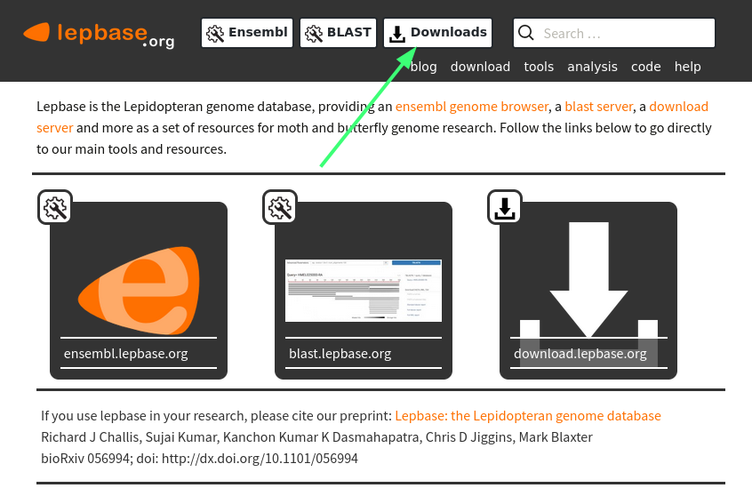
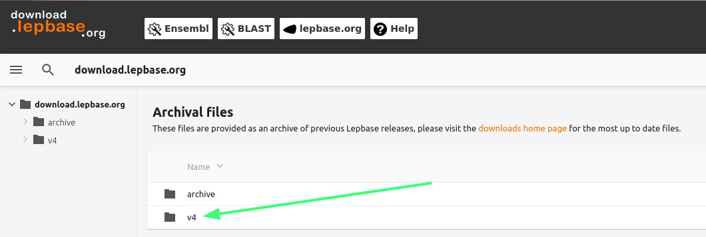
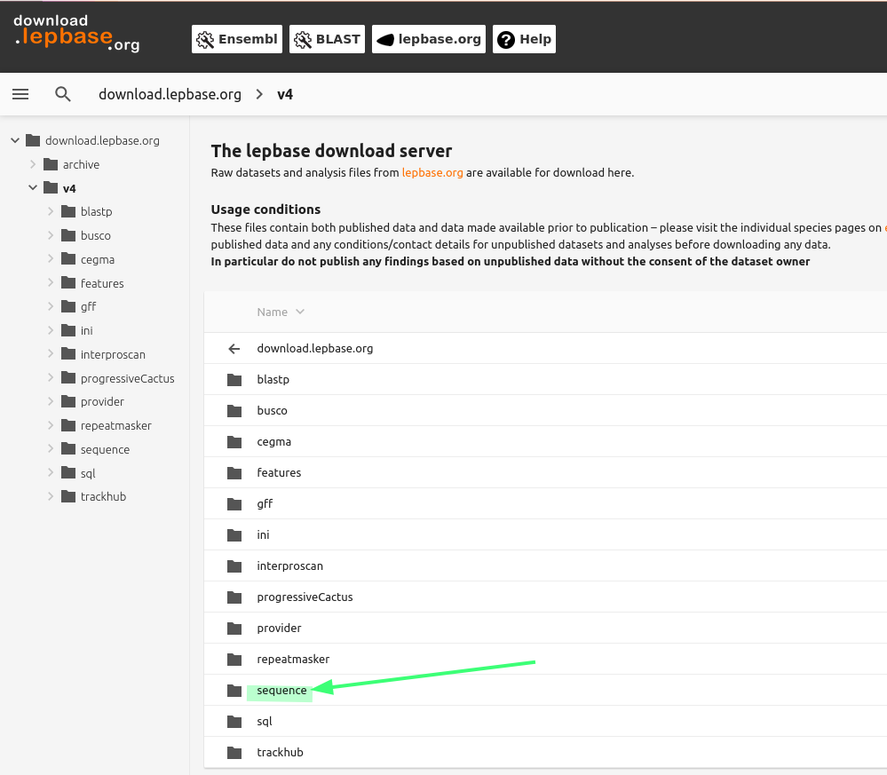
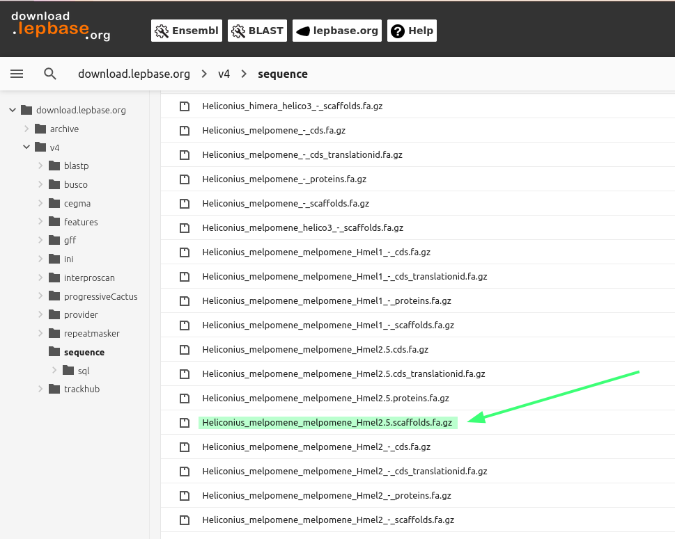

<!-- markdown-toc start - Don't edit this section. Run M-x markdown-toc-refresh-toc -->
# Índice

- [Mapeo: Calidad de los datos de lectura](#mapeo-calidad-de-los-datos-de-lectura)
    - [Las muestras que usaremos](#las-muestras-que-usaremos)
    - [Estructura de los datos: El formato `fastq`](#estructura-de-los-datos-el-formato-fastq)
    - [Puntajes de calidad](#puntajes-de-calidad)
    - [Analizando las calidades de las lecturas](#analizando-las-calidades-de-las-lecturas)
    - [Buenas y malas calidades](#buenas-y-malas-calidades)
- [Mapeo: Genoma de referencia](#mapeo-genoma-de-referencia)
    - [Descargando un genoma de referencia](#descargando-un-genoma-de-referencia)
- [Mapeo: Pasos y herramientas](#mapeo-pasos-y-herramientas)
    - [Preparando los archivos](#preparando-los-archivos)
    - [Alineamiento de las lecturas](#alineamiento-de-las-lecturas)
    - [Quitando duplicados de PCR](#quitando-duplicados-de-pcr)

<!-- markdown-toc end -->


# Mapeo: Calidad de los datos de lectura

## Las muestras que usaremos

Para este proceso usaremos 18 muestras de mariposas *Heliconius* que
corresponden a individuos de dos grupos taxonómicos cercanamente
emparentados. Las silvaniformes, que tienen patrones amarillos/naranja y
negros predominantemente (parte superior de la imagen) y dos especies
del clado conocido como *cydno - melpomene*. De este último clado
tenemos muestras de dos especies: *Heliconius melpomene* y *Heliconius
timareta*. Específicamente tenemos individuos de la raza *malleti*
(Colombia, especie *H. melpomene*) e individuos de las razas *florencia*
(Colombia) y *thelxinoe* (Perú) de la especie *H. timareta*. Estas
muestras fueron secuenciadas usando secuenciación de genoma completo de
alta profundidad en plataforma Illumina. Desde hace varios años existe
un genoma de referencia al que podemos alinear estos datos de
secuenciación para hacer análisis genéticos posteriores en nuestras
muestras.

|                                                    |
|-------------------------------------------------------------------------------------------|
| Imagen tomada de [Dasmahapatra et al., 2012](https://www.nature.com/articles/nature11041) |

Los datos de las lecturas de secuenciación de estas muestras que
usaremos en los siguientes pasos están disponibles en Centauro, en la
carpeta `/home/workshopX/shared_workshop/reads_heliconius/`, donde
`workshopX` es el usuario que te corresponde para el curso. Verifica que
puedes acceder a la carpeta y hacer una lista de los archivos.

| Clado           | Especie      | Polbación/Raza | ID        | Archivo lecturas 1                    | Archivo lecturas 2                    |
|-----------------|--------------|----------------|-----------|---------------------------------------|---------------------------------------|
| silvaniformes   | *ethilla*    | *aerotome*     | JM67      | H.eth.aer.JM67.SH.R1.fastq.gz         | H.eth.aer.JM67.SH.R2.fastq.gz         |
| silvaniformes   | *hecale*     | *felix*        | JM273     | H.hec.fel.JM273.SH.R1.fastq.gz        | H.hec.fel.JM273.SH.R2.fastq.gz        |
| cydno/melpomene | *melpomene*  | *malleti*      | CJ16550   | H.melp.malleti.CJ16550.SH.R1.fastq.gz | H.melp.malleti.CJ16550.SH.R2.fastq.gz |
| cydno/melpomene | *melpomene*  | *malleti*      | CS21      | H.melp.malleti.CS21.SH.R1.fastq.gz    | H.melp.malleti.CS21.SH.R2.fastq.gz    |
| cydno/melpomene | *melpomene*  | *malleti*      | CS22      | H.melp.malleti.CS22.SH.R1.fastq.gz    | H.melp.malleti.CS22.SH.R2.fastq.gz    |
| cydno/melpomene | *melpomene*  | *malleti*      | CS24      | H.melp.malleti.CS24.SH.R1.fastq.gz    | H.melp.malleti.CS24.SH.R2.fastq.gz    |
| silvaniformes   | *numata*     | *numata*       | MJ09.4125 | H.num.num.MJ09.4125.SH.R1.fastq.gz    | H.num.num.MJ09.4125.SH.R2.fastq.gz    |
| silvaniformes   | *numata*     | *silvana*      | MJ09.4184 | H.num.sil.MJ09.4184.SH.R1.fastq.gz    | H.num.sil.MJ09.4184.SH.R2.fastq.gz    |
| silvaniformes   | *pardalinus* | *sergestus*    | JM202     | H.par.ser.JM202.SH.R1.fastq.gz        | H.par.ser.JM202.SH.R2.fastq.gz        |
| silvaniformes   | *pardalinus* | *ssp. nova*    | JM371     | H.par.spn.JM371.SH.R1.fastq.gz        | H.par.spn.JM371.SH.R2.fastq.gz        |
| cydno/melpomene | *timareta*   | *florencia*    | CS2337    | H.tim.fln.CS2337.SH.R1.fastq.gz       | H.tim.fln.CS2337.SH.R2.fastq.gz       |
| cydno/melpomene | *timareta*   | *florencia*    | CS2341    | H.tim.fln.CS2341.SH.R1.fastq.gz       | H.tim.fln.CS2341.SH.R2.fastq.gz       |
| cydno/melpomene | *timareta*   | *florencia*    | CS2358    | H.tim.fln.CS2358.SH.R1.fastq.gz       | H.tim.fln.CS2358.SH.R2.fastq.gz       |
| cydno/melpomene | *timareta*   | *florencia*    | CS2359    | H.tim.fln.CS2359.SH.R1.fastq.gz       | H.tim.fln.CS2359.SH.R2.fastq.gz       |
| cydno/melpomene | *timareta*   | *thelxinoe*    | JM313     | H.tim.thx.JM313.SH.R1.fastq.gz        | H.tim.thx.JM313.SH.R2.fastq.gz        |
| cydno/melpomene | *timareta*   | *thelxinoe*    | JM57      | H.tim.thx.JM57.SH.R1.fastq.gz         | H.tim.thx.JM57.SH.R2.fastq.gz         |
| cydno/melpomene | *timareta*   | *thelxinoe*    | JM84      | H.tim.thx.JM84.SH.R1.fastq.gz         | H.tim.thx.JM84.SH.R2.fastq.gz         |
| cydno/melpomene | *timareta*   | *thelxinoe*    | JM86      | H.tim.thx.JM86.SH.R1.fastq.gz         | H.tim.thx.JM86.SH.R2.fastq.gz         |

**Atención:** En este punto debes escoger una muestra para trabajar.
Copia sus archivos en tu directorio de trabajo y ten a la mano los datos
correspondientes a esta muestra.

## Estructura de los datos: El formato `fastq`

La estructura del formato de lecturas `fastq` es sencilla, la
información correspondiente a cada lectura está codificada en cuatro
líneas consecutivas que contienen la siguiente información:

-   La primera línea contiene el identificador de la lectura y comienza
    siempre con `@`, seguido del identificador único de la lectura. Si
    la librería fue hecha usando el método `paired-end` el identificador
    finaliza con un `1` o un `2` dependiendo del par al que pertenece
    (`_1` o `_2`).
-   La segunda línea es la secuencia de ADN leida por la máquina
-   La tercera línea empieza con un `+` y opcionalmente se sigue de
    otros datos adicionales de identificación de la secuencia.
-   La cuarta línea contiene las calidades de cada base encontrada en la
    línea 2. Las líneas 2 y 4 deben tener la misma longitud.

Ejemplo de la información correspondiente a **una** lectura de Illumina

``` shell
@ERR1307113.10673758/1
GTCTACTCTTTCACTTTCGACCAGGCCTATAAAGCCCTTGGTGCTGCTATAGGCCGCCATGTACTGTCCCGTCATGCTTCCGTGAATGACACGGGAGCTG
+
@CBFFFFFHHFHHJIJJJJJIJGGGHGDHGIIGIIJJJJJIBHIIJGAHBIHEGHIEHGAC?AEEDFFE@A?CCDCCCDDC?CB<8@A<A3:5599>>89
```

Examinaremos los archivos `fastq` de *Heliconius* con los que vamos a
trabajar. El objetivo es que reconozcas su estructura y que identifiques
partes importantes de estos datos antes de procesarlos.

**Atención:** Los archivos de lecturas, alineamientos y genotipos
normalmente se comprimen porque contienen mucho texto y ocupan un
espacio sustancial en el disco. **No descomprimas estos archivos**.
Existen herramientas para analizar el contenido de archivos comprimidos
como `zcat`, `zless`, `zgrep`, etc., que son versiones modificadas de
herramientas comunes para analizar texto en Unix.

1.  Para el archivo de lecturas que descargaste usando `wget`: Cuenta el
    número de líneas y el número de lecturas que contiene el archivo.

2.  Para los archivos en el directorio `reads_short`: Escoge un par de
    muestras y analiza los pares de lecturas (R1 y R2) de estas
    muestras. Cuenta el número de líneas y de lecturas de R1 y R2.
    ¿Cuántas líneas tienen? ¿Cuántas lecturas tienen? ¿R1 y R2 tienen el
    mismo número de lecturas?

## Puntajes de calidad

El rango de calidades de las bases secuenciadas está codificado en la
siguiente escala.

``` shell
Menor calidad ----> ----> ----> ----> ----> -----> ----> ----> ----> ----> ----> Mayor calidad
!"#$%&'()*+,-./0123456789:;<=>?@ABCDEFGHIJKLMNOPQRSTUVWXYZ[\]^_`abcdefghijklmnopqrstuvwxyz{|}~
| |                      |     |         |                                      |            |
0.2......................26....31........41.....................................80..........93
```

¿Qué interpretación tienen esos números? La calidad Q y la probabilidad
de error en una base P se relacionan mediante la siguiente expresión:


Esta escala de calidades se conoce como la escala Phred. El puntaje
Phred está directamente relacionado con la probabilidad de error al leer
una base en un experimento de secuenciación como lo muestra la tabla.

| Puntaje Phred (Q) | Probabilidad de error (P) | Precisión de la base secuenciada |
|-------------------|---------------------------|----------------------------------|
| 20                | 1 en 100                  | 99%                              |
| 40                | 1 en 10000                | 99.99%                           |
| 80                | 1 en 100000000            | 99.999999%                       |

## Analizando las calidades de las lecturas

Recursos computacionales: 1 procesador, 1 GB de memoria, \~10 min de
tiempo de ejecución.

Corriendo fastqc con los datos de *Heliconius*:

1.  En tu carpeta de trabajo crea un directorio temporal, dale el nombre
    que quieras. Yo, por ejemplo, lo llamé `TMP_DIR`. Ten a mano la ruta
    absoluta a este directorio (usa `pwd` y copia la ruta).

2.  Crea un script de `bash` para enviar el trabajo a la cola del
    cluster. Pide los recursos necesarios usando las directivas de
    `SBATCH`, no olvides el `shebang`. Encuentra el módulo de `Fastqc`
    en el cluster y cárgalo.

3.  En tu script: Crea un directiorio y dale un nombre que identifique a
    la muestra que vas a correr. Finaliza el nombre con el sufijo `_QC`.

4.  En tu script: Llama a `fastqc` con las opciones `-d <directorio>` y
    `-o
            <directorio>`. `-d` se usa para especificar el directorio en
    el que `fastqc` escribirá algunos resultados intermedios
    temporalmente. `-o` se usa para especificar el nombre o ruta del
    directorio en el que se guardarán los resultados finales (varios
    archivos).

    La sintaxis para llamar a `fastqc` tiene la siguiente estructura,
    donde `seqfile1` y `seqfile2` son los archivos que contienen las
    lecturas pareadas de UNA SOLA muestra. ¿Cómo crees que cambia la
    sintaxis si tienes un solo archivo de lecturas?

    ``` shell
    # sintaxis para llamar fastqc
    # si quieres consultar en detalle las opciones
    # ejecuta fastqc -h
    fastqc [OPCIONES] seqfile1 seqfile2
    ```

5.  Antes de enviar tu script a la cola de trabajo muéstraselo al
    personal docente para revisar que se ve bien.

6.  Cuando `fastqc` termine de correr, todos los archivos resultantes
    deben quedar en el directorio especificado usando `-o`. Copia este
    directorio con todo su contenido a tu máquina.

7.  Usando tu interfaz gráfica ve hasta el directorio que acabas de
    copiar. Verás 4 archivos; dos comprimidos y dos con extensión
    `.html`. Cada par de archivos corresponde a uno de los pares de
    lecturas de cada muestra (`_1` y `_2`). Abre cada uno de los
    archivos `.html` usando tu navegador web y explora su contenido, qué
    observas?

## Buenas y malas calidades

Sin mucha experiencia no es fácul saber cuándo determinamos que un
experimento de secuenciación resultó mal para una o varias muestras. En
este punto podemos referirnos a ejemplos de buenas y malas calidades
para ver en qué casos un set de lecturas puede no ser apropiado.

Aquí encuentras un ejemplo de [lecturas de Illumina de buena
calidad](https://www.bioinformatics.babraham.ac.uk/projects/fastqc/good_sequence_short_fastqc.html)
y otro de [lecturas de Illumina de mala
calidad](https://www.bioinformatics.babraham.ac.uk/projects/fastqc/bad_sequence_fastqc.html).
Compara las calidades de las lecturas que analizaste y responde: ¿En
general, los datos de secuenciación tienen buena o mala calidad? ¿Alguna
medida en particular se ve mal para tus lecturas? Discute con tu grupo
las observaciones hechas sobre tus datos.

Te alentamos a revisar [la documentación de
`fastqc`](https://www.bioinformatics.babraham.ac.uk/projects/fastqc/Help/3%20Analysis%20Modules/).
Esta contiene explicaciones detalladas sobre cada medida de calidad, las
posibles razones por las que la calidad puede ser mala en algunos
experimentos/lecturas y sugerencias sobre cómo procesar los datos para
mejorar la calidad.

# Mapeo: Genoma de referencia

Vamos a descargar la última versión del genoma de referencia de *H.
melpomene*.

## Descargando un genoma de referencia

El genoma de referencia que usaremos es de la especie *H. melpomene*
(v2.5).  
Sigue estos pasos para descargarlo:  

1.  Ve al sitio web de [lepbase](http://lepbase.org/)
2.  Haz click en el botón señalado por las flechas (Downloads)  
    
3.  En Downloads, escoge la carpeta que dice `v4`  
    
4.  Dentro de `v4` ve a la carpeta `sequence`  
    
5.  Dentro de `sequence` busca
    `Heliconius_melpomene_melpomene_Hmel2.5.scafolds.fa.gz`  
    
6.  Dale click derecho al enlace y selecciona `Copiar enlace`
7.  Ve a tu carpeta de trabajo en el cluster y crea una nueva carpeta
    llamada `ref_hmel2.5`, cambia de directorio a esta carpeta.
8.  Descarga el archivo de la referencia con `wget` pegando el enlace
    que copiaste. Recuerda la ruta de ubicación de este archivo!
    Regístrala en tu archivo de comandos.
9.  Verifica que el archivo se haya descargado correctamente y que puede
    leerse y procesarse. Usa `zless -S` para visualizarlo. Usa `zcat` o
    `zgrep` para responder a la siguiente pregunta: ¿Cuántas secuencias
    tiene este archivo multifasta? Pista: El número de secuencias en un
    archivo `fasta` puede contarse contando el número de encabezados de
    secuencia (líneas que empiezan con `>`).

# Mapeo: Pasos y herramientas

## Preparando los archivos

1.  Es necesario preparar el genoma de referencia creando una nueva
    estructura de datos a partir del archivo `fasta` original. Esto lo
    hacemos usando el comando `index` de `bwa`. La sintaxis es
    `bwa index archivo.fa`, donde `archivo.fa` es la referencia en
    formato `fasta`. La referencia puede estar comprimida en este caso
    (`.gz`). Recuerda cargar el módulo `bwa` en centauro antes de crear
    el índice. Este paso no tarda mucho tiempo ( 5min) y requiere pocos
    recursos; puedes realizarlo en una sesión interactiva.

2.  Luego de indexar es necesario crear un archivo de texto con la
    información que usaremos para mapear nuestras lecturas al genoma de
    referencia. Usa `nano` para crear un nuevo archivo de texto.  
    Usa una línea por muestra y la siguiente estructura para cada
    línea:  
    Columna 1: La ruta completa al primer archivo de lecturas de la
    muestra (R1)  
    Columna 2: La ruta completa al segundo archivo de lecturas de la
    muestra (R2)  
    Columna 3: La ruta completa al archivo de la referencia (`fasta` o
    `fasta` comprimido).  
    Columna 4: El identificador de la muestra: Fíjate en la tabla de las
    muestras. Para identificar a cada una usamos abreviaturas de su
    especie y raza y su columna de ID para crear un identificador único:
    Por ejemplo, para los archivos correspondientes a *Heliconius
    timareta florencia* CS2538 usamos el identificador
    H.tim.fln.CS2358  
    Columna 5: El identificador de la referencia (Hmel2.5)  
    **Importante:** Este archivo es creado con esta estructura para
    poder tener un registro organizado de las muestras que queremos
    procesar. **Cada estudiante hará el mapeo de solo una de las
    muestras.**

3.  Escoge **una** de las muestras para hacer el mapeo, ten a mano la
    línea de este archivo correspondiente a la muestra.

## Alineamiento de las lecturas

Recursos computacionales: 2 procesadores, 4 GB de memoria, \~25 min de
tiempo de ejecución.

1.  Para este paso necesitamos escribir un script de bash usando `nano`
    (u otro editor de texto disponible en el cluster). Crea un nuevo
    archivo de texto usando el editor y ponle un nombre informativo, por
    ejemplo: `mapeo_bwa.sh`

2.  No olvides añadir el
    [shebang](https://en.wikipedia.org/wiki/Shebang_(Unix)) en la
    primera línea. En las siguientes líneas escribe directivas para
    pedir al sistema 2 procesadores, 4GB de RAM y 12 horas de tiempo
    límite de ejecución. Escribe también directivas para que el sistema
    te envíe notificaciones al correo cuando el proceso inicie, termine
    o encuentre errores.

3.  Carga los módulos requeridos: Durante estos pasos del alineamiento
    vamos a usar [`bwa`](http://bio-bwa.sourceforge.net/bwa.shtml) para
    alinear las lecturas al genoma de referencia,
    [`samtools`](https://www.htslib.org/doc/samtools.html) para ordenar
    los alineamientos y optimizar el acceso a las lecturas mapeadas.
    `bwa` y `samtools` están disponibles directamente como módulos en el
    cluster.

4.  Necesitamos establecer la forma en la que ingresamos a nuestro
    script la información necesaria para alinear las lecturas. Para esto
    usamos los **argumentos ordenados** de los scripts de `bash`.
    Recuerda que los números del 1 en adelante, precedidos del operador
    `$` sirven para asociar los argumentos con los que se llama el
    script (`$1` sería el primer argumento, `$2` sería el segundo y así
    sucesivamente). En este caso necesitamos 5 argumentos: Las rutas de
    los dos archivos de lecturas pareadas (R1 y R2), la ruta del archivo
    de la referencia, el identificador de la muestra y el identificador
    de la referencia que usaremos para alinear. Definamos entonces 5
    variables en nuestro script y asignémosles cada uno de los
    argumentos de entrada. Por ejemplo para declarar una variable que
    asignaremos al primer archivo de lecturas, podemos escribir algo
    como `lecturas_r1=$1`. Declara de la misma manera el resto de las
    variables.

5.  Escribamos el comando de `bwa`. Utilizaremos la función `mem` para
    hacer el alineamiento de nuestras lecturas pareadas. Inmediatamente
    después de escribir la función que usaremos, especificamos el número
    de procesadores que `bwa` usará para alinear con la opción
    `-t <procesadores>`. Vamos a usar 2 procesadores para el
    alineamiento. Usamos la opción `-M` para marcar los alineamientos
    más cortos como secundarios (para que los alineamientos sean
    compatibles con `picard`).

    Tal vez la parte más importante de este paso es establecer el **read
    group**. En este caso podemos asumir que cada muestra fue
    secuenciada una sola vez y en un solo instrumento, luego tenemos un
    solo **read group** por muestra. Si tuviéramos más de un **read
    group** por muestra sería recomendable hacer dos alineamientos y
    luego unirlos usando otras herramientas. Para establecer el read
    group usamos la opción `-R`. Si el identificador de la muestra está
    en una variable llamada `id_muestra`, esta parte de la llamada se
    vería así: `-R $(echo
             "@RG\tID:$id_muestra\tSM:$id_muestra\tPL:Illumina")`. Si
    revisamos esta expresión en detalle consta de tres campos separados
    por tabulación (`\t`). El primero, (`ID`), corresponde al
    identificador del corrido de secuenciación, que normalmente
    corresponde a uno de los carriles de la máquina secuenciadora. El
    segundo (`SM`) corresponde al identificador de la muestra. El
    tercero (`PL`) corresponde a la plataforma usada para secuenciar. En
    el caso de los datos de *Heliconius* la plataforma utilizada para
    todas las muestras fue Illuimina. Debes cambiar `id_muestra` por el
    identificador asociado con la muestra que vas a mapear. Establece el
    read group correctamente usando la opción `-R` y los detales
    correspondientes a la muestra escogida. Como lo dijimos antes, todas
    las muestras de *Heliconius* que usaremos fueron secuenciadas usando
    la plataforma `Illumina`.

    Los tres argumentos siguientes son la ruta de la referencia y la
    ruta de los archivos de lectura (R1 y luego R2). Asegúrate de
    especificar la variable correcta para cada uno de estos archivos.

    La ruta utilizada por `bwa mem` para escribir el alineamiento es la
    **salida estándar**; esto significa que debemos re-dirigir los
    resultados con el operador adecuado hacia un archivo o hacia otro
    programa si queremos procesar directamente estos datos de salida. En
    este caso queremos optar por la segunda opción para ordenar el
    alineamiento según las coordenadas del genoma de referencia y para
    guardar el alineamiento en un formato amigable con el espacio en
    disco (más compacto). Usando el operador `pipe` re-dirigimos la
    salida hacia la herramienta `samtools`. Como necesitamos ordenar el
    alineamiento entonces la función de `samtools` que utilizaremos será
    `sort`. Especificamos que queremos usar 2 procesadores con la opción
    `-@ <procesadores>` y usando la opción `-o` le damos el nombre al
    archivo de salida; como es un alineamiento ya ordenado vamos a
    finalizar el nombre del archivo con el sufijo `.sort.bam`. La última
    pieza de información que debemos darle a `samtools
             sort` es un `-` (guión): Esto le indica a `samtools` que la
    información debe ser leída usando la **entrada estándar** y no un
    archivo.

6.  Finalmente debemos indexar el alineamiento resultante con `samtools
             index`. La sintáxis es la siguiente:

    ``` shell
    samtools index aln.sam|aln.bam
    ```

    Listo! Con esta instrucción finalizamos el script que alinea, ordena
    e indexa la primera versión del alineamiento.

7.  **Atención!:** Muéstrale tu script al personal docente para
    verificar que luce bien antes de enviarlo a la cola de trabajo.

    <details>
    <summary> Trata de construir el script por tu cuenta. Si no puedes avanzar en tu solución puedes ver el código aquí. </summary>

    ``` shell
    #!/bin/bash
    #SBATCH -p normal
    #SBATCH -n 2
    #SBATCH --mem=4000
    #SBATCH --time=0-12:00
    #SBATCH --mail-type=BEGIN,END,FAIL
    #SBATCH --mail-user=mi.usuario@urosario.edu.co

    read_1=$1
    read_2=$2
    ref=$3
    rg_info=$4
    ref_info=$5

    module load bwa
    module load samtools

    bwa mem -t 2 -M -R $(echo "@RG\tID:$rg_info\tSM:$rg_info\tPL:Illumina") \
        $ref $read_1 $read_2 | samtools sort -@ 2 -o $rg_info.$ref_info.SHORT.sort.bam -

    samtools index $rg_info.$ref_info.SHORT.sort.bam
    ```

    </details>

8.  Escribe la línea de comando que envía este script junto con la
    información de las lecturas a la cola de trabajo. **Atención!:**
    Muéstrale tu línea al personal docente antes de enviarla a la cola.

    <details>
    <summary> Trata escribir la línea de comando por tu cuenta. Si no puedes avanzar en tu solución puedes ver el código aquí. </summary>

    Si tu script se llama `mapeo_bwa.sh` lo envías a la cola con
    `sbatch` de esta forma.

    ``` shell
    ### Esta es la línea para enviar el trabajo a la cola
    sbatch mapeo_bwa.sh /ruta/lectura.R1.fastq.gz /ruta/lectura.R2.fastq.gz \
           /ruta/referencia.fasta id_muestra hmel2.5
    ```

    Reemplaza adecuadamente las rutas a las lecturas, a la referencia y
    reemplaza también a `id_muestra` por el identificador de la muestra.

    </details>

## Quitando duplicados de PCR

Recursos computacionales: 2 procesadores, 4 GB de memoria, \~20 min de
tiempo de ejecución. Este análisis lo vas a correr con el alineamiento
resultante del paso anterior.

1.  Tenemos que quitar los duplicados de PCR, estos pueden interferir
    luego con el proceso de inferencia de alelos. Puedes encontrar
    detalles sobre este proceso en [este paper de
    Ebbert (2016)](http://ebbertlab.com/Ebbert_PCR_duplicates_BMC_Bioinformatics.pdf).
    Para este proceso vamos a usar una suite de herramientas llamada
    [`Picard Tools`](https://broadinstitute.github.io/picard/).
    Específicamente queremos usar la herramienta
    [`MarkDuplicates`](https://broadinstitute.github.io/picard/command-line-overview.html#MarkDuplicates).
    En centauro `Picard tools` está en la ruta
    `/opt/ohpc/pub/apps/picard-tools/2.18.15/picard.jar`. Es una
    aplicación de `java` por lo tanto debes cargar el módulo de `java`
    (para `picard-tools` necesitamos cargar la versión 8 de `java`, cuyo
    módulo en el cluster es `java8/1.8.0.172`) y llamarla usando `4GB`
    de memoria como máximo. La llamada a una aplicación de java se hace
    usando la siguiente sintáxis:

    ``` shell
    # Estructura basica de llamada a una app de java
    java -Xmx4G -jar /ruta/completa/archivo.jar
    ```

    Debemos crear un directorio temporal en donde `Picard` almacenará
    algunos datos mientras completa el proceso de quitar duplicados.
    Crea un directorio llamado `DIR_TEMP`.

    El nombre de la herramienta (`MarkDuplicates`) debe ir
    inmediatamente después de `picard.jar`. A continuación especificamos
    los argumentos de `MarkDuplicates` que debemos utilizar. Son:
    `REMOVE_DUPLICATES=true`, `ASSUME_SORTED=true`,
    `VALIDATION_STRINGENCY=SILENT`,
    `MAX_FILE_HANDLES_FOR_READ_ENDS_MAP=1000`,
    `INPUT=alineamiento.sort.bam`, `OUTPUT=alineamiento.sort.rmd.bam`,
    `METRICS_FILE=alineamiento.sort.rmd.metrics`, y el directorio
    temporal `TMP_DIR=DIR_TEMP`. Te recomendamos capturar los nombres
    del alineamiento ordenado original (`alineamiento.sort.bam`), el
    nombre del alineamiento sin duplicados (`alineamiento.sort.rmd.bam`)
    y el nombre archivo de métricas (`alineamiento.sort.rmd.metrics`),
    usando los argumentos posicionales de un script de bash. Por
    ejemplo, la correspondencia puede ser la siguiente: Primer argumento
    (`$1`) `alineamiento.sort.bam`. Segundo argumento (`$2`)
    `alineamiento.sort.rmd.bam`. Tercer argumento (`$3`)
    `alineamiento.sort.rmd.metrics`. Recuerda que en estos nombres debes
    sustituir `alineamiento` por los datos relevantes de la muestra que
    estás trabajando. Recuerda también que los argumentos posicionales
    puedes asignarlos a variables usando el operador `=` así:

    ``` shell
    bam_original=$1
    nombre_salida=$2
    nombre_metricas=$3
    ```

    Y luego puedes usar estas variables con el operador `$` en tu
    script: `$bam_original`, `$nombre_salida` y `$nombre_metricas`.

2.  Crea un script de `bash` solicitando los recursos necesarios y
    construye la línea con la que vas a llamar a `Picard`. Recuerda
    cargar el módulo de `java`. Carga también el módulo de `samtools`,
    pues lo vamos a necesitar para el último paso. Usa también las
    opciones `--mail-type` y `--mail-user` para recibir notificaciones
    sobre el progreso del análisis.

3.  Debemos indexar nuestro alineamiento después de remover sus
    duplicados de PCR. Finaliza tu script con una llamada a `samtools`
    para indexar el nuevo alineamiento creado.

    **Atención!:** Antes de enviar el trabajo a la cola muéstrale tu
    script al personal docente para verificar que se ve bien :)

    <details>
    <summary> Trata de construir el script por tu cuenta. Si no puedes avanzar en tu solución puedes ver el código aquí. </summary>

    ``` shell
    #!/bin/bash
    #SBATCH -p normal
    #SBATCH -n 2
    #SBATCH --mem=4000
    #SBATCH --time=0-12:00
    #SBATCH --mail-type=BEGIN,END,FAIL
    #SBATCH --mail-user=mi.usuario@urosario.edu.co

    baminfo=$1
    salida=$2
    metricas=$3

    module load java8
    module load samtools

    java -Xmx4G -jar /opt/ohpc/pub/apps/picard-tools/2.18.15/picard.jar \
         MarkDuplicates REMOVE_DUPLICATES=true ASSUME_SORTED=true \
         VALIDATION_STRINGENCY=SILENT MAX_FILE_HANDLES_FOR_READ_ENDS_MAP=1000 \
         INPUT=$baminfo OUTPUT=$salida \
         METRICS_FILE=$metricas TMP_DIR=../TMP_DIR

    samtools index $salida
    ```

    </details>

4.  Envía tu trabajo a la cola usando `sbatch`. Ten en cuenta los
    argumentos posicionales que requiere el script. Muéstrale la línea
    de comando a un miembro del personal docente antes de enviar el
    trabajo a la cola.

    <details>
    <summary> Trata de escribir la línea de comando por tu cuenta. Si no puedes avanzar en tu solución puedes ver el código aquí. </summary>

    Si tu script se llama `quita_duplicados.sh` puedes llamarlo usando
    los tres argumentos posicionales de esta forma. Asegúrate de
    reemplazar los argumentos con las rutas correctas a tus archivos.

    ``` shell
    sbatch quita_duplicados.sh /ruta/alineamiento.ordenado.bam \
           /ruta/alineamiento.salida /ruta/alineamiento.metricas
    ```

    </details>
