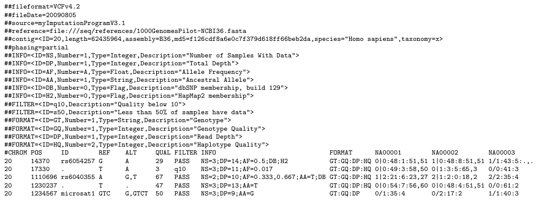
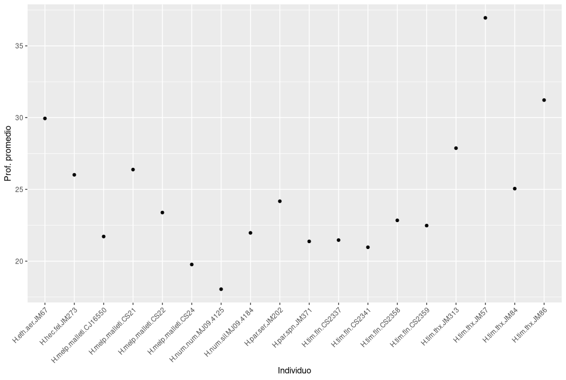

<!-- markdown-toc start - Don't edit this section. Run M-x markdown-toc-refresh-toc -->
**Table of Contents**

- [Qué es *de novo* <a name = "denovo"></a>](#qué-es-de-novo-a-name--denovoa)
- [Datos de ejemplo <a name = "dato"></a>](#datos-de-ejemplo-a-name--datoa)
    - [*Lupinus* (Contreras-Ortiz, et al., 2018)](#lupinus-contreras-ortiz-et-al-2018)
- [Software STACKS <a name = "stacks"></a>](#software-stacks-a-name--stacksa)
    - [-](#-)
    - [*process_radtags* <a name = "process_radtags"></a>](#process_radtags-a-name--process_radtagsa)
    - [*ustacks* <a name = "ustacks"></a>](#ustacks-a-name--ustacksa)
    - [*cstacks* <a name = "cstacks"></a>](#cstacks-a-name--cstacksa)
    - [*sstacks* <a name = "sstacks"></a>](#sstacks-a-name--sstacksa)
    - [*tsv2bam* <a name = "tsv2bam"></a>](#tsv2bam-a-name--tsv2bama)
    - [*gstacks* <a name = "gstacks"></a>](#gstacks-a-name--gstacksa)
    - [*populations* <a name = "populations"></a>](#populations-a-name--populationsa)
- [Mapeo: Calidad de los datos de lectura](#mapeo-calidad-de-los-datos-de-lectura)
    - [Las muestras que usaremos](#las-muestras-que-usaremos)
    - [Estructura de los datos: El formato `fastq`](#estructura-de-los-datos-el-formato-fastq)
    - [Puntajes de calidad](#puntajes-de-calidad)
    - [Analizando las calidades de las lecturas](#analizando-las-calidades-de-las-lecturas)
    - [Buenas y malas calidades](#buenas-y-malas-calidades)
- [Mapeo: Genoma de referencia](#mapeo-genoma-de-referencia)
    - [Descargando un genoma de referencia](#descargando-un-genoma-de-referencia)
- [Mapeo: Pasos y herramientas](#mapeo-pasos-y-herramientas)
    - [Preparando los archivos](#preparando-los-archivos)
    - [Alineamiento de las lecturas](#alineamiento-de-las-lecturas)
    - [Quitando duplicados de PCR](#quitando-duplicados-de-pcr)
- [Sub-muestreando los alineamientos](#sub-muestreando-los-alineamientos)
    - [Extrayendo una región específica de los alineamientos](#extrayendo-una-región-específica-de-los-alineamientos)
- [Llamando genotipos](#llamando-genotipos)
    - [Genotipos y SNPs](#genotipos-y-snps)
    - [Llamada de genotipos](#llamada-de-genotipos)
- [Operaciones con archivos VCF/BCF](#operaciones-con-archivos-vcfbcf)
    - [El formato VCF](#el-formato-vcf)
    - [Extrayendo información de un archivo VCF](#extrayendo-información-de-un-archivo-vcf)
    - [Tipos de variantes](#tipos-de-variantes)
    - [Filtrando sitios](#filtrando-sitios)
        - [Calculando estadísticas en nuestros genotipos](#calculando-estadísticas-en-nuestros-genotipos)
        - [Analizando y visualizando las estadísticas de los genotipos en `R`](#analizando-y-visualizando-las-estadísticas-de-los-genotipos-en-r)
        - [Aplicando los filtros al archivo VCF](#aplicando-los-filtros-al-archivo-vcf)

<!-- markdown-toc end -->


# Qué es *de novo* <a name = "denovo"></a>

*De novo* es una forma de ensamblaje del genoma sin la ayuda de datos genómicos
de referencia, así és, un ensamblaje inicial de un genoma. Esto asume que no se
conoce detalles del genoma, como el tamaño y la composición de las secuencias
del ADN. Por esto, son bastante utilizados en organismos no-modelos donde no hay
disponible genomas para muchas espécies. En la ausencia de un genoma referencia,
los loci no se pueden visualizar posicionalmente; en su lugar, cada locus se
examina de forma independiente para comprobar si es un valor atípico para
detectar falsos positivos. En la figura abajo (Fig. 1) una comparación de (a)
*de novo* y (b) genoma referencia.

).](../Imagenes/denovo_vs_mapping.jpg)

Además, *de novo* puede ser utilizado si hay un genoma referencia pero no es de
alta calidad. Un análisis *de novo* complementario es bueno para comparar
cuántos loci pueden faltar en el genoma de referencia o para identificar loci
atípicos que no están en la referencia ensamblada. Cuando el genoma de
referencia está distante, o si su calidad es cuestionable, tiene sentido adoptar
un enfoque híbrido: ensamblar loci de novo y luego alinear sus secuencias de
consenso y respaldar la información posicional en el conjunto de datos de novo.
Esto permite aprovechar el genoma de referencia sin comprometer la consistencia
de las llamadas de genotipo. Este enfoque híbrido permite una comparación
directa de los análisis de novo y basados en referencias. Cuando el genoma es de
buena calidad y las propiedades genómicas (por ejemplo, contenido repetido) del
sistema son tales que el ensamblaje de novo de los loci RAD funciona bien, los
dos enfoques deberían producir resultados muy similares.

En este curso vamos a utilizar STACKS para hacer la ensemblaje *de novo*. Pero
es importante saber que hay varios otros softwares que lo hacen y el uso de uno
u otro dependerá del tipo de datos y el propósito del estudio. Por ejemplo,
[ipyrad](https://ipyrad.readthedocs.io/en/master/) es bastante utilizado para
filogenómica,
[SOAPdenovo](https://www.animalgenome.org/bioinfo/resources/manuals/SOAP.html)
es un software nuevo y muchos otros.

---

# Datos de ejemplo <a name = "dato"></a>
## *Lupinus* (Contreras-Ortiz, et al., 2018)
*Lupinus* es un género de planta con una diversificación muy grande en los
Andes, con 85 especies. Algunas especies cambian su historia de vida anual a
perenne, esto ha sido sugerido como una adaptación clave que facilita la
colonización de hábitats montanos (3500-4900m). Aquí vamos a utilizar muestras
de dos especies estrechamente relacionadas de *Lupinus* (*L. triananus* (A) y
*L. alopecuroides* (B) en la figura abajo).

).](../Imagenes/Lupinus_foto.png)

*L. alopecuroides* se distribuye en la cordillera Central y Oriental al sur y
*L. triananus* en la cordillera Oriental (ver mapa abajo). Vamos a utilizar
cinco individuos de cada especie que fueron secuenciados a través de la técnica
nextRAD en el trabajo de [Contreras-Ortiz, et al.,
2018](https://academic.oup.com/botlinnean/article-abstract/187/1/118/4907975) y
que están disponibles públicamente. El secuenciamiento fue realizado en Illumina
NextSeq500 con lecturas de 150bp y *single-end*.

).](../Imagenes/Lupinus_distr.png)

Artículos con más información sobre el conjunto de datos:  
- [Contreras-Ortiz, et al., 2018](https://academic.oup.com/botlinnean/article-abstract/187/1/118/4907975);
- [Nevado et al., 2018](https://nph.onlinelibrary.wiley.com/doi/full/10.1111/nph.15243).

---

# Software STACKS <a name = "stacks"></a>


[**Website**](https://catchenlab.life.illinois.edu/stacks/) | [**Manual**](https://catchenlab.life.illinois.edu/stacks/manual/)

Stacks es un "*pipeline*" para construir loci a partir de secuencias cortas,
como las generadas en la plataforma Illumina. Stacks se desarrolló para trabajar
con datos basados en enzimas de restricción, como RAD-seq, con el propósito de
construir mapas genéticos y realizar genómica y filogeografía de poblaciones.

Stacks identifica los loci en un conjunto de individuos, usando *de novo* o
alineados con un genoma de referencia, y luego genotipa cada locus. Un análisis
*de novo* en Stacks se desarrolla en seis etapas principales (Fig. abajo).
Primero, las lecturas son demultiplexadas y limpiadas por el programa
**process_radtags**. Las siguientes tres etapas comprenden la canalización
principal de Stacks: construcción de loci (**ustacks**), creación del catálogo
de loci (**cstacks**) y comparación con el catálogo (**sstacks**). En la quinta
etapa, se ejecuta el programa **gstacks** para ensamblar y fusionar contigs de
extremos emparejados, llamar a sitios variantes en la población y genotipos en
cada muestra. En la etapa final, se ejecuta el programa de **populations**, que
puede filtrar datos, calcular estadísticas de genética de poblaciones y exportar
una variedad de formatos de datos.

).](../Imagenes/stacks_full_pipeline.png)

### Antes de empezar:
Vamos a copiar los datos brutos que analizaremos a su usuario. Los datos **all.fastq.gz** se encuentran en la carpeta compartida **xxxx**. Ejecute el comando `scp` para copiar los datos a tu usuario.  
Además, creemos una carpeta donde vamos poner todos los resultados de Stacks.
Entonces en tu directorio y usando el comando `mkdir` generemos la carpeta
llamada `01_stacks`. Ahora estamos listos para hacer el primero paso del
pipeline :)

Además, en el clúster para cargar Stacks necesitamos usar este comando en el
sbatch o en la línea de comando: `module load stacks/2.59`

---

## *process_radtags* <a name = "process_radtags"></a>

En un análisis típico, los datos estarán en formato FASTQ, que es el formato que
normalmente se recibe de un secuenciador de Next-gen, como el Illumina. El
primer requisito es demultiplexar los datos sin procesar para recuperar las
muestras individuales. Al hacer esto, usaremos *Phred scores* proporcionadas en
los archivos FASTQ para descartar las lecturas de secuenciación de baja calidad.
Estas tareas se realizan en *process_radtags*.

*Process_radtags* examina las lecturas crudas de Illumina y, en primer lugar,
comprueba que los barcodes y el sitio de corte RAD (Fig. abajo) estén intactos y
demultiplexa los datos. Si hay errores en el barcode o en el sitio RAD dentro de
un cierto margen, *process_radtags* puede corregirlos. En segundo lugar, desliza
una ventana a lo largo de la lectura y verifica el puntaje de calidad promedio
dentro de la ventana. Si la puntuación cae por debajo del 90% de probabilidad de
ser correcta (una puntuación *phred* bruta de 10), la lectura se descarta. Estos
procedimientos eliminan las lecturas en que la secuencia se degrada a medida que
se secuencia, pero aún admite algunos errores de secuenciación que se puede
corregir.

](../Imagenes/Peterson2012_diagramLibrary.png)

**Archivos necesarios:**
- archivo fastq.gz con todas las muestras crudas (no procesado)
- archivo *.txt* con dos columnas separadas por un *tab*. La primera columna
  debe corresponder al barcode y la segunda al nombre de la muestra - la
  información sobre los barcodes y nombres está disponible en la tabla
  "Info_data_Lupinus.csv" que compartimos en GitHub.


**Parámetros:**

Muchos de los parámetros utilizados aquí dependerán de cómo se haya secuenciado
la biblioteca. Por lo tanto, es importante tener en cuenta que estos cambiarán
de una biblioteca a otra según el conjunto de barcodes, adaptadores y el
protocolo de secuencia utilizado.

Hoy usaremos estas opciones (para otras consulte el manual de Stacks):

`-p` = ruta al directorio donde esta el archivo fastq.gz (sin el nombre del archivo)
`-i` = tipo de archivo de entrada, ya sea 'fastq', 'gzfastq' (fastq comprimido con gzip), 'bam' o 'bustard'  
`-b` = ruta a un archivo que contiene el listado de los barcodes en la primera columna y en la segunda el nombre de la muestra correspondiente (mirar "Archivos necesarios" para más info)  
`-o` = ruta donde se van a poner los archivos procesados (`01_stacks`)  
`-q, --quality` = descartar lecturas con baja calidad  
`-E` = especificar cómo se codifican las puntuaciones de calidad, 'phred33' (Illumina 1.8 + / Sanger, predeterminado) o 'phred64' (Illumina 1.3-1.5)  
`-D` = capturar lecturas descartadas en un archivo  
`-e [enz], --renz_1 [enz]` = la enzima de restrición utilizada (acá vamos utilizar `ecoRI`)  
`--inline_null` = barcode está en la misma línea que la secuencia, ocurre solo en lecturas *single-end* (predeterminado)  
`--barcode_dist_1` = la cantidad de discrepancias permitidas al rescatar códigos de barras (predeterminado 1)  
`--filter_illumina` = descartar las lecturas que hayan sido marcadas por el filtro de pureza de Illumina como fallidas

**Memoria necesaria:** 10mb

**Tiempo de ejecución:** ~25min

**Output:** un archivo fq.gz por individuo (+discards y log) porque és *single-end*

---

## *ustacks* <a name = "ustacks"></a>

*Ustacks* alineará para cada muestra las secuencias cortas en alelos putativos.
Al comparar estos, se formará un conjunto de loci putativos y detectará SNP en
cada locus utilizando una metodología de maximum likelihood.

**Archivos necesarios:**  
- un archivo fq.gz por muestra generado por *process_radtags*

**Parámetros:**

Tenga en cuenta que un comando *ustacks* debe realizarse para cada muestra.  
`-t` = tipo de archivo de entrada. Tipos admitidos: fasta, fastq, gzfasta o gzfastq (predeterminado: adivinar)  
`-f` = ruta del archivo de entrada con el nombre del archivo (<NOMBRE>.fz.gz)  
`-o` = ruta donde escribir los resultados (`01_stacks`)  
`-i` = un ID numérico único para cada muestra (1,2,3,...)  
`-m` = profundidad mínima de cobertura requerida para crear un stack (predeterminado 3, usaremos 5)  
`-M` = distancia máxima (en nucleótidos) permitida entre stacks (predeterminado 2)  
`-p` = habilitar la ejecución paralela con número de subprocesos (usaremos -p 2)  
`--model_type` = 'snp' (predeterminado), 'bounded'(vamos usar esto), o 'fixed'

**Memoria necesaria:** ~2.5gb

**Tiempo de ejecución:** ~12 horas (¡esto es el paso mas lento de todos!)

**Output:** 3 archivos por muestra: `.tags.tsv.gz`, `.snps.tsv.gz`, `.alleles.tsv.gz`

---

## *cstacks* <a name = "cstacks"></a>

Crea un catálogo a partir de cualquier conjunto de muestras procesadas por
ustacks, generando un conjunto de loci de consenso fusionando alelos.

**Archivos necesarios:**  
- los archivos de las muestras generado por *ustacks*
- un archivo *.txt* con el **mapa de población** que tiene en cada línea:
  muestra <TAB> población a que pertenece.

**Parámetros:**  
`-P, --in_path` = directorio de entrada que tenga los archivos generados por Stacks hasta ahora (`01_stacks`).  
`-M,--popmap` = ruta a un mapa de población (mirar archivos necesarios)  
`-p` = habilitar la ejecución paralela con número de subprocesos (usaremos -p 2)  
`-n` = número de discrepancias permitidas entre los loci putativos cuando se crea el catálogo (predeterminado 1, usaremos 2)

**Memoria necesaria:** ~5.5gb

**Tiempo de ejecución:** ~40min

**Output:** 3 archivos con el nombre "catalog" (`.tags`, `.snps` y `.alleles`)

---

## *sstacks* <a name = "sstacks"></a>

Los conjuntos de loci putativos construidos por *ustacks* se van a buscar en el
catálogo producido por *cstacks*. Esto es, todas las muestras van ser comparadas
con el catálogo.

**Archivos necesarios:**
- catálogo generado en *cstacks*
- archivos generados por *ustacks*
- mapa de población (lo mismo que generamos para *cstacks*)

**Parámetros:**  
`-P, --in_path` = directorio de entrada que tenga los archivos generados por Stacks hasta ahora (`01_stacks`).  
`-M,--popmap` = ruta a un mapa de población  
`-p,--threads` = habilitar la ejecución paralela con número de subprocesos (usaremos -p 2)  

**Memoria necesaria:** ~5.2gb

**Tiempo de ejecución:** ~22min

**Output:** 1 archivo `.matches.tsv.gz` por muestra

---

## *tsv2bam* <a name = "tsv2bam"></a>

El programa *tsv2bam* transpondrá los datos para que estén orientados por locus, en lugar de por muestra.

**Archivos necesarios:**  
- archivos generados por *ustacks* y *sstacks*
- mapa de población (lo mismo que generamos para *cstacks*)

**Parámetros:**  
`-P,--in-dir` = directorio de entrada que tenga los archivos generados por Stacks hasta ahora (`01_stacks`).  
`-M,--popmap` = ruta a un mapa de población  
`-t` — habilitar la ejecución paralela con número de subprocesos (predeterminado 1, usaremos 2)

**Memoria necesaria:** ~600mb

**Tiempo de ejecución:** ~4min

**Output:** archivo BAM estándar para cada muestra

---

## *gstacks* <a name = "gstacks"></a>

El programa gstacks examinará un conjunto de datos RAD un locus a la vez,
observando a todos los individuos en la metapoblación para ese locus. Para los
análisis *de novo*, gstacks empezará con los resultados del pipeline (ustacks →
cstacks → sstacks → tsv2bam) y alineará las lecturas de las muestras
individuales con el locus. Al hacer esto, gstacks identificará SNP dentro de la
metapoblación para cada locus y luego genotipará a cada individuo en cada SNP
identificado. Una vez que se han identificado y genotipado los SNPs, gstacks
dividirán los SNPs en cada locus, en cada individuo, en un conjunto de
haplotipos.

**Archivos necesarios:**  
- archivos *.matches.bam creado por tsv2bam
- mapa de población (lo mismo que generamos para *cstacks*)

**Parámetros:**  
`-P` = directorio de entrada que contiene archivos `*.matches.bam` creados por el pipeline *de novo* de Stacks (`01_stacks`).  
`-M,--popmap` = ruta a un mapa de población

**Memoria necesaria:** ~350mb

**Tiempo de ejecución:** ~15min

**Output:** `catalog.fa.gz` que contiene la secuencia de consenso para cada locus ensamblado en los dato, y `catalog.calls`, que és un archivo personalizado que contiene datos de genotipado.

---

## *populations* <a name = "populations"></a>

**Archivos necesarios:**
- los archivos generados por Stacks
- mapa de población (lo mismo que generamos para *cstacks*)

**Parámetros:**  
Lista completa de parámetros [aquí](https://catchenlab.life.illinois.edu/stacks/comp/populations.php).  
`-P,--in_path` = directorio de entrada que tenga los archivos generados por Stacks (`01_stacks`).  
`-O,--out_path` = ruta a un directorio donde escribir los archivos de salida. (predeterminado al valor de -P.)  
`-M,--popmap` = ruta a un mapa de población (lo mismo que se usó antes)  
`-t,--threads` = habilitar la ejecución paralela con número de subprocesos (predeterminado 1, usaremos 2)  
`-p,--min-populations [int]` = número mínimo de poblaciones en las que debe estar presente un locus para ser procesado  
`-r,--min-samples-per-pop [float]` = porcentaje mínimo de individuos en una población requerido para procesar un locus para esa población (usaremos 0.8)  
`-R,--min-samples-overall [float]` = porcentaje mínimo de individuos en poblaciones requerido para procesar un locus (usaremos 0.8)  
`--min-mac [int]` = especificar el número mínimo de muestras que un alelo tiene que estar presente para procesar un SNP (aplicado a la metapoblación, usaremos 2)  
`--max-obs-het [float]` = especificar la heterocigosidad máxima observada requerida para procesar un sitio de nucleótidos en un locus (aplicado a la metapoblación, usaremos 0.5)  

`--write-random-snp` = restringir el análisis de datos a un SNP aleatorio por locus  
`--fstats` = habilitar estadísticas basadas en SNPs y las F basadas en haplotipos  
`--vcf` = output SNPs y haplotipos en  Variant Call Format (VCF)  
`--structure` = output los resultados en el formato de Structure  
`--plink` = output genotipos en formato PLINK  

Para este conjunto de datos, vamos correr *populations* dos veces. Uno usando
todos los SNPs para calcular estadísticas sumarias `--fstats` y otro para
generar los archivos para diferentes programas usando solamente un SNP aleatorio
por loci `--write-random-snp` `--vcf` `--structure` `--plink`. Crear una carpeta
para cada vez que ejecutaremos *populations*.

**Memoria necesaria:** ~1gb

**Tiempo de ejecución:** <1min

**Output:** muchos arquivos - dependerá de los parámetros que elija.

---

# Mapeo: Calidad de los datos de lectura

## Las muestras que usaremos

Para este proceso usaremos 18 muestras de mariposas *Heliconius* que
corresponden a individuos de dos grupos taxonómicos cercanamente
emparentados. Las silvaniformes, que tienen patrones amarillos/naranja y
negros predominantemente (parte superior de la imagen) y dos especies
del clado conocido como *cydno - melpomene*. De este último clado
tenemos muestras de dos especies: *Heliconius melpomene* y *Heliconius
timareta*. Específicamente tenemos individuos de la raza *malleti*
(Colombia, especie *H. melpomene*) e individuos de las razas *florencia*
(Colombia) y *thelxinoe* (Perú) de la especie *H. timareta*. Estas
muestras fueron secuenciadas usando secuenciación de genoma completo de
alta profundidad en plataforma Illumina. Desde hace varios años existe
un genoma de referencia al que podemos alinear estos datos de
secuenciación para hacer análisis genéticos posteriores en nuestras
muestras.

|                                                    |
|-------------------------------------------------------------------------------------------|
| Imagen tomada de [Dasmahapatra et al., 2012](https://www.nature.com/articles/nature11041) |

Los datos de las lecturas de secuenciación de estas muestras que
usaremos en los siguientes pasos están disponibles en Centauro, en la
carpeta `/home/workshopX/shared_workshop/reads_heliconius/`, donde
`workshopX` es el usuario que te corresponde para el curso. Verifica que
puedes acceder a la carpeta y hacer una lista de los archivos.

| Clado           | Especie      | Polbación/Raza | ID        | Archivo lecturas 1                    | Archivo lecturas 2                    |
|-----------------|--------------|----------------|-----------|---------------------------------------|---------------------------------------|
| silvaniformes   | *ethilla*    | *aerotome*     | JM67      | H.eth.aer.JM67.SH.R1.fastq.gz         | H.eth.aer.JM67.SH.R2.fastq.gz         |
| silvaniformes   | *hecale*     | *felix*        | JM273     | H.hec.fel.JM273.SH.R1.fastq.gz        | H.hec.fel.JM273.SH.R2.fastq.gz        |
| cydno/melpomene | *melpomene*  | *malleti*      | CJ16550   | H.melp.malleti.CJ16550.SH.R1.fastq.gz | H.melp.malleti.CJ16550.SH.R2.fastq.gz |
| cydno/melpomene | *melpomene*  | *malleti*      | CS21      | H.melp.malleti.CS21.SH.R1.fastq.gz    | H.melp.malleti.CS21.SH.R2.fastq.gz    |
| cydno/melpomene | *melpomene*  | *malleti*      | CS22      | H.melp.malleti.CS22.SH.R1.fastq.gz    | H.melp.malleti.CS22.SH.R2.fastq.gz    |
| cydno/melpomene | *melpomene*  | *malleti*      | CS24      | H.melp.malleti.CS24.SH.R1.fastq.gz    | H.melp.malleti.CS24.SH.R2.fastq.gz    |
| silvaniformes   | *numata*     | *numata*       | MJ09.4125 | H.num.num.MJ09.4125.SH.R1.fastq.gz    | H.num.num.MJ09.4125.SH.R2.fastq.gz    |
| silvaniformes   | *numata*     | *silvana*      | MJ09.4184 | H.num.sil.MJ09.4184.SH.R1.fastq.gz    | H.num.sil.MJ09.4184.SH.R2.fastq.gz    |
| silvaniformes   | *pardalinus* | *sergestus*    | JM202     | H.par.ser.JM202.SH.R1.fastq.gz        | H.par.ser.JM202.SH.R2.fastq.gz        |
| silvaniformes   | *pardalinus* | *ssp. nova*    | JM371     | H.par.spn.JM371.SH.R1.fastq.gz        | H.par.spn.JM371.SH.R2.fastq.gz        |
| cydno/melpomene | *timareta*   | *florencia*    | CS2337    | H.tim.fln.CS2337.SH.R1.fastq.gz       | H.tim.fln.CS2337.SH.R2.fastq.gz       |
| cydno/melpomene | *timareta*   | *florencia*    | CS2341    | H.tim.fln.CS2341.SH.R1.fastq.gz       | H.tim.fln.CS2341.SH.R2.fastq.gz       |
| cydno/melpomene | *timareta*   | *florencia*    | CS2358    | H.tim.fln.CS2358.SH.R1.fastq.gz       | H.tim.fln.CS2358.SH.R2.fastq.gz       |
| cydno/melpomene | *timareta*   | *florencia*    | CS2359    | H.tim.fln.CS2359.SH.R1.fastq.gz       | H.tim.fln.CS2359.SH.R2.fastq.gz       |
| cydno/melpomene | *timareta*   | *thelxinoe*    | JM313     | H.tim.thx.JM313.SH.R1.fastq.gz        | H.tim.thx.JM313.SH.R2.fastq.gz        |
| cydno/melpomene | *timareta*   | *thelxinoe*    | JM57      | H.tim.thx.JM57.SH.R1.fastq.gz         | H.tim.thx.JM57.SH.R2.fastq.gz         |
| cydno/melpomene | *timareta*   | *thelxinoe*    | JM84      | H.tim.thx.JM84.SH.R1.fastq.gz         | H.tim.thx.JM84.SH.R2.fastq.gz         |
| cydno/melpomene | *timareta*   | *thelxinoe*    | JM86      | H.tim.thx.JM86.SH.R1.fastq.gz         | H.tim.thx.JM86.SH.R2.fastq.gz         |

**Atención:** En este punto debes escoger una muestra para trabajar.
Copia sus archivos en tu directorio de trabajo y ten a la mano los datos
correspondientes a esta muestra.

## Estructura de los datos: El formato `fastq`

La estructura del formato de lecturas `fastq` es sencilla, la
información correspondiente a cada lectura está codificada en cuatro
líneas consecutivas que contienen la siguiente información:

-   La primera línea contiene el identificador de la lectura y comienza
    siempre con `@`, seguido del identificador único de la lectura. Si
    la librería fue hecha usando el método `paired-end` el identificador
    finaliza con un `1` o un `2` dependiendo del par al que pertenece
    (`_1` o `_2`).
-   La segunda línea es la secuencia de ADN leida por la máquina
-   La tercera línea empieza con un `+` y opcionalmente se sigue de
    otros datos adicionales de identificación de la secuencia.
-   La cuarta línea contiene las calidades de cada base encontrada en la
    línea 2. Las líneas 2 y 4 deben tener la misma longitud.

Ejemplo de la información correspondiente a **una** lectura de Illumina

``` shell
@ERR1307113.10673758/1
GTCTACTCTTTCACTTTCGACCAGGCCTATAAAGCCCTTGGTGCTGCTATAGGCCGCCATGTACTGTCCCGTCATGCTTCCGTGAATGACACGGGAGCTG
+
@CBFFFFFHHFHHJIJJJJJIJGGGHGDHGIIGIIJJJJJIBHIIJGAHBIHEGHIEHGAC?AEEDFFE@A?CCDCCCDDC?CB<8@A<A3:5599>>89
```

Examinaremos los archivos `fastq` de *Heliconius* con los que vamos a
trabajar. El objetivo es que reconozcas su estructura y que identifiques
partes importantes de estos datos antes de procesarlos.

**Atención:** Los archivos de lecturas, alineamientos y genotipos
normalmente se comprimen porque contienen mucho texto y ocupan un
espacio sustancial en el disco. **No descomprimas estos archivos**.
Existen herramientas para analizar el contenido de archivos comprimidos
como `zcat`, `zless`, `zgrep`, etc., que son versiones modificadas de
herramientas comunes para analizar texto en Unix.

1.  Para el archivo de lecturas que descargaste usando `wget`: Cuenta el
    número de líneas y el número de lecturas que contiene el archivo.

2.  Para los archivos en el directorio `reads_short`: Escoge un par de
    muestras y analiza los pares de lecturas (R1 y R2) de estas
    muestras. Cuenta el número de líneas y de lecturas de R1 y R2.
    ¿Cuántas líneas tienen? ¿Cuántas lecturas tienen? ¿R1 y R2 tienen el
    mismo número de lecturas?

## Puntajes de calidad

El rango de calidades de las bases secuenciadas está codificado en la
siguiente escala.

``` shell
Menor calidad ----> ----> ----> ----> ----> -----> ----> ----> ----> ----> ----> Mayor calidad
!"#$%&'()*+,-./0123456789:;<=>?@ABCDEFGHIJKLMNOPQRSTUVWXYZ[\]^_`abcdefghijklmnopqrstuvwxyz{|}~
| |                      |     |         |                                      |            |
0.2......................26....31........41.....................................80..........93
```

¿Qué interpretación tienen esos números? La calidad Q y la probabilidad
de error en una base P se relacionan mediante la siguiente expresión:


Esta escala de calidades se conoce como la escala Phred. El puntaje
Phred está directamente relacionado con la probabilidad de error al leer
una base en un experimento de secuenciación como lo muestra la tabla.

| Puntaje Phred (Q) | Probabilidad de error (P) | Precisión de la base secuenciada |
|-------------------|---------------------------|----------------------------------|
| 20                | 1 en 100                  | 99%                              |
| 40                | 1 en 10000                | 99.99%                           |
| 80                | 1 en 100000000            | 99.999999%                       |

## Analizando las calidades de las lecturas

Recursos computacionales: 1 procesador, 1 GB de memoria, \~10 min de
tiempo de ejecución.

Corriendo fastqc con los datos de *Heliconius*:

1.  En tu carpeta de trabajo crea un directorio temporal, dale el nombre
    que quieras. Yo, por ejemplo, lo llamé `TMP_DIR`. Ten a mano la ruta
    absoluta a este directorio (usa `pwd` y copia la ruta).

2.  Crea un script de `bash` para enviar el trabajo a la cola del
    cluster. Pide los recursos necesarios usando las directivas de
    `SBATCH`, no olvides el `shebang`. Encuentra el módulo de `Fastqc`
    en el cluster y cárgalo.

3.  En tu script: Crea un directiorio y dale un nombre que identifique a
    la muestra que vas a correr. Finaliza el nombre con el sufijo `_QC`.

4.  En tu script: Llama a `fastqc` con las opciones `-d <directorio>` y
    `-o
            <directorio>`. `-d` se usa para especificar el directorio en
    el que `fastqc` escribirá algunos resultados intermedios
    temporalmente. `-o` se usa para especificar el nombre o ruta del
    directorio en el que se guardarán los resultados finales (varios
    archivos).

    La sintaxis para llamar a `fastqc` tiene la siguiente estructura,
    donde `seqfile1` y `seqfile2` son los archivos que contienen las
    lecturas pareadas de UNA SOLA muestra. ¿Cómo crees que cambia la
    sintaxis si tienes un solo archivo de lecturas?

    ``` shell
    # sintaxis para llamar fastqc
    # si quieres consultar en detalle las opciones
    # ejecuta fastqc -h
    fastqc [OPCIONES] seqfile1 seqfile2
    ```

5.  Antes de enviar tu script a la cola de trabajo muéstraselo al
    personal docente para revisar que se ve bien.

6.  Cuando `fastqc` termine de correr, todos los archivos resultantes
    deben quedar en el directorio especificado usando `-o`. Copia este
    directorio con todo su contenido a tu máquina.

7.  Usando tu interfaz gráfica ve hasta el directorio que acabas de
    copiar. Verás 4 archivos; dos comprimidos y dos con extensión
    `.html`. Cada par de archivos corresponde a uno de los pares de
    lecturas de cada muestra (`_1` y `_2`). Abre cada uno de los
    archivos `.html` usando tu navegador web y explora su contenido, qué
    observas?

## Buenas y malas calidades

Sin mucha experiencia no es fácul saber cuándo determinamos que un
experimento de secuenciación resultó mal para una o varias muestras. En
este punto podemos referirnos a ejemplos de buenas y malas calidades
para ver en qué casos un set de lecturas puede no ser apropiado.

Aquí encuentras un ejemplo de [lecturas de Illumina de buena
calidad](https://www.bioinformatics.babraham.ac.uk/projects/fastqc/good_sequence_short_fastqc.html)
y otro de [lecturas de Illumina de mala
calidad](https://www.bioinformatics.babraham.ac.uk/projects/fastqc/bad_sequence_fastqc.html).
Compara las calidades de las lecturas que analizaste y responde: ¿En
general, los datos de secuenciación tienen buena o mala calidad? ¿Alguna
medida en particular se ve mal para tus lecturas? Discute con tu grupo
las observaciones hechas sobre tus datos.

Te alentamos a revisar [la documentación de
`fastqc`](https://www.bioinformatics.babraham.ac.uk/projects/fastqc/Help/3%20Analysis%20Modules/).
Esta contiene explicaciones detalladas sobre cada medida de calidad, las
posibles razones por las que la calidad puede ser mala en algunos
experimentos/lecturas y sugerencias sobre cómo procesar los datos para
mejorar la calidad.

---

# Mapeo: Genoma de referencia

Vamos a descargar la última versión del genoma de referencia de *H.
melpomene*.

## Descargando un genoma de referencia

El genoma de referencia que usaremos es de la especie *H. melpomene*
(v2.5).  
Sigue estos pasos para descargarlo:  

1.  Ve al sitio web de [lepbase](http://lepbase.org/)
2.  Haz click en el botón señalado por las flechas (Downloads)  
    
3.  En Downloads, escoge la carpeta que dice `v4`  
    
4.  Dentro de `v4` ve a la carpeta `sequence`  
    
5.  Dentro de `sequence` busca
    `Heliconius_melpomene_melpomene_Hmel2.5.scafolds.fa.gz`  
    
6.  Dale click derecho al enlace y selecciona `Copiar enlace`
7.  Ve a tu carpeta de trabajo en el cluster y crea una nueva carpeta
    llamada `ref_hmel2.5`, cambia de directorio a esta carpeta.
8.  Descarga el archivo de la referencia con `wget` pegando el enlace
    que copiaste. Recuerda la ruta de ubicación de este archivo!
    Regístrala en tu archivo de comandos.
9.  Verifica que el archivo se haya descargado correctamente y que puede
    leerse y procesarse. Usa `zless -S` para visualizarlo. Usa `zcat` o
    `zgrep` para responder a la siguiente pregunta: ¿Cuántas secuencias
    tiene este archivo multifasta? Pista: El número de secuencias en un
    archivo `fasta` puede contarse contando el número de encabezados de
    secuencia (líneas que empiezan con `>`).

--- 

# Mapeo: Pasos y herramientas

## Preparando los archivos

1.  Es necesario preparar el genoma de referencia creando una nueva
    estructura de datos a partir del archivo `fasta` original. Esto lo
    hacemos usando el comando `index` de `bwa`. La sintaxis es
    `bwa index archivo.fa`, donde `archivo.fa` es la referencia en
    formato `fasta`. La referencia puede estar comprimida en este caso
    (`.gz`). Recuerda cargar el módulo `bwa` en centauro antes de crear
    el índice. Este paso no tarda mucho tiempo ( 5min) y requiere pocos
    recursos; puedes realizarlo en una sesión interactiva.

2.  Luego de indexar es necesario crear un archivo de texto con la
    información que usaremos para mapear nuestras lecturas al genoma de
    referencia. Usa `nano` para crear un nuevo archivo de texto.  
    Usa una línea por muestra y la siguiente estructura para cada
    línea:  
    Columna 1: La ruta completa al primer archivo de lecturas de la
    muestra (R1)  
    Columna 2: La ruta completa al segundo archivo de lecturas de la
    muestra (R2)  
    Columna 3: La ruta completa al archivo de la referencia (`fasta` o
    `fasta` comprimido).  
    Columna 4: El identificador de la muestra: Fíjate en la tabla de las
    muestras. Para identificar a cada una usamos abreviaturas de su
    especie y raza y su columna de ID para crear un identificador único:
    Por ejemplo, para los archivos correspondientes a *Heliconius
    timareta florencia* CS2538 usamos el identificador
    H.tim.fln.CS2358  
    Columna 5: El identificador de la referencia (Hmel2.5)  
    **Importante:** Este archivo es creado con esta estructura para
    poder tener un registro organizado de las muestras que queremos
    procesar. **Cada estudiante hará el mapeo de solo una de las
    muestras.**

3.  Escoge **una** de las muestras para hacer el mapeo, ten a mano la
    línea de este archivo correspondiente a la muestra.

## Alineamiento de las lecturas

Recursos computacionales: 2 procesadores, 4 GB de memoria, \~25 min de
tiempo de ejecución.

1.  Para este paso necesitamos escribir un script de bash usando `nano`
    (u otro editor de texto disponible en el cluster). Crea un nuevo
    archivo de texto usando el editor y ponle un nombre informativo, por
    ejemplo: `mapeo_bwa.sh`

2.  No olvides añadir el
    [shebang](https://en.wikipedia.org/wiki/Shebang_(Unix)) en la
    primera línea. En las siguientes líneas escribe directivas para
    pedir al sistema 2 procesadores, 4GB de RAM y 12 horas de tiempo
    límite de ejecución. Escribe también directivas para que el sistema
    te envíe notificaciones al correo cuando el proceso inicie, termine
    o encuentre errores.

3.  Carga los módulos requeridos: Durante estos pasos del alineamiento
    vamos a usar [`bwa`](http://bio-bwa.sourceforge.net/bwa.shtml) para
    alinear las lecturas al genoma de referencia,
    [`samtools`](https://www.htslib.org/doc/samtools.html) para ordenar
    los alineamientos y optimizar el acceso a las lecturas mapeadas.
    `bwa` y `samtools` están disponibles directamente como módulos en el
    cluster.

4.  Necesitamos establecer la forma en la que ingresamos a nuestro
    script la información necesaria para alinear las lecturas. Para esto
    usamos los **argumentos ordenados** de los scripts de `bash`.
    Recuerda que los números del 1 en adelante, precedidos del operador
    `$` sirven para asociar los argumentos con los que se llama el
    script (`$1` sería el primer argumento, `$2` sería el segundo y así
    sucesivamente). En este caso necesitamos 5 argumentos: Las rutas de
    los dos archivos de lecturas pareadas (R1 y R2), la ruta del archivo
    de la referencia, el identificador de la muestra y el identificador
    de la referencia que usaremos para alinear. Definamos entonces 5
    variables en nuestro script y asignémosles cada uno de los
    argumentos de entrada. Por ejemplo para declarar una variable que
    asignaremos al primer archivo de lecturas, podemos escribir algo
    como `lecturas_r1=$1`. Declara de la misma manera el resto de las
    variables.

5.  Escribamos el comando de `bwa`. Utilizaremos la función `mem` para
    hacer el alineamiento de nuestras lecturas pareadas. Inmediatamente
    después de escribir la función que usaremos, especificamos el número
    de procesadores que `bwa` usará para alinear con la opción
    `-t <procesadores>`. Vamos a usar 2 procesadores para el
    alineamiento. Usamos la opción `-M` para marcar los alineamientos
    más cortos como secundarios (para que los alineamientos sean
    compatibles con `picard`).

    Tal vez la parte más importante de este paso es establecer el **read
    group**. En este caso podemos asumir que cada muestra fue
    secuenciada una sola vez y en un solo instrumento, luego tenemos un
    solo **read group** por muestra. Si tuviéramos más de un **read
    group** por muestra sería recomendable hacer dos alineamientos y
    luego unirlos usando otras herramientas. Para establecer el read
    group usamos la opción `-R`. Si el identificador de la muestra está
    en una variable llamada `id_muestra`, esta parte de la llamada se
    vería así: `-R $(echo
             "@RG\tID:$id_muestra\tSM:$id_muestra\tPL:Illumina")`. Si
    revisamos esta expresión en detalle consta de tres campos separados
    por tabulación (`\t`). El primero, (`ID`), corresponde al
    identificador del corrido de secuenciación, que normalmente
    corresponde a uno de los carriles de la máquina secuenciadora. El
    segundo (`SM`) corresponde al identificador de la muestra. El
    tercero (`PL`) corresponde a la plataforma usada para secuenciar. En
    el caso de los datos de *Heliconius* la plataforma utilizada para
    todas las muestras fue Illuimina. Debes cambiar `id_muestra` por el
    identificador asociado con la muestra que vas a mapear. Establece el
    read group correctamente usando la opción `-R` y los detales
    correspondientes a la muestra escogida. Como lo dijimos antes, todas
    las muestras de *Heliconius* que usaremos fueron secuenciadas usando
    la plataforma `Illumina`.

    Los tres argumentos siguientes son la ruta de la referencia y la
    ruta de los archivos de lectura (R1 y luego R2). Asegúrate de
    especificar la variable correcta para cada uno de estos archivos.

    La ruta utilizada por `bwa mem` para escribir el alineamiento es la
    **salida estándar**; esto significa que debemos re-dirigir los
    resultados con el operador adecuado hacia un archivo o hacia otro
    programa si queremos procesar directamente estos datos de salida. En
    este caso queremos optar por la segunda opción para ordenar el
    alineamiento según las coordenadas del genoma de referencia y para
    guardar el alineamiento en un formato amigable con el espacio en
    disco (más compacto). Usando el operador `pipe` re-dirigimos la
    salida hacia la herramienta `samtools`. Como necesitamos ordenar el
    alineamiento entonces la función de `samtools` que utilizaremos será
    `sort`. Especificamos que queremos usar 2 procesadores con la opción
    `-@ <procesadores>` y usando la opción `-o` le damos el nombre al
    archivo de salida; como es un alineamiento ya ordenado vamos a
    finalizar el nombre del archivo con el sufijo `.sort.bam`. La última
    pieza de información que debemos darle a `samtools
             sort` es un `-` (guión): Esto le indica a `samtools` que la
    información debe ser leída usando la **entrada estándar** y no un
    archivo.

6.  Finalmente debemos indexar el alineamiento resultante con `samtools
             index`. La sintáxis es la siguiente:

    ``` shell
    samtools index aln.sam|aln.bam
    ```

    Listo! Con esta instrucción finalizamos el script que alinea, ordena
    e indexa la primera versión del alineamiento.

7.  **Atención!:** Muéstrale tu script al personal docente para
    verificar que luce bien antes de enviarlo a la cola de trabajo.

    <details>
    <summary> Trata de construir el script por tu cuenta. Si no puedes avanzar en tu solución puedes ver el código aquí. </summary>

    ``` shell
    #!/bin/bash
    #SBATCH -p normal
    #SBATCH -n 2
    #SBATCH --mem=4000
    #SBATCH --time=0-12:00
    #SBATCH --mail-type=BEGIN,END,FAIL
    #SBATCH --mail-user=mi.usuario@urosario.edu.co

    read_1=$1
    read_2=$2
    ref=$3
    rg_info=$4
    ref_info=$5

    module load bwa
    module load samtools

    bwa mem -t 2 -M -R $(echo "@RG\tID:$rg_info\tSM:$rg_info\tPL:Illumina") \
        $ref $read_1 $read_2 | samtools sort -@ 2 -o $rg_info.$ref_info.SHORT.sort.bam -

    samtools index $rg_info.$ref_info.SHORT.sort.bam
    ```

    </details>

8.  Escribe la línea de comando que envía este script junto con la
    información de las lecturas a la cola de trabajo. **Atención!:**
    Muéstrale tu línea al personal docente antes de enviarla a la cola.

    <details>
    <summary> Trata escribir la línea de comando por tu cuenta. Si no puedes avanzar en tu solución puedes ver el código aquí. </summary>

    Si tu script se llama `mapeo_bwa.sh` lo envías a la cola con
    `sbatch` de esta forma.

    ``` shell
    ### Esta es la línea para enviar el trabajo a la cola
    sbatch mapeo_bwa.sh /ruta/lectura.R1.fastq.gz /ruta/lectura.R2.fastq.gz \
           /ruta/referencia.fasta id_muestra hmel2.5
    ```

    Reemplaza adecuadamente las rutas a las lecturas, a la referencia y
    reemplaza también a `id_muestra` por el identificador de la muestra.

    </details>

## Quitando duplicados de PCR

Recursos computacionales: 2 procesadores, 4 GB de memoria, \~20 min de
tiempo de ejecución. Este análisis lo vas a correr con el alineamiento
resultante del paso anterior.

1.  Tenemos que quitar los duplicados de PCR, estos pueden interferir
    luego con el proceso de inferencia de alelos. Puedes encontrar
    detalles sobre este proceso en [este paper de
    Ebbert (2016)](http://ebbertlab.com/Ebbert_PCR_duplicates_BMC_Bioinformatics.pdf).
    Para este proceso vamos a usar una suite de herramientas llamada
    [`Picard Tools`](https://broadinstitute.github.io/picard/).
    Específicamente queremos usar la herramienta
    [`MarkDuplicates`](https://broadinstitute.github.io/picard/command-line-overview.html#MarkDuplicates).
    En centauro `Picard tools` está en la ruta
    `/opt/ohpc/pub/apps/picard-tools/2.18.15/picard.jar`. Es una
    aplicación de `java` por lo tanto debes cargar el módulo de `java`
    (para `picard-tools` necesitamos cargar la versión 8 de `java`, cuyo
    módulo en el cluster es `java8/1.8.0.172`) y llamarla usando `4GB`
    de memoria como máximo. La llamada a una aplicación de java se hace
    usando la siguiente sintáxis:

    ``` shell
    # Estructura basica de llamada a una app de java
    java -Xmx4G -jar /ruta/completa/archivo.jar
    ```

    Debemos crear un directorio temporal en donde `Picard` almacenará
    algunos datos mientras completa el proceso de quitar duplicados.
    Crea un directorio llamado `DIR_TEMP`.

    El nombre de la herramienta (`MarkDuplicates`) debe ir
    inmediatamente después de `picard.jar`. A continuación especificamos
    los argumentos de `MarkDuplicates` que debemos utilizar. Son:
    `REMOVE_DUPLICATES=true`, `ASSUME_SORTED=true`,
    `VALIDATION_STRINGENCY=SILENT`,
    `MAX_FILE_HANDLES_FOR_READ_ENDS_MAP=1000`,
    `INPUT=alineamiento.sort.bam`, `OUTPUT=alineamiento.sort.rmd.bam`,
    `METRICS_FILE=alineamiento.sort.rmd.metrics`, y el directorio
    temporal `TMP_DIR=DIR_TEMP`. Te recomendamos capturar los nombres
    del alineamiento ordenado original (`alineamiento.sort.bam`), el
    nombre del alineamiento sin duplicados (`alineamiento.sort.rmd.bam`)
    y el nombre archivo de métricas (`alineamiento.sort.rmd.metrics`),
    usando los argumentos posicionales de un script de bash. Por
    ejemplo, la correspondencia puede ser la siguiente: Primer argumento
    (`$1`) `alineamiento.sort.bam`. Segundo argumento (`$2`)
    `alineamiento.sort.rmd.bam`. Tercer argumento (`$3`)
    `alineamiento.sort.rmd.metrics`. Recuerda que en estos nombres debes
    sustituir `alineamiento` por los datos relevantes de la muestra que
    estás trabajando. Recuerda también que los argumentos posicionales
    puedes asignarlos a variables usando el operador `=` así:

    ``` shell
    bam_original=$1
    nombre_salida=$2
    nombre_metricas=$3
    ```

    Y luego puedes usar estas variables con el operador `$` en tu
    script: `$bam_original`, `$nombre_salida` y `$nombre_metricas`.

2.  Crea un script de `bash` solicitando los recursos necesarios y
    construye la línea con la que vas a llamar a `Picard`. Recuerda
    cargar el módulo de `java`. Carga también el módulo de `samtools`,
    pues lo vamos a necesitar para el último paso. Usa también las
    opciones `--mail-type` y `--mail-user` para recibir notificaciones
    sobre el progreso del análisis.

3.  Debemos indexar nuestro alineamiento después de remover sus
    duplicados de PCR. Finaliza tu script con una llamada a `samtools`
    para indexar el nuevo alineamiento creado.

    **Atención!:** Antes de enviar el trabajo a la cola muéstrale tu
    script al personal docente para verificar que se ve bien :)

    <details>
    <summary> Trata de construir el script por tu cuenta. Si no puedes avanzar en tu solución puedes ver el código aquí. </summary>

    ``` shell
    #!/bin/bash
    #SBATCH -p normal
    #SBATCH -n 2
    #SBATCH --mem=4000
    #SBATCH --time=0-12:00
    #SBATCH --mail-type=BEGIN,END,FAIL
    #SBATCH --mail-user=mi.usuario@urosario.edu.co

    baminfo=$1
    salida=$2
    metricas=$3

    module load java8
    module load samtools

    java -Xmx4G -jar /opt/ohpc/pub/apps/picard-tools/2.18.15/picard.jar \
         MarkDuplicates REMOVE_DUPLICATES=true ASSUME_SORTED=true \
         VALIDATION_STRINGENCY=SILENT MAX_FILE_HANDLES_FOR_READ_ENDS_MAP=1000 \
         INPUT=$baminfo OUTPUT=$salida \
         METRICS_FILE=$metricas TMP_DIR=../TMP_DIR

    samtools index $salida
    ```

    </details>

4.  Envía tu trabajo a la cola usando `sbatch`. Ten en cuenta los
    argumentos posicionales que requiere el script. Muéstrale la línea
    de comando a un miembro del personal docente antes de enviar el
    trabajo a la cola.

    <details>
    <summary> Trata de escribir la línea de comando por tu cuenta. Si no puedes avanzar en tu solución puedes ver el código aquí. </summary>

    Si tu script se llama `quita_duplicados.sh` puedes llamarlo usando
    los tres argumentos posicionales de esta forma. Asegúrate de
    reemplazar los argumentos con las rutas correctas a tus archivos.

    ``` shell
    sbatch quita_duplicados.sh /ruta/alineamiento.ordenado.bam \
           /ruta/alineamiento.salida /ruta/alineamiento.metricas
    ```

    </details>

---

# Sub-muestreando los alineamientos

<span id="submuestreo"></span>

Para este paso vamos a utilizar los alineamientos de las 18 muestras de
*Heliconius* cuyos duplicados de PCR ya fueron removidos. Los
alineamientos y sus archivos de índice se encuentran en Centauro, en la
ruta `/home/workshopX/shared_workshop/alineamientos_heliconius/`, donde
`workshopX` es el usuario asignado para el curso, y tienen la extensión
`smallr.rmd.sort.bam`. Copia los alineamientos y sus índicies a un
directorio llamado `llamada_genotipos` en tu directorio de trabajo.
**Asegúrate de copiar los alineamientos y sus índices**.

## Extrayendo una región específica de los alineamientos

<span id="region_especifica"></span> Recursos computacionales: 2
procesadores, 2 GB de memoria, \~10 min de tiempo de ejecución.

En algunos casos estaremos interesados en extraer regiones específicas
del genoma en lugar de analizarlo completamente. En nuestro curso
particularmente queremos trabajar con algunos segmentos del genoma de
*Heliconius* por motivos prácticos; analizarlo todo nos tomaría mucho
tiempo aún con pocas muestras. Además, conocemos regiones en donde hay
genes interesantes. Para trabajar con una región específica del genoma
aprenderemos a extraer regiones de nuestro alineamiento. Esto debemos
hacerlo <u>muestra por muestra</u>. Usaremos `samtools` para esta tarea.
Trabajaremos con el scaffold `Hmel218003o` de *Heliconius melpomene* que
contiene al gen *optix*.


Este gen tiene un rol clave en la adaptación de *Heliconius* y otras
mariposas; puedes leer más sobre él en este [paper publicado en
*Science*
(2011)](https://www.science.org/doi/pdf/10.1126/science.1208227), en
esta [perspectiva
(2011)](https://www.science.org/doi/full/10.1126/science.1211025) o en
este [paper publicado en PNAS
(2017).](https://www.pnas.org/content/114/40/10707)

**Sigue los pasos:**

1.  Crea un script de `bash` usando `nano` y solicita los recursos
    necesarios. No olvides cargar el módulo de `samtools`.

2.  Dentro del script crea un ciclo `for` que itere sobre los
    alineamientos `.bam` que ya están ordenados y sin duplicados de PCR.
    Si no recuerdas cómo escribir un ciclo `for` en `bash` puedes
    consultarlo [aquí](./for_loops_bash.md).

3.  En cada iteración del ciclo debes llamar a `samtools view` con dos
    procesadores usando la opción `-@`. Debes usar la opción `-b` para
    que el archivo de salida tenga formato `bam` y debes especificar el
    nombre del archivo de salida usando la opción `-o`. Como argumentos
    para `samtools
            view` debes incluir primero el nombre del archivo `bam`
    original del que quieres extraer la región y luego debes especificar
    el nombre de la región que quieres extraer: La región que
    extraeremos corresponde al primer millón y medio de bases del
    scaffold `Hmel218003o` y la especificamos así:
    `Hmel218003o:1-1500000`. Dale una extensión informativa a cada
    archivo de salida: Estamos extrayendo parte del scaffold
    `Hmel218003o`; te sugerimos usar `optixscaf` como parte del nombre
    de los archivos resultantes (el scaffold `Hmel218003o` contiene al
    gen *optix*, de ahí el nombre).

    La forma general de usar `samtools view` es:

    ``` shell
    # Los argumentos dentro de los parentesis cuadrados [] son opcionales
    # Los argumentos dentro de los angulos <> son obligatorios
    samtools view [options] <in.bam>|<in.sam>|<in.cram> [region ...]
    ```

4.  Dentro del ciclo `for`, después de extraer la región de interés es
    necesario crear un índice para cada archivo de salida. Esto lo
    podemos hacer usando `samtools index`.

    La forma general de usar `samtools index es`:

    ``` shell
    # Los argumentos dentro de los parentesis cuadrados [] son opcionales
    # los argumentos dentro de los angulos <> son obligatorios
    samtools index [-@ threads] <in.bam>
    ```

5.  **Atención!** Antes de enviar el trabajo a la cola muéstrale tu
    script a un monitor/instructor para verificar que no haya errores de
    sintáxis. Muéstrale también la línea que usarás para enviar el
    trabajo a la cola.

6.  Envía el trabajo a la cola. Asegúrate de enviar el trabajo desde el
    directorio donde están tus archivos de entrada.

---

# Llamando genotipos

<span id="llamando_gt"></span>

## Genotipos y SNPs

El proceso de convertir las bases de las lecturas y los puntajes ed
calidad de cada base en un conjunto de genotipos para cada individuo se
divide en dos pasos: Llamada de SNPs y llamada de genotipos.

La llamada de SNPs consiste en determinar las posiciones del genoma hay
polimorfismos o sitios variantes. En este proceso se determina qué
posiciones tienen bases diferentes a las encontradas en el genoma de
referencia. Los alelos o bases encontradas en el genoma de referencia y
las que sean iguales a ellas en las muestras se llaman **alelos de
referencia (REF)** y las bases en las muestras que sean diferentes a las
encontradas en la referencia se llaman **alelos alternos (ALT)**.

La llamada de genotipos es el proceso de determinar el genotipo de cada
individuo en todos los sitios posibles a lo largo de su genoma. Usamos
la palabra 'llamada' para referirnos a la estimación de un único SNP o
genotipo.

Las llamadas de SNPs y genotipos se hacen esencialmente contando las
bases encontradas en las lecturas alineadas en un sitio determinado para
cada individuo usando reglas y umbrales relativamente simples.
Típicamente estos procesos aplican un primer filtro, el cual retiene
solamente las bases de alta calidad. Con este criterio normalmente
podemos tener confianza de que la evidencia encontrada para un alelo
determiando es buena. Por ejemplo, el umbral de calidad más común que se
usa es que el puntaje Phred de una base debe ser mínimo de 20 (recuerda
que esto implica que la probabilidad de error en la base es de 1 en
100). Luego, si en el conteo de bases de alta calidad encontramos una
proporción de alelos 80:20 podemos decir que el individuo es
heterocigoto para ese sitio (ver imagen abajo).

|                                                             |
|-------------------------------------------------------------------------------------------------|
| Representación de una llamada de genotipo usando umbrales Q  ≥ 20 y proporción de conteos 80:20 |

Las aproximaciones más comunes hacen los procesos que acabamos de
describir pero existen métodos alternos que incorporan la incertidumbre
de los genotipos directamente en el análisis de los alineamiento (ver
por ejemplo [Korneliussen et al.,
2014](https://pubmed.ncbi.nlm.nih.gov/25420514/)).

## Llamada de genotipos

<span id="llamada_gt"></span> Recursos computacionales: 2 procesadores,
8 GB de memoria, \~20-25 min de tiempo total de ejecución.

Vamos a hacer un paso conocido como "llamada de genotipos" usando los
alineamientos del scaffold `Hmel218003o` que extrajimos en la tarea
anterior. El resultado final será un archivo en el que cada base o
posición en el genoma aparece en una fila y cada una de nuestras
muestras aparece en una columna.

La estructura es similar a esta tabla, pero es un poco más compleja.
Luego veremos en detalle la estructura de este archivo.

| CROMOSOMA   | POSICIÓN | REF. | ALT. | Muestra1 | Muestra2 | Muestra3 | Muestra4 | …   |
|-------------|----------|------|------|----------|----------|----------|----------|-----|
| Hmel218003o | 1        | A    | G    | 0/0      | 0/1      | 0/0      | 1/1      | …   |
| Hmel218003o | 2        | T    | G    | 0/0      | 0/0      | 0/0      | 0/1      | …   |
| Hmel218003o | 3        | G    | A    | 0/1      | 0/1      | 0/1      | 0/1      | …   |
| Hmel218003o | 4        | C    | A    | 0/0      | 0/1      | 0/1      | 1/1      | …   |
| Hmel218003o | 5        | C    | T    | 0/1      | 0/1      | 0/1      | 1/1      | …   |
| Hmel218003o | 6        | T    | C    | 0/0      | 0/0      | 0/1      | 0/1      | …   |
| …           | …        |      |      | …        | …        | …        | …        | …   |

Existen varias herramientas que pueden llamar genotipos, cada una tiene
ciertos estándares y modelos probabilísticos que usa para decidir si se
llama o no a un genotipo determinado. Las diferentes herramientas y
modelos tienen efectos fuertes sobre los datos que se producirán, por lo
que es importante considerar las diferentes opciones de antemano. [Este
review en Nature Genetics
(2011)](https://www.nature.com/articles/nrg2986) es un buen punto de
partida para conocer las distintas perspectivas y recomendaciones al
hacer este paso.

En este caso usaremos
[`bcftools`](https://samtools.github.io/bcftools/bcftools.html), que es
parte de `samtools`, por su simplicidad de uso y velocidad de ejecución.
En general, independientemente de la herramienta utilizada este es el
paso más largo de todo el proceso, por eso trabajaremos con una región
pequeña.

**Sigue los pasos:**

1.  Llamar genotipos con `bcftools` y otras herramientas es un proceso
    que da mejores resultados cuando se consideran los individuos <u>en
    conjunto</u>. Lo primero que debemos hacer es poner en un archivo de
    texto plano la lista de alineamientos de la región `Hmel218003o`.
    Recuerda que cada alineamiento corresponde a un individuo; tu lista
    debe tener los nombres de los alineamientos de las 18 muestras.
    ¿Cómo creas este archivo con la lista de muestras?

2.  Crea un script de `bash` usando `nano` y solicita los recursos
    necesarios. No olvides cargar el módulo de `samtools`.

3.  Tu script debe recibir y procesar la siguiente información (3
    argumentos como mínimo):

    -   El archivo con la lista de alineamientos que creaste en el paso
        1

    -   La ubicación del archivo `fasta` de referencia (ruta absoluta)

    -   El nombre del archivo de salida que quieres darle a tu `vcf` con
        los genotipos. No olvides que vamos a escribir un `vcf`
        comprimido (`.vcf.gz`).

4.  Dentro de este script haremos tres pasos: <u>El primer paso</u>
    consiste en calcular las verosimilitudes de los genotipos a partir
    de los datos observados en el alineamiento. Para este paso usamos
    [`bcftools mpileup`](https://samtools.github.io/bcftools/bcftools.html#mpileup).
    Lee la descripción de las opciones de este programa en el enlace.
    Las opciones relevantes para nuestro análisis son: `-O`,
    `--threads`, `--max-depth`, `-q`, `-Q`, `-P`, `-a`, `-f` y `-b`. Usa
    una profundidad máxima de 1000, umbrales de calidad de base y de
    mapeo de 20 y especifica que nuestros datos se produjeron en una
    plataforma Illumina. Dedícale un poco más de atención a la opción
    `-a`, que se usa para especificar con qué información estará anotado
    nuestro archivo `vcf`. Queremos incluir la profundidad alélica
    (`AP`) y el número de bases de alta calidad que dan soporte a cada
    sitio (`DP`). Revisa el manual de `bcftools mpileup` (opción `-a`)
    para conocer cómo especificar estas dos anotaciones.

    La forma general de usar `bcftools mpileup` es:

    ``` shell
    # Llamaremos de esta forma bcftools mpileup
    # Resaltamos dos piezas de informacion importantes:
    # La referencia y la lista de alineamientos
    bcftools mpileup [opciones] -f ref.fa -b lista_de_bams.txt
    ```

    La salida de `bcftools mpileup` la re-dirigiremos hacia
    `bcftools call` usando el operador "pipe" de unix. Recuerdas cómo
    usar este operador?

5.  <u>El segundo paso</u> utiliza las verosimilitudes calculadas por la
    herramienta `mpileup` y las bases observadas en cada posición del
    alineamiento para determinar el genotipo de cada individuo en esa
    posición. El resultado conjunto de estos dos primeros pasos se
    escribe en un archivo `vcf` comprimido con
    [`bgzip`](https://www.htslib.org/doc/bgzip.html) (extensión
    `.vcf.gz`). Utilizamos
    [`bcftools call`](https://samtools.github.io/bcftools/bcftools.html#call)
    para este propósito. Lee la descripción de las opciones de este
    programa en el enlace. Las opciones relevantes para nuestro análisis
    son: `-m`, `--threads`, `-f`, `-O` y `-o`. Utiliza el "multiallelic
    caller", dos procesadores, calidad del genotipo (GQ) en el campo de
    formato para cada muestra y vcf comprimido como tipo de archivo de
    salida. Dale un nombre informativo a tu archivo de salida.

    La forma general de usar `bcftools call` es:

    ``` shell
    # No olvides conectar la salida estandar de mpileup
    # con este comando
    bcftools call [opciones] -o genotipos.vcf.gz
    ```

6.  Finalmente en <u>el tercer paso</u> generamos un índice del archivo
    `vcf.gz` para hacer operaciones de forma más rápida con él. Utiliza
    [`bcftools         index`](https://samtools.github.io/bcftools/bcftools.html#index)
    con dos procesadores para construir este índice. Si se ejecuta
    correctamente debería crearse un archivo con un nombre idéntico al
    creado en el paso anterior pero con la extensión `.csi` añadida al
    final; este archivo es el índice.

    La forma general de usar `bcftools index` es:

    ``` shell
    # Sintaxis para construir un indice con bcftools
    # como archivo de entrada puedes tener formatos vcf o bcf
    bcftools index [opciones] genotipos.vcf.gz|genotipos.bcf
    ```

7.  **Atención!** Antes de enviar el trabajo a la cola muéstrale tu
    script a un monitor/instructor para verificar que no haya errores de
    sintáxis. Muéstrale también la línea que usarás para enviar el
    trabajo a la cola.

8.  Envía el trabajo a la cola. Asegúrate de enviar el trabajo desde el
    directorio donde están tus archivos de entrada.

---

# Operaciones con archivos VCF/BCF

<span id="operaciones_vcf"></span>

## El formato VCF

<span id="formato_vcf"></span>

VCF es un formato de texto plano, a menudo comprimido, que contiene
información genética de uno o más organismos en varias posiciones a lo
largo del genoma.

Normalmente la estructura del archivo VCF consta de tres partes: i) Las
líneas de meta-información (líneas que empiezan con `##`) ii) la línea
de encabezado (empieza con `#CHROM`) y iii) líneas de datos con las
posiciones específicas a lo largo del genoma y otra información de las
muestras. Puedes encontrar la especificación del formato VCF con
descripciones detalladas de todos sus campos
[aquí](https://samtools.github.io/hts-specs/VCFv4.2.pdf). A continuación
puedes ver un ejemplo de las primeras líneas de un archivo VCF.



-   [ ] Explora el archivo de genotipos (`.vcf.gz`) usando `zless -S`.
    ¿Puedes ubicar la línea de encabezado?

## Extrayendo información de un archivo VCF

<span id="extrayendo_info_vcf"></span> Es posible utilizar las
herramientas de unix que hemos aprendido a usar para explorar la
información de un archivo `vcf`. Podemos incluso explorar nuestro
archivo sin necesidad de descomprimirlo (recuerda que es un vcf
comprimido). Explora el archivo usando las herramientas que consideres
necesarias y trata de **no** descomprimirlo usando `gunzip`.

**Responde a las preguntas:**

1.  Cuántas líneas tiene mi archivo de genotipos en total?
2.  Cuántas líneas tiene el encabezado?
3.  Cuántas líneas tiene el cuerpo principal?
4.  Si la región que extrajimos del scaffold `Hmel218003o` tiene 1500000
    pares de bases, por qué el cuerpo principal tiene más posiciones?
5.  Todas las posiciones que extrajimos del scaffold `Hmel218003o` están
    representadas?
6.  Reto: Extrae los nombres de las muestras de la línea de encabezado
    del `vcf` y haz que se muestre cada uno en una línea diferente. Para
    hacer esto combina `zgrep`, `cut` y `tr`, re-dirigiendo la
    información entre estas herramientas en el orden apropiado y
    posteriormente guarda la salida en un archivo de texto plano.

## Tipos de variantes

<span id="tipos_variantes"></span> Cuando genotipificamos podemos
encontrar esencialmente tres tipos de sitios: Sitios sin variación con
respecto a la referencia, sitios con variación simple (SNPs) o sitios
que potencialmente pueden tener mutaciones estructurales como
inserciones o deleciones (INDELS). Exploremos nuestro archivo para tener
una mejor idea de cómo pueden verse estas variantes.

**Responde a las preguntas:**

1.  Qué tipo de variante observamos en la posición 281946 del scaffold
    `Hmel218003o`?
2.  Cuál es el alelo encontrado en la referencia?
3.  Cuál es el alelo alternativo encontrado en algunas de las muestras?
4.  Cuáles muestras tienen el alelo alternativo en esta posición?
5.  Cuántas muestras no tienen genotipo en esta posición?
6.  Cuántos indels hay en el archivo de genotipos?
7.  Cómo harías para encontrar qué sitios tienen SNPs y qué sitios son
    invariantes?

## Filtrando sitios

<span id="filtrando_sitios"></span> Recursos computacionales: 2
procesadores, 2 GB de memoria, \~30 min de tiempo total de ejecución.

Usaremos [`vcftools`](https://vcftools.github.io/man_latest.html) para
filtrar y [bgzip](https://www.htslib.org/doc/bgzip.html) como
herramienta complementaria para manejar la compresión de archivos `vcf`.
Existen otras herramientas disponibles para hacer esto, como `bcftools`
o `GATK`. `vcftools` es razonablemente simple y nos permite calcular
algunas estadísticas sobre nuestras muestras para decidir qué filtros
aplicar. Podemos visualizar estas estadísticas en `R` para facilitar el
análisis. `vcftools` está disponible como módulo en Centauro y `bgzip`
hace parte del módulo `samtools`. Carga ambos módulos antes de empezar a
trabajar.

### Calculando estadísticas en nuestros genotipos

<span id="calcula_estadisticas"></span>

1.  **Preparando el análisis por sitios:** Es necesario modificar
    nuestro archivo de genotipos para poder aplicar filtros
    correctamente y hacer análisis posteriores de forma correcta; la
    mayoría de análisis y modelos en genética de poblaciones están
    diseñados considerando individualmente sitios con dos alelos
    (bialélicos). Debemos entonces quitar los indels y los sitios con
    más de dos alelos de nuestro archivo `vcf`. Para quitar los indels
    usamos la opción `--remove-indels`. Para quedarnos con sitios con
    uno o dos alelos usamos la opción `--max-alleles`. La opción
    `--recode` se usa para tener información de salida en formato `vcf`.
    La opción `--recode-INFO-all` se usa para mantener el encabezado del
    vcf original y la opción `--out` se usa para darle un pre-fijo al
    nombre del archivo de salida. `vcftools` escribe un archivo sin
    comprimir, cuando tengas el resultado en un vcf comprímelo con
    `bgzip`. La sintaxis para usar `bgzip` es `bgzip archivo.vcf.gz`.

    La forma general de usar `vcftools` es la siguiente:

    ``` shell
    # Consulta los ejemplos en el manual de vcftools para que
    # tengas mas claridad de la sintaxis que usaras
    vcftools [--vcf ARCHIVO | --gzvcf ARCHIVO | --bcf ARCHIVO] \
             [--out PREFIJO] [OPCIONES DE FILTRO] [OPCIONES DE SALIDA]
    ```

    Puedes correr `vcftools` en una sesión interactiva de slurm,
    recuerda solicitar la sesión interactiva con `salloc`.

    **Atención:** Muéstrale tus líneas de comando a un monitor o
    instructor antes de correrlas.

    Si corriste `vcftools` correctamente debes observar algo parecido a
    esto:

    ``` shell
    VCFtools - 0.1.16
    (C) Adam Auton and Anthony Marcketta 2009

    Parameters as interpreted:
    ...

    Using zlib version: 1.2.11
    Warning: Expected at least 2 parts in INFO entry: ...
    Warning: Expected at least 2 parts in INFO entry: ...
    Warning: Expected at least 2 parts in INFO entry: ...
    After filtering, kept 18 out of 18 Individuals
    Outputting VCF file...
    After filtering, kept 1454897 out of a possible 1502460 Sites
    Run Time = 31.00 seconds
    ```

    Para poder hacer algunos de los filtros que haremos en esta práctica
    es necesario agregar una pieza de información que no está aún en
    nuestro vcf: El identificador de cada sitio. Fíjate en la tercera
    columna del archivo de genotipos; tiene puntos que representan
    ausencia de información.

    ``` shell
    #CHROM  POS     ID      REF     ALT
    Hmel218003o     133     .       G       .
    Hmel218003o     134     .       T       .
    Hmel218003o     135     .       A       .
    Hmel218003o     136     .       T       .
    Hmel218003o     137     .       G       .
    Hmel218003o     138     .       T       .
    ```

    Necesitamos convertir estos puntos en identificadores únicos de cada
    sitio. Una solución usada a menudo para nombrar los sitios es el
    formato `scaffold:posicion`. Para hacer esto con nuestros datos
    vamos a usar la herramienta
    [`sed`](https://www.gnu.org/software/sed/) (stream editor). Haremos
    varios pasos para incluir esta información en nuestro archivo. El
    paso <u>clave</u> utiliza `sed` para sustituir todo lo que empiece
    con `Hmel` seguido de cualquier cantidad de dígitos, seguido de una
    o minúscula (primera columna), una tabulación, varios dígitos
    seguidos (segunda columna), otra tabulación y un punto por la
    primera columna, una tabulación, la segunda columna, otra
    tabulación, y las columnas 1 y 2 unidas por el caracter `:`. Debemos
    volver a comprimir usando
    [`bgzip`](https://www.htslib.org/doc/bgzip.html), enviando el
    resultado a la salida estándar y luego re-dirigimos la salida
    estándar al nombre que queremos darle a los datos usando el operador
    `>`. Finalizamos indexando este nuevo archivo con `bcftools index`.
    Los procesos de descomprimir, sustituir y comprimir nuevamente están
    unidos entre sí por el operador `|`. Lee con atención los siguientes
    comandos. Para usar `bgzip` necesitamos las herramientas
    relacionadas con `samtools`, cargamos el módulo de `samtools` si no
    está cargado.

    ``` shell
    # Cambiamos el nombre de nuestro archivo a un nombre transitorio
    mv heliconius.optixscaf.SNPS.NV.vcf.gz heliconius.optixscaf.SNPS.NV.NOID.vcf.gz

    # Descomprimimos y agregamos los id por sitio
    # comprimimos con bgzip y enviamos a la salida estandar
    # re-dirigimos al nombre de archivo original
    zcat heliconius.optixscaf.SNPS.NV.NOID.vcf.gz \
        | sed -e 's/\(Hmel[[:digit:]]\+o\)\t\([[:digit:]]\+\)\t\./\1\t\2\t\1:\2/g' \
        | bgzip -c > heliconius.optixscaf.SNPS.NV.vcf.gz

    # indexamos nuevamente con bcftools
    bcftools index heliconius.optixscaf.SNPS.NV.vcf.gz
    ```

    Listo! Después de esta operación complicada tenemos sitios con
    identificador; revisa el contenido del nuevo archivo con `zless -s`.
    Nota el cambio.

    ``` shell
    #CHROM  POS     ID      REF     ALT
    Hmel218003o     133     Hmel218003o:133 G       .
    Hmel218003o     134     Hmel218003o:134 T       .
    Hmel218003o     135     Hmel218003o:135 A       .
    Hmel218003o     136     Hmel218003o:136 T       .
    Hmel218003o     137     Hmel218003o:137 G       .
    Hmel218003o     138     Hmel218003o:138 T       .
    ```

    Podemos continuar con los siguientes pasos.

2.  **Contando alelos:**

    El primer criterio que usaremos para filtrar algunos sitios es el
    número de alelos que observamos en ellos. Si el número de individuos
    con alelos en un sitio es muy bajo, y si hay alelos "raros" en un
    sitio, podríamos tener efectos negativos en nuestros análisis
    posteriores. En parte esto se debe a que muchos de los modelos y
    análisis disponibles son sensibles a la presencia de variantes raras
    (presentes en baja frecuencia).

    Usaremos nuestro archivo con sitios invariantes y bi-alélicos para
    calcular los conteos de alelos por sitio. Llama a `vcftools` usando
    la opción `--counts2` para contar los alelos por sitio. No olvides
    especificar un prefijo para el nombre de salida
    (`--out <prefijo archivo
             salida>`). El archivo de salida tiene la extensión
    `.frq.count` (`vcftools` pone la extensión automáticamente). Como
    tenemos un archivo de genotipos comprimido `vcf.gz` debemos usar la
    opción `--gzvcf <archivo
             de genotipos>`.

    Abre el archivo resultante usando `less`, deberías ver algo como
    esto:

    ``` shell
    CHROM   POS     N_ALLELES       N_CHR   {COUNT}
    Hmel218003o     133     1       0       0
    Hmel218003o     134     1       2       2
    Hmel218003o     135     1       2       2
    Hmel218003o     136     1       2       2
    Hmel218003o     137     1       2       2
    ```

    Si te fijas, algunas filas tienen 6 elementos y otras tienen 5 ¿Por
    qué pasa esto? Revisa atentamente el archivo y trata de responder a
    la pregunta.

    Para trabajar con un archivo como este en `R` es más sencillo tener
    el mismo número de columnas en todas las filas. Las filas con 5
    columnas solo tienen el conteo del alelo de referencia y no del
    alelo alterno, ese conteo es de 0 (¿Por qué?) y debemos agregarlo
    por nuestra cuenta.

    Usaremos el lenguaje
    [`awk`](https://www.gnu.org/software/gawk/manual/gawk.html) para
    hacer esta tarea. `awk` procesa el archivo línea por línea y permite
    explorar varias propiedades de cada línea. El razonamiento es el
    siguiente: Si una línea tiene menos de 6 columnas (`NF`) entonces
    debemos imprimir la línea original ($0) y adjuntar un 0 al final (el
    número de alelos alternos en el sitio), separado por un caracter de
    tabulación `"\t"`. En caso contrario imprimimos la línea original
    (`$0`).

    El razonamiento anterior se captura en la siguiente línea de comando
    usando `awk`. Asegúrate de que entiendes la línea antes de
    ejecutarla. Si tienes dudas pide aclaraciones al personal docente o
    a tus compañeros de curso.

    ``` shell
    # Sintaxis:
    # awk 'codigo de awk' archivo
    awk '{if(NF < 6){print $0 "\t" 0} else {print $0}}' archivo.conteos
    ```

    Reemplaza el nombre `archivo.conteos` por el nombre de tu archivo.
    El resultado de la operación va a la salida estandar, re-dirígelo a
    un nuevo archivo con un nombre informativo; en mi caso el nuevo
    archivo se llama `heliconius.optixscaf.conteofull`.

    Finalmente debemos editar el encabezado para que sea leido
    correctamente por `R`. Abre el archivo con `nano` y cambia el nombre
    de la columna `{COUNT}` por `CONTEO_REF` y el `0` que aparece como
    nombre de la última columna por `CONTEO_ALT`.

    <u>Antes:</u>

    ``` shell
    CHROM  POS N_ALLELES   N_CHR   {COUNT} 0
    Hmel218003o    133 1   0   0   0
    Hmel218003o    134 1   2   2   0
    Hmel218003o    135 1   2   2   0
    ```

    <u>Después:</u>

    ``` shell
    CHROM  POS N_ALLELES   N_CHR   CONTEO_REF  CONTEO_ALT
    Hmel218003o    133 1   0   0   0
    Hmel218003o    134 1   2   2   0
    Hmel218003o    135 1   2   2   0
    ```

3.  **Calculando profundidad promedio de secuenciación por individuo:**

    La profundidad de sencuenciación es importante pues ayuda a informar
    los soportes estadísticos para llamar determinados alelos. En
    general, se considera que los datos soportados por profundidades
    bajas tienen un mayor nivel de incertidumbre que aquellos en donde
    la profundidad es mayor.

    A nivel de individuo la profundidad también tiene un efecto sobre la
    calidad de los análisis: Si un individuo tiene profundidad muy baja
    a lo largo de todo su genoma puede afectar las estadísticas de todo
    el set de datos y sería preferible excluirlo.

    Llama a `vcftools` usando la opción `--depth` para calcular la
    profundidad promedio por individuo. No olvides especificar un
    prefijo para el nombre de salida (`--out`). El archivo de salida
    debe tener la extensión `.idepth`. Para estos datos debemos ver
    valores entre 18 y 37 de profundidad aproximadamente. Como tenemos
    un archivo de genotipos comprimido `vcf.gz` debemos usar la opción
    `--gzvcf <archivo de
             genotipos>`.

4.  **Calculando profundidad promedio de secuenciación por sitio:**

    A nivel de sitio el efecto de la profundidad baja no es muy
    diferente: Si un sitio tiene baja profundidad de cobertura es más
    difícil confiar en los alelos presentes en ese sitio. También es
    recomendable remover sitios con baja profundidad de secuenciación.

    Calculamos la profundidad por sitio usando la opción
    `--site-mean-depth`. El archivo de salida debe tener la extensión
    `.ldepth.mean`.

5.  **Calculando calidad de alineamiento por sitio (`QUAL`):**

    La calidad de alineamiento por sitio nos dice qué tan bien alineadas
    están las lecturas que cubren una región determinada.

    Calculamos la calidad de alineamiento por sitio usando la opción
    `--site-quality`. El archivo de salida debe tener la extensión
    `.lqual`.

6.  **Calculando la proporción de datos perdidos por individuo:**

    Los sitios con datos perdidos son aquellos en donde no hubo
    evidencia suficiente para llamar un genotipo durante el paso de
    llamada. Estos sitios aparecen en el archivo `vcf` como `./.`,
    puedes dar un ejemplo de un sitio en algún indivuduo que no tenga
    genotipo llamado?

    Los individuos con una proporción grande de sitios perdidos pueden
    causar problemas en los análisis; de ser tenidos en cuenta sería
    necesario eliminar muchos sitios potencialmente informativos para
    mantener la calidad de los datos en general.

    Calculamos la proporción de datos perdidos por individuo usando la
    opción `--missing-indv`. La extensión del archivo de salida debe ser
    `.imiss`.

    El archivo de salida es pequeño y puedes explorarlo. Responde: ¿Qué
    individuos tienen las tasas más altas de datos perdidos? ¿Notas
    algún patrón? ¿Cuál puede ser la razón biológica para estas
    observaciones?

7.  **Calculando la proporción de datos perdidos por sitio:**

    La proporción de datos perdidos por sitio nos permite determinar
    regiones del genoma que fueron difíciles de alinear para la mayoría
    de los individuos y que por lo tanto no serán informativas. En
    cierta forma esto ya lo tenemos en cuenta cuando contamos el número
    de alelos por sitio. Tenemos 18 individuos dipliodes; un sitio con
    cantidad perfecta de información tendrá entonces 36 alelos.

    Calculamos la proporción de datos perdidos por sitio usando la
    opción `--missing-site`. La extensión del archivo de salida debe ser
    `.lmiss`. Ya hicimos un paso equivalente a este en el paso 2 de esta
    sección (contando alelos). En este punto el cálculo sería
    redundante.

8.  **Transfiriendo los datos a nuestra máquina**

    Finalmente copia a tu máquina los archivos creados usando `scp` o
    `mailx`.

### Analizando y visualizando las estadísticas de los genotipos en `R`

1.  **Preparando el ambiente de trabajo**

    Debemos asegurarnos de que tenemos nuestro `R` en el estado
    apropiado antes de trabajar analizando los datos. Empecemos creando
    un nuevo script en `Rstudio` y dándole un nombre apropiado.

    ``` r
    ### Empezamos limpiando el ambiente de trabajo
    rm(list = ls())

    ### cambia la ruta actual de trabajo a la carpeta donde
    ### guardas los datos generados en la sección anterior
    setwd("~/ruta/de/trabajo")
    ```

    Si no lo tenemos instalado, instalamos el paquete
    [`tidyverse`](https://www.tidyverse.org/), que es una colección de
    paquetes diseñada para trabajar en análisis de datos.

    ``` r
    ### Si no tenemos instalado tidyverse, ejecutamos
    install.packages("tidyverse")

    ### Cargamos el paquete
    library(tidyverse)
    ```

2.  **Estadísticas por sitio: Conteo de alelos**

    <span id="estadisticas_sitio_conteo"></span>

    ``` r
    ### Cargamos los datos de conteo de alelos
    conteo_alelos <- read_tsv("archivo.conteo")
    ```

    Debemos tomar decisiones sobre el número de alelos que queremos como
    representación mínima para un sitio. No tenemos muchas muestras,
    apenas 18 individuos dipliodes, entonces idealmente en todos los
    sitios deberíamos tener 36 alelos. Si examinamos en detalle los
    datos nos damos cuenta que muchos sitios están lejos de tener los 36
    alelos. ¿Cómo podemos ver un resumen de lo que está pasando con
    nuestros datos? Podemos revisarlo con la función `summary` de `R`.
    También podemos visualizarlo: Hagamos un histograma de los conteos
    de alelos por sitio usando las funciones del paquete `ggplot2`.

    ``` r
    ### Pintamos un histograma de los conteos de alelos por sitio
    ggplot(data=conteo_alelos, aes(x=N_CHR)) + geom_histogram() +
      labs(x="Num. alelos", y="Conteo")
    ```

    El resultado debe verse así:
    

    ¿Cómo podemos usar la información que acabamos de graficar para
    tomar decisiones? Podemos ver en la gráfica que la mayoría de sitios
    tienen 30 o más alelos, lo cual corresponde a tener información
    aproximadamente para el 83% de los individuos. Este número es
    razonable, tendríamos relativamente buena información en los sitios
    que tengan 30 o más alelos. Vamos a conservar los sitios con 30 o
    más alelos.

3.  **Estadísticas por sitio: Profundidad promedio**

    <span id="estadisticas_prof_promedio"></span> Normalmente en un
    experimento de secuenciación la profundidad es altamente variable;
    algunos sitios no tienen cobertura mientras que otros están
    cubiertos por cientos o miles de lecturas. Debemos examinar la
    variación de profundidad en los sitios que estamos analizando. Para
    esto cargamos y graficamos los datos de la siguiente forma:

    ``` r
    ### Cargamos los datos de profundidad promedio por sitio
    prof_avg_sitio <- read_tsv("heliconius.optixscaf.2.ldepth.mean")

    ### Pintamos un histograma de la profundidad por sitio
    ggplot(data=prof_avg_sitio, aes(x=MEAN_DEPTH)) + geom_histogram() +
      labs(x="Prof. prom. x sitio", y="Conteo")
    ```

    El resultado debe verse así:

    

    Preguntas: ¿Cuál es el rango principal de distribución de los datos
    de profundidad? ¿Por qué el eje x tiene su límite derecho tan lejos?

    Normalmente se considera que en un experimento de secuenciación la
    profundidad debe ser mayor a 5 (5 lecturas soportando los alelos
    observados en una posición, a menos que el experimento haya sido
    diseñado desde el principio con baja profundidad). Según nuestra
    gráfica es raro observar sitios con profundidad de secuenciación de
    50 o más; las profundidades muy altas pueden ser resultado de
    artefactos y es razonable excluirlas. Por lo tanto, vamos a incluir
    sitios cuyas profundidades promedio estén en el intervalo
    5 ≤ *p**r**o**f**u**n**d**i**d**a**d* ≤ 50.

4.  **Estadísticas por individuo: Profundidad promedio**

    Los datos de estadísticas por individuo no son muy grandes entonces
    podemos verlos sin necesidad de una gráfica. Sin embargo, vamos a
    graficarlos para practicar nuestras habilidades de presentación de
    datos con `R`. Exploremos la profundidad promedio por indivuduo.

    ``` r
    ### Profundidad promedio por individuo
    prof_prom_indv <- read_tsv("heliconius.optixscaf.2.idepth")

    ### Graficamos los datos
    ggplot(data=prof_prom_indv, aes(x=INDV, y=MEAN_DEPTH)) + geom_point() +
      labs(x="Individuo", y="Prof. promedio") + 
      theme(axis.text.x = element_text(angle = 45, hjust=1))
    ```

    

    Podemos observar que nuestros individuos tienen todos profundidad
    promedio superior a 20, lo cual se considera bueno. Si tuvieramos
    individuos cuyos promedios de profundidad están por debajo de 3
    podríamos considerar excluirlos del análisis.

5.  **Estadísticas por individuo: Datos perdidos**

    Exploremos el porcentaje de datos perdidos que cada individuo tiene
    en la region `Hmel218003o:1-1500000`.

    ``` r
    ### Estadisticas por individuo
    ### Importando datos
    datos_perdidos_indv <- read_tsv("heliconius.optixscaf.2.imiss")

    ### Pintando la grafica
    ggplot(data=datos_perdidos_sitio, aes(x=INDV, y=F_MISS)) + geom_point() +
      labs(x="Individuo", y="% Datos perdidos") + 
      theme(axis.text.x = element_text(angle = 45, hjust=1))
    ```

    

    Pregunta: ¿Observando la información de los datos perdidos, crees
    que hay algún individuo que deba excluirse?

### Aplicando los filtros al archivo VCF

1.  **Criterio basado en conteos:**

    Este es el filtro más complejo de los tres. Lo que debemos hacer en
    este caso es anlizar nuestros datos de conteo de alelos en `R`,
    seleccionar los sitios que cumplen con el criterio que establecemos
    y exportar estos datos en el formato requerido.

    Recuerda que en la sección donde preparábamos el análisis por sitios
    ([3.4.1](#calcula_estadisticas)) hicimos una operación en la que le
    dábamos a cada sitio un identificador único. Usaremos esos
    identificadores únicos aquí para filtrar nuestro archivo usando la
    opción `--snps` de `vcftools`.

    Cargamos nuestro archivo de conteos en `R`. Fíjate que conectamos
    varias operaciones entre sí con el operador `%>%`, que funciona como
    `|`, pero en `R`. Dijimos anteriormente
    ([2](#estadisticas_sitio_conteo)) que queríamos retener sitios con
    30 o más alelos, luego debemos aplicar un filtro para retener los
    sitios que cumplen con esta condición (primer `filter`). Con estos
    sitios calculamos la frecuencia del alelo menos frecuente (`AF`,
    parte de `mutate`, `ifelse`, etc.). Luego, queremos retener los
    sitios que tienen más de tres alelos menores, es decir, una valor de
    `AF > 3/30` (0.1). También queremos retener sitios invariantes
    (`AF == 0`). Luego, creamos una nueva columna llamada `SNP_ID`, que
    es el resultado de unir las columnas `CHROM` y `POS` usando `:` como
    separador (parte de `mutate` y `paste`). Seleccionamos solo esa
    columna (`select`) y la asignamos a la variable `sitios_cont`.
    Finalmente escribimos estos datos en el disco usando la función
    `write_tsv`, ignorando el nombre de la columna.

    ``` r
    ### Conteo alelos x sitio, cargamos los datos
    conteo_alelos <- read_tsv("heliconius.optixscaf.conteofull")

    ### Sitios con mas de 30 alelos en los cuales
    ### la frecuencia del alelo menor debe ser mayor que 0.1
    ### creamos una nueva columna llamada ID_SNP
    ### con el identificador de los sitios que vamos a conservar
    ### seleccionamos solo esta columna y asignamos el nombre sitios_cont
    sitios_cont <- conteo_alelos %>% filter(N_CHR >= 30) %>%
      mutate(AF=ifelse(CONTEO_ALT < CONTEO_REF, CONTEO_ALT/N_CHR,
                       CONTEO_REF/N_CHR)) %>%
      filter(AF == 0 | AF > 0.1) %>%
      mutate(ID_SNP=paste(CHROM, POS, sep=":")) %>%
      select(ID_SNP)

    ### Escribimos estos datos en un archivo ignorando el encabezado
    write_tsv(sitios_cont, "sitios_retenidos_cont.txt",
              col_names = FALSE)
    ```

    **Atención!:** Muéstrale el resultado de esta operación al personal
    docente antes de continuar.

    Aplicamos el filtro: Le decimos a `vcftools` que debe dejar
    únicamente estos sitios y descartar el resto. Usamos la opción
    `--snps`. Copia los datos que acabaste de generar a tu carpeta de
    trabajo en el clúster y usa este archivo para indicarle a `vcftools`
    qué sitios retener.

    ``` shell
    vcftools --gzvcf heliconius.optixscaf.SNPS.NV.vcf.gz \
             --snps sitios_retenidos_cont.txt --recode --recode-INFO-all \
             --stdout | bgzip -c > heliconius.optixscaf.SNPS.NV.FL1.vcf.gz

    # After filtering, kept 1067052 out of a possible 1454897 Sites
    bcftools index heliconius.optixscaf.SNPS.NV.FL1.vcf.gz
    ```

2.  **Criterio basado en profundidad:**

    Cuando calculamos la profundidad por sitio
    ([3](#estadisticas_prof_promedio)) decidimos retener sitios con
    profundidades entre 5 y 50. Podemos establecer estos límites en
    `vcftools` usando las opciones `--min-meanDP
             <float>` y `--max-meanDP <float>`. Como en el caso del
    filtro anterior, usa las opciones de `vcftools` para producir datos
    en formato `vcf` y envíalos a la salida estándar. Utiliza `bgzip -c`
    para comprimir, re-dirige a un archivo nuevo e indéxalo con
    `bcftools`.

    ``` shell
    vcftools --gzvcf heliconius.optixscaf.SNPS.NV.FL1.vcf.gz \
             --min-meanDP 5 --max-meanDP 50 --recode --recode-INFO-all \
             --stdout | bgzip -c > heliconius.optixscaf.SNPS.NV.FL2.vcf.gz

    bcftools index heliconius.optixscaf.SNPS.NV.FL2.vcf.gz
    ```

3.  **Criterios basados en estadísitcas por individuo:**

    En general nuestros individuos lucen bien en términos de profundidad
    promedio y datos perdidos como lo vimos en nuestras gráficas de
    resultados. Si quisiéramos excluir individuos basados en estas
    estadísticas usamos las opciones `--keep` o `--remove`, incluyendo
    junto a ellas la lista de nombres de individuos que queremos
    mantener o descartar.

**Pregunta:** Después de filtrar ¿Cuántos sitios tenemos en nuestra
última versión del archivo de genotipos?

-   [ ] Reto: ¿Puedes aplicar estos dos filtros en una sola línea? ¿Cómo
    lo harías?
