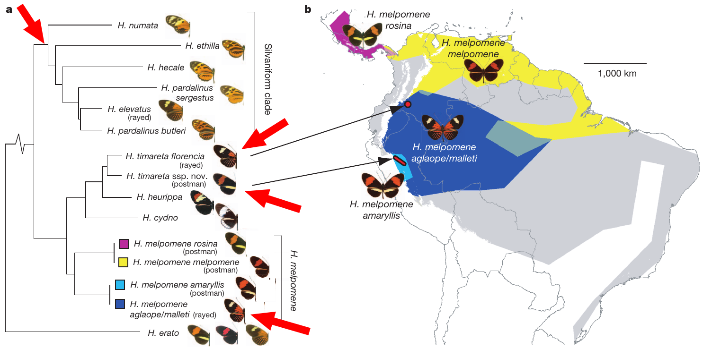

<!-- markdown-toc start - Don't edit this section. Run M-x markdown-toc-refresh-toc -->
# Índice

- [Estructura poblacional en *Heliconius*](#estructura-poblacional-en-heliconius)
    - [Infiriendo estructura poblacional usando PCA](#infiriendo-estructura-poblacional-usando-pca)
    - [¿Podemos observar diferentes patrones usando las mismas muestras?](#podemos-observar-diferentes-patrones-usando-las-mismas-muestras)
- [Análisis poblacionales por sitios y ventanas](#análisis-poblacionales-por-sitios-y-ventanas)
    - [Diversidad nucleotídica π](#diversidad-nucleotídica-π)
    - [Índice de fijación: Motivación y explicación](#índice-de-fijación-motivación-y-explicación)
    - [Calculando índice de fijación F<sub>ST</sub> por sitio](#calculando-índice-de-fijación-fsubstsub-por-sitio)
    - [Calculando índice de fijación F<sub>ST</sub> por ventana](#calculando-índice-de-fijación-fsubstsub-por-ventana)
- [Introgresión](#introgresión)
    - [Motivación](#motivación)
    - [D de Patterson: Explicación](#d-de-patterson-explicación)
- [Introgresión: Estimados por ventana](#introgresión-estimados-por-ventana)
    - [Evolución de la adaptación](#evolución-de-la-adaptación)
    - [Análisis por ventanas](#análisis-por-ventanas)

<!-- markdown-toc end -->


# Estructura poblacional en *Heliconius*

**Todas las tareas de este tutorial tienen requerimientos bajos de
tiempo y recursos, vamos a ejecutarlas de forma interactiva**

Nuestras 18 muestras de *Heliconius* corresponden a individuos de dos
grupos taxonómicos cercanamente emparentados. Las silvaniformes, que
tienen patrones amarillos/naranja y negros predominantemente (parte
superior de la imagen) y dos especies del clado conocido como *cydno -
melpomene*. De este último clado tenemos muestras de dos especies:
*Heliconius melpomene* y *Heliconius timareta*. Específicamente tenemos
individuos de la raza *malleti* (Colombia, especie *H. melpomene*) e
individuos de las razas *florencia* (Colombia) y *thelxinoe* (Perú) de
la especie *H. timareta*. Fíjate bien en las relaciones entre grupos
mostradas en la filogenia y en el fenotipo de cada uno de estos grupos.

|                                                    |
|-------------------------------------------------------------------------------------------|
| Imagen tomada de [Dasmahapatra et al., 2012](https://www.nature.com/articles/nature11041) |

Esperaríamos, naturalmente, que las relaciones de ancestría sean más
cercanas entre las dos razas de *H. timareta* que cualquiera de ellas
con otro grupo, y además esperaríamos que *H. timareta* y *H. melpomene*
tengan una relación más cercana que cualquiera de ellas con las
silvaniformes.

Recuerda la identidad de nuestros individuos y las poblaciones y
especies a las que pertenecen.

| Clado           | Especie      | Polbación/Raza | ID        | Identificador en nuestros datos |
|-----------------|--------------|----------------|-----------|---------------------------------|
| silvaniformes   | *ethilla*    | *aerotome*     | JM67      | H.eth.aer.JM67                  |
| silvaniformes   | *hecale*     | *felix*        | JM273     | H.hec.fel.JM273                 |
| cydno/melpomene | *melpomene*  | *malleti*      | CJ16550   | H.melp.malleti.CJ16550          |
| cydno/melpomene | *melpomene*  | *malleti*      | CS21      | H.melp.malleti.CS21             |
| cydno/melpomene | *melpomene*  | *malleti*      | CS22      | H.melp.malleti.CS22             |
| cydno/melpomene | *melpomene*  | *malleti*      | CS24      | H.melp.malleti.CS24             |
| silvaniformes   | *numata*     | *numata*       | MJ09.4125 | H.num.num.MJ09.4125             |
| silvaniformes   | *numata*     | *silvana*      | MJ09.4184 | H.num.sil.MJ09.4184             |
| silvaniformes   | *pardalinus* | *sergestus*    | JM202     | H.par.ser.JM202                 |
| silvaniformes   | *pardalinus* | *ssp. nova*    | JM371     | H.par.spn.JM371                 |
| cydno/melpomene | *timareta*   | *florencia*    | CS2337    | H.tim.fln.CS2337                |
| cydno/melpomene | *timareta*   | *florencia*    | CS2341    | H.tim.fln.CS2341                |
| cydno/melpomene | *timareta*   | *florencia*    | CS2358    | H.tim.fln.CS2358                |
| cydno/melpomene | *timareta*   | *florencia*    | CS2359    | H.tim.fln.CS2359                |
| cydno/melpomene | *timareta*   | *thelxinoe*    | JM313     | H.tim.thx.JM313                 |
| cydno/melpomene | *timareta*   | *thelxinoe*    | JM57      | H.tim.thx.JM57                  |
| cydno/melpomene | *timareta*   | *thelxinoe*    | JM84      | H.tim.thx.JM84                  |
| cydno/melpomene | *timareta*   | *thelxinoe*    | JM86      | H.tim.thx.JM86                  |

## Infiriendo estructura poblacional usando PCA

Requerimientos computacionales: 1 procesador, 1GB de memoria, \~5
minutos corriendo el PCA.

El análisis de componentes principales tiene un amplio repertorio de
aplicaciones, la genética es uno de ellos. Este método es uno de los más
comúnmente utilizados para identificar patrones de estructura
poblacional en un grupo de muestras. Este método es frecuentemente
utilizado porque no usa modelos de ningún tipo, es relativamente fácil
de utilizar y tiene una interpretación sencilla.

Este análisis nos permite calcular los componentes (PCs) que explican
las diferencias entre individuos usando sus genotipos. El nombre de los
componentes está basado en el porcentaje de variación que cada uno
explica; PC1 es el componente que explica el mayor porcentaje de
variación, PC2 explica el segundo porcentaje más grande y así
sucesivamente. La suma de la variación explicada por los componentes
principales es 100. Por ejemplo, si PC1 explica el 58% de la variación
observada entonces el resto de los componentes sumados explica el 42% de
la variación restante.

Usaremos el archivo de genotipos extendido
`heliconius.GT.NOINDEL.FILTER.vcf.gz` y su archivo de índice (`.csi`)
están disponibles en la ruta
`/home/workshopX/shared/genotipos_heliconius/`
en Centauro, **no usaremos el archivo de genotipos que filtramos en este
análisis pero sí en los siguientes**. Este archivo tiene 5 cromosomas de
nuestros 18 individuos de *Heliconius*. Es una aproximación más
realista, pero todavía limitada, al conjunto completo de datos del
genoma si lo comparamos con los datos que hemos venido trabajando.

La herramienta que usaremos para explorar la estructura poblacional
usando el análisis de componentes principales es `plink 1.9`, como
hicimos con los datos de *Lupinus*, es posible que veas algunas
diferencias entre este análisis y el que hiciste anteriormente.

Vamos a construir nuestro PCA por pasos.

1.  **Sitios independientes:** En este caso necesitamos tener
    independencia entre los sitios que usamos para hacer el análisis. La
    solución a esto es eliminar una fracción de sitios que estén en
    desequilibrio de ligamiento, es decir, sitios cuyos alelos muestren
    una frecuencia muy alta de asociación estadística. Usamos las
    siguientes opciones en `plink` para ejecutar este paso.

    -   `--vcf <archivo.vcf.gz>` aquí especificamos el archivo de
        genotipos que usaremos.

    -   `--double-id` esta opción le indica a `plink` que no tenemos
        información de la familia de cada individuo y que su
        identificador debería usarse como información de familia
        (`plink` espera tener una columna con información de la familia
        de cada individuo).

    -   `--allow-extra-chr` `plink` originalmente fue escrito para
        trabajar con datos de humanos y espera que la nomenclatura de
        los cromosomas corresponda con esto (1-22 autosomas y un
        cromosoma sexual X). Activar esta opción flexibiliza la
        nomenclatura que puede utilizarse.

    -   `--indep-pairwise <tamaño ventana> <paso> <umbral r2>` esta
        opción es la que activa la tarea de marcar los sitios en
        desequilibrio de ligamiento y los sitios independientes. Recibe
        tres parámetros: el tamaño de la ventana en pares de bases, la
        longitud del paso con el que nos movemos a lo largo de los datos
        también en pares de bases, y el umbral de ligamiento que vamos a
        tolerar entre variables independientes. El desequilibrio de
        ligamiento entre variantes puede medirse con un coeficiente de
        determinación (r<sup>2</sup>). Aquí vamos a marcar como
        no-independientes a los sitios que tengan un r<sup>2</sup> mayor
        a 0.1. Para el tamaño de ventana y el paso usaremos 50 pb y 10
        pb respectivamente.

    -   `--out <prefijo>` nos permite determinar el prefijo de los
        archivos de salida.

    <details>
    <summary> Trata de construir la línea de comando por tu cuenta. Si no puedes avanzar mira el código aquí </summary>

    ``` shell
    plink --vcf archivo.vcf.gz --double-id \
          --allow-extra-chr --indep-pairwise ventana paso umbral \
          --out prefijo.salida
    ```

    </details>

    Al finalizar debemos tener dos archivos: Uno con una lista de sitios
    en desequilibrio de ligamiento (extensión `.prune.out`) y otro con
    una lista de sitios que son independientes entre sí (extensión
    `.prune.in`). Examina ambos archivos de salida, ¿Qué información
    observas en ellos? ¿Cuántos sitios están registrados en cada uno de
    los archivos?

2.  **Análisis de componentes principales:** Ahora ejecutamos el
    análisis de componentes principales usando solo los sitios
    independientes resultantes del paso anterior.

    -   `--vcf <archivo.vcf.gz>`

    -   `--double-id`

    -   `--allow-extra-chr`

    -   `--extract <archivo.prune.in>` recibe la lista de sitios
        independientes que generamos en el paso anterior.

    -   `--pca` hace que `plink` corra un análisis de componentes
        principales con los datos especificados.

    -   `--out <prefijo.salida>`

    <details>
    <summary> Trata de construir la línea de comando por tu cuenta. Si no puedes avanzar mira el código aquí </summary>

    ``` shell
    plink --vcf archivo.vcf.gz --double-id \
          --allow-extra-chr --extract archivo.prune.in \
          --pca --out prefijo.salida
    ```

    </details>

    `plink` produce dos archivos de resultados al ejecutar el PCA: uno
    que contiene las proyecciones sobre cada eje para cada individuo
    (extensión `.eigenvec`), y otro que contiene los valores propios
    correspondientes a cada componente principal (extensión
    `.eigenval`). En este caso cada uno de los valores propios
    corresponde a la varianza explicada por cada uno de los componentes
    principales. Transfiere estos dos archivos de resultados a tu
    máquina usando `scp` ó `mailx`.

3.  **Visualización de los resultados en R:**

    Vamos a graficar los resultados del análisis de componentes
    principales. Es típico de estos análisis graficar las relaciones
    entre las componentes 1 y 2, pues son el par de componentes que
    explican la mayor proporción de variación genética en los datos,
    pintaremos la relación entre estas dos componentes y un diagrama de
    barras con el porcentaje de variación explicado por cada componente
    usando R.

    ``` r
    ### Leer datos de la pca, recuerda que tenemos dos archivos
    eigvec <- read_table2("archivo.eigenvec", col_names = FALSE)
    eigval <- scan("archivo.eigenval")

    ### Arreglamos un poco los datos de los vectores propios
    ### quitamos la primera o segunda columna, que estan repetidas
    eigvec <- eigvec[,-1]

    ### le damos nombres a las columnas
    ### sustituimos los valores X1, X2,... etc, por nombres informativos
    names(eigvec)[1] <- "Indv"
    names(eigvec)[2:ncol(eigvec)] <- paste("PC", 1:(ncol(eigvec) - 1), sep="")

    ### datos de especie y raza
    especie <- rep(NA, length(eigvec$Indv))

    ### a los nombres que contengan "melp" les asignamos "Melpomene"
    especie[grep("melp", eigvec$Indv)] <- "Melpomene"
    ### a los nombres que contengan "tim" les asignamos "Timareta"
    especie[grep("tim", eigvec$Indv)] <- "Timareta"
    ### a los nombres que no contengan "melp" o "tim" les asignamos "Silvaniforme"
    especie[-grep("melp|tim", eigvec$Indv)] <- "Silvaniforme"

    ### Hacemos lo mismo con las razas
    raza <- rep(NA, length(eigvec$Indv))

    raza[grep("malleti", eigvec$Indv)] <- "Malleti"
    raza[grep("fln", eigvec$Indv)] <- "Florencia"
    raza[grep("thx", eigvec$Indv)] <- "Thelxinoe"
    raza[-grep("malleti|fln|thx", eigvec$Indv)] <- "Otra"

    esp_raza <- paste(especie, raza, sep="_")

    ### Construimos nuevamente el marco de datos de la PCA
    ### juntando toda la informacion que especificamos anteriorente
    pca_helic <- as_tibble(data.frame(especie, raza, esp_raza, eigvec))

    # Construimos los datos del porcentaje de variacion por componente
    pve <- data.frame(PC = 1:length(eigval), pve = 100*(eigval/sum(eigval)))

    ### Graficamos los resultados de la PCA
    ggplot(pca_helic, aes(x=PC1, y=PC2, col=especie, shape=raza)) +
      geom_point(size=6) + coord_equal() + theme_bw() +
      xlab(paste("PC1 (", signif(pve$pve[1], 3), "%)")) +
      ylab(paste("PC2 (", signif(pve$pve[2], 3), "%)"))

    ### Graficamos el porcentaje explicado por componente
    ggplot(pve, aes(x=PC, y=pve)) + geom_bar(stat="identity") + theme_bw() +
      ylab("Porcentaje de variación explicado") + 
      xlab("Componente principal") +
      scale_x_continuous(breaks = 1:length(eigval))
    ```

    Tus resultados deben verse como estos.

    

    

    Preguntas:

    -   [ ] ¿Qué grupos de individuos se encuentran más cerca entre sí?
        Describe los patrones que observas.

    -   [ ] ¿Qué grupo se encuentra más alejado del resto? ¿En qué basas
        tu afirmación?

    -   [ ] Observando la segunda gráfica ¿cuánta variación explica el
        quinto componente principal?

    -   [ ] ¿Qué modificaciones tendríamos que hacer en el código de R
        para pintar la relación entre PC2 y PC3?

## ¿Podemos observar diferentes patrones usando las mismas muestras?

Ciertas regiones del genoma pueden mostrar procesos evolutivos
interesantes. Vamos a comparar la región del gen *optix* con una
representación más amplia del genoma y estudiar las posibles
diferencias.

Usa `vcftools` para extraer la región `Hmel218003o:720000-800000`, que
rodea al gen *optix*. Esta región podemos extraerla de cualquiera de los
dos conjuntos de genotipos (`vcf.gz`), debemos guardarla correctamente
como un archivo `vcf.gz`. Las opciones `--chr <scaffold>`,
`--from-bp <base inicio>` y `--to-bp <base fin>` son útiles para hacer
esta extracción. No olvides incluir las opciones `--recode` y
`--recode-INFO-all` para que los datos de salida estén en formato `vcf`.

<details>
<summary> Trata de construir la línea de comando por tu cuenta. Si no puedes avanzar mira el código aquí </summary>

``` shell
vcftools --gzvcf heliconius.optixscaf.SNPS.NV.FL2.vcf.gz \
         --chr Hmel218003o --from-bp 720000 --to-bp 800000 \
         --recode --recode-INFO-all --stdout \
    | bgzip -c > region.optix.vcf.gz

bcftools index region.optix.vcf.gz
```

</details>

Usa `plink` para retener solo los sitios en equilibrio de ligamiento
(independientes entre sí) y para hacer un análisis de componentes
principales de esta región de forma similar a como lo hicimos en la
sección anterior. Recuerda transferir los archivos del cluster a tu
máquina para analizarlos en R.

Las gráficas también las haces de la misma forma que en la sección
anterior. **Te alentamos a digitarlas y a tratar de entenderlas en lugar
de copiarlas y pegarlas en R**. Debes ver los siguientes resultados.


Preguntas:

-   [ ] ¿Qué grupos de individuos se encuentran más cerca entre sí?
    Describe los patrones que observas.
-   [ ] ¿Ves alguna agrupación atípica en los resultados de la PCA?
    ¿Cuál es? ¿Por qué es atípica?
-   [ ] Propón una hipótesis que explique las observaciones.

# Análisis poblacionales por sitios y ventanas

**Todas las tareas de este tutorial tienen requerimientos bajos de
tiempo y recursos, vamos a ejecutarlas de forma interactiva**

Vamos a usar el archivo `vcf` que filtramos para examinar la diversidad
genómica en nuestras muestras. Recuerda que cada fila del ar chivo `vcf`
describe una posición en el genoma de varias muestras y las columnas
describen las llamadas de los alelos de cada individuo.

Analizar la diversidad genética nos permite describir las poblaciones y
posiblemente la evidencia de algunos procesos de selección que estas
hayan tenido en su historia natural.

Existen estrategias robustas para medir diversidad genética que nos
permiten comparar qué tanta variedad hay en nuestras muestras y en qué
lugares del genoma posiblemente están pasando cosas interesantes.

## Diversidad nucleotídica π

Requerimientos computacionales: 1 procesador, 50 MB de memoria RAM, \~5
minutos de tiempo de ejecución.

La [diversidad
nucleotídica](https://en.wikipedia.org/wiki/Nucleotide_diversity), a
menudo simbolizada con la letra π, es la diferencia de composición
genética entre todos los pares de individuos de nuestro conjunto de
muestras promediada entre el número de comparaciones hechas. Es una
medida simple de diversidad genética y se puede estimar con precisión,
aún con pocas muestras.

Esta medida normalmente se estima promediando varios sitios en regiones
del genoma en lugar de estimarse para un solo sitio.

\[ \] Pregunta: ¿Qué procesos pueden causar que algunas partes del
genoma tengan más diversidad nucleotídica que otras en una población?

1.  **Estimando diversidad nucleotídica a lo largo de `Hmel218003o`**

    Para este análisis ya tenemos todo preparado; nuestro archivo de
    genotipos ya fue filtrado en un paso anterior. Podemos estimar la
    diversidad nucleotídica en nuestros datos usando `vcftools`.
    Empezaremos haciendo estimados de π en ventanas de 2kb (2000 bases)
    a lo largo del scaffold `Hmel218003o`. Para esto usamos la opción
    `--window-pi <tam. ventana>` de `vcftools`, donde `<tamn. ventana>`
    es un número entero que define el número de posiciones que debe
    contener una ventana.

    <details>
    <summary> Trata de construir la línea de comando por tu cuenta. Si no puedes avanzar mira el código aquí </summary>

    ``` shell
    vcftools --gzvcf archivo.vcf.gz \
             --window-pi tamaño ventana --out prefijo.salida
    ```

    </details>

2.  **Examinando los resultados**

    Verifica el archivo de texto que resultó de estimar π en ventanas de
    2kb.

    Responde a las siguientes preguntas:

    -   [ ] ¿Qué estructura tiene el archivo (número y contenido de
        filas, columnas y encabezado)?

    -   [ ] ¿Qué información puedes identificar en las columnas del
        archivo?

    -   [ ] ¿Qué efectos puede tener el número de variantes en el
        estimado?

    -   [ ] ¿Según tus observaciones, los estimados de todas las
        ventanas son confiables o piensas que hay algunos que no lo son?

    -   [ ] ¿Para interpretar los datos te quedarías con todos los
        resultados o excluirías algunas ventanas? ¿Por qué?

3.  **Visualizando los resultados**

    Transfiere los resultados de los análisis de diversidad nucleotídica
    a tu máquina local usando `scp` o `mailx`.

    Carga la librería `tidyverse` y los datos en `R`.

    ``` r
    ### limpia el ambiente de trabajo
    rm(list=ls())

    library(tidyverse)

    ### carga los datos
    pi_2k <- read_tsv("archivo.pi.2k")
    ```

    Observando nuestros datos en texto plano notamos que existen algunas
    ventanas que tienen muy pocos sitios segregantes. Usando un
    histograma, visualicemos la distribución de sitios segregantes a lo
    largo de las ventanas del scaffold para evaluar qué tan informativas
    son las ventanas con menos sitios invariantes.

    <details>
    <summary> Trata de hacer el histograma por tu cuenta. Si no puedes avanzar mira el código aquí </summary>

    ``` r
    ggplot(data=datos.pi.2k, aes(x=N_VARIANTS)) + geom_histogram()
    ```

    </details>

    El histograma debe verse así

    

    Grafica los de posición a lo largo de `Hmel218003o` vs. diversidad
    nucleotídica usando `ggplot` y una gráfica de línea.

    <details>
    <summary> Trata de graficar los resultados por tu cuenta. Si no puedes avanzar mira el código aquí </summary>

    ``` r
    ggplot(datos.pi.2k.filtrados, aes(x=BIN_START, y=PI)) + geom_line() + theme_bw() +
      labs(x="Posicion en Hmel218003o", y=expression("Diversidad nucleotidica"))
    ```

    </details>

    Observa los resultados ¿Tu gráfica se parece a esta?

    

    Preguntas:

    -   [ ] ¿Puedes observar algún patrón?

    -   [ ] Calcula versiones del estimado usando ventanas más grandes y
        más pequeñas a lo largo de `Hmel218003o`, usa por lo menos otros
        dos tamaños de ventana. ¿Qué observas cuando cambias el tamaño
        de ventana?

    -   [ ] En tu opinión ¿Qué tamaño de ventana permite observar mejor
        la variación de diversidad nucleotídica a lo largo de
        `Hmel218003o`?

En los pasos anteriores usamos todos los individuos en nuestro conjunto
de muestras para calcular π por ventanas. Caclula π por ventanas por
separado para las dos razas de *Heliconius timareta* y para *Heliconius
melpomene malleti* (tres en total, uno por población) ¿Cómo lo haces?
Pista: Puedes hacerlo en una sola llamada de `vcftools` para cada
población usando la opción `-keep`. ¿Cómo produces el archivo de texto
que contiene los nombres de los individuos que vas a usar? Grafica los
datos y compáralos con los estimados anteriores.

-   [ ] ¿Observas diferencias? ¿A qué crees que se deben estas
    diferencias?

**Si te sobra tiempo...**

Explora los patrones de diversidad nucleotídica en el set de datos
extendido (archivo `heliconius.GT.NOINDEL.FILTER.vcf.gz`). ¿Puedes
graficar la diversidad nucleotídica promedio por scaffold como un
boxplot? ¿Hay algún scaffold que tenga diversidad nucleotídica promedio
distinta a la del resto de los scaffolds?

## Índice de fijación: Motivación y explicación

El índice de fijación F<sub>ST</sub> es una medida de separación entre
grupos de individuos. En teoría F<sub>ST</sub> varía entre 0 y 1 en
donde 0 representa la ausencia de distancia genética entre poblaciones,
mientras que 1 significa que las poblaciones están totalmente separadas.

La diferenciación entre poblaciones puede variar a lo largo del genoma;
dos poblaciones pueden ser casi idénticas en una región y tener una
fuerte diferenciación en otra. Las regiones del genoma con evidencia de
divergencia fuerte son interesantes; podrían potencialmente albergar
genes que permitan a las poblaciones adaptarse a diferentes ambientes,
dependiendo de los alelos que tengan. En este caso la exploración de
estos patrones a lo largo del genoma se vuelve interesante.

El estimado que usaremos está basado en el método de [Weir y Cockerham
(1984)](https://www.jstor.org/stable/2408641). Este método esencialmente
estima las varianzas genéticas entre poblaciones (P), individuos de una
población (I) y genotipos de un individuo (G). Luego utiliza la
siguiente expresión para estimar el índice de fijación entre
poblaciones:


## Calculando índice de fijación F<sub>ST</sub> por sitio

Requerimientos computacionales: 1 procesador, 50 MB de memoria RAM, \~10
minutos de tiempo de ejecución.

1.  **Preparando los datos**

    Para este análisis ya tenemos una gran parte preparada; nuestro
    archivo de genotipos ya fue filtrado en un paso anterior. Vamos a
    usar `vcftools` para analizar la estructura por ventana usando este
    archivo y otras piezas de información.

    Necesitamos preparar archivos de texto en los que especificamos la
    población a la que pertenece cada muestra. Usando `nano` crea un
    archivo por población. Cada archivo debe tener una columna con los
    identificadores de las muestras que pertenecen a determinada
    población tal y como aparecen en la línea `#CHROM` del archivo
    `vcf`. Para este análisis ignora a las muestras de especies
    'silvaniformes', utiliza solo las dos poblaciones de *H. timareta* y
    la población de *H. melpomene* (3 poblaciones en total). Estas
    poblaciones son más cercanas genéticamente entre sí que cualquiera
    de ellas con las silvaniformes.

2.  **Estimando la estructura a lo largo de Hmel218003o**

    Utiliza `vcftools` con las opciones `--weir-fst-pop <archivo
            identidades>`. Revisa [la documentación de
    `vcftools`](https://vcftools.github.io/man_latest.html) para
    informarte sobre cómo comparar individuos de dos poblaciones. En
    teoría puedes estimar la estructura genética entre más de dos grupos
    pero la interpretación de los resultados se vuelve compleja, por eso
    vamos a comparar **pares de poblaciones**. Recuerda especificar un
    prefijo para tu archivo de salida con la opción `--out <prefijo>`.

    <details>
    <summary> Trata de construir la línea de comando por tu cuenta. Si no puedes avanzar mira el código aquí </summary>

    ``` shell
    # comparacion timaretas: florencia thelxinoe
    vcftools --gzvcf heliconius.optixscaf.SNPS.NV.FL2.vcf.gz \
             --weir-fst-pop tim_fln_ids.txt --weir-fst-pop tim_thx_ids.txt \
             --out fln_thx_fst.SITIO

    # comparacion malleti florencia
    vcftools --gzvcf heliconius.optixscaf.SNPS.NV.FL2.vcf.gz \
             --weir-fst-pop tim_fln_ids.txt --weir-fst-pop melp_mallet_ids.txt \
             --out mallet_fln_fst.SITIO

    # comparacion malleti thelxinoe
    vcftools --gzvcf heliconius.optixscaf.SNPS.NV.FL2.vcf.gz \
             --weir-fst-pop tim_thx_ids.txt --weir-fst-pop melp_mallet_ids.txt \
             --out mallet_thx_fst.SITIO
    ```

    </details>

3.  **Examinando los resultados:**

    Examina los archivos de texto que resultaron de estimar
    F<sub>ST</sub> por sitios con `vcftools`.

    Responde a las preguntas:

    -   [ ] ¿Qué estructura tienen los archivos (número de filas y
        columnas, encabezado)?

    -   [ ] ¿Qué información puedes identificar en ellos (contenido de
        cada columna)?

    -   [ ] ¿Cuántos estimados de estructura aparecen?

    -   [ ] ¿Qué valores aparecen más frecuentemente? ¿Cuál piensas que
        es la razón por la que observamos estos valores?

4.  **Visualizando F<sub>ST</sub> por sitio a lo largo de Hmel218003o**

    Transfiere los resultados de los análisis de índice de fijación
    F<sub>ST</sub> a tu máquina local usando `scp` o `mailx`.

    Antes de importar los datos a `R` vamos a procesar nuestro archivo
    para ignorar los valores no numéricos. De esta forma podemos
    procesar los datos un poco más fácil en `R`. Usa `grep` para excluir
    las posiciones con valores no numéricos y guarda el resultado en un
    nuevo archivo.

    Carga la librería `tidyverse` y los datos en `R`.

    ``` r
    ### limpia el ambiente de trabajo
    rm(list=ls())

    library(tidyverse)

    ### carga los datos
    fst_site <- read_tsv("archivo.weir.fst")

    ### recuerda cargar las tres comparaciones
    ```

    Ahora debemos agregarle una nueva columna a cada uno de los
    dataframes que indique la comparación que estamos haciendo. Puedes
    hacerlo usando la función
    [`mutate`](https://dplyr.tidyverse.org/reference/mutate.html) de
    `tidyverse`. En la nueva columna incluye el nombre de la comparación
    tantas veces como filas tenga el dataframe. Puedes hacer esto usando
    las funciones `rep` y `nrow`. `nrow(dataframe)` te debería dar el
    número de filas en el dataframe. Haz esto para los tres marcos de
    datos.

    <details>
    <summary> Trata de escribir el código por tu cuenta. Si no puedes avanzar mira el código aquí </summary>

    ``` r
    ###
    ### mutate le agrega la columna COMP al dataframe fst_site
    ### la columna que agrega es "comparacion" repetida nrow(fst_site) veces
    fst_site <- mutate(fst_site, COMP=rep("comparacion", nrow(fst_site)))
    ```

    </details>

    Junta los datos usando la función `rbind`. La función `rbind` junta
    las filas de los dataframes que entran como parámetro.

    <details>
    <summary> Si necesitas pistas de cómo hacerlo puedes ver el código aquí </summary>

    ``` r
    ### rbind une los datos de las tres comparaciones
    ### de forma vertical
    fst_todos <- rbind(fst_site1, fst_site2, fst_site3)
    ```

    </details>

    Pinta los datos uisando `ggplot`. Haz un gráfico de puntos
    (`geom_point()`) con la posición en `Hmel218003o` en el eje x y el
    índice de fijación por sitio en el eje y. En mi caso pinté las
    diferentes comparaciones usando diferentes colores. Puedes también
    pintarlas en paneles independientes usando la función `facet_wrap`.

    <details>
    <summary> Si necesitas pistas de cómo hacerlo puedes ver el código aquí </summary>

    ``` r
    ### Pintamos un grafico de puntos dandole colores diferentes a cada
    ### comparacion
    ggplot(data=fst_todos, aes(x=POS, y=WEIR_AND_COCKERHAM_FST, color=COMP)) +
      geom_point() + theme_bw() +
      labs(x="Posicion en Hmel218003o", y=expression("F"["ST"]))
    ```

    </details>

    Observemos la gráfica:

    

    Se ve terrible! :fearful: No podemos distinguir muchos detalles a lo
    largo de la región examinada.

    -   [ ] ¿Qué valores u observaciones se ven extrañas o incorrectas?

    -   [ ] ¿Qué podemos hacer para conservar solo los valores que
        tengan sentido?

    -   [ ] ¿Cómo podemos mejorar la visualización?

    

    -   [ ] ¿Podemos hacer inferencias basados en esta nueva versión?
        ¿Qué comparaciones muestran mayores índices de fijación en
        general?

## Calculando índice de fijación F<sub>ST</sub> por ventana

Requerimientos computacionales: 1 procesador, 50 MB de memoria RAM, \~5
minutos de tiempo de ejecución.

1.  **Preparando los datos**

    En este caso los archivos de entrada son los mismos que cuando
    calculamos F<sub>ST</sub> por sitio.

2.  **Estimando la estructura a lo largo de Hmel218003o**

    Utiliza `vcftools` con las opciones
    `--weir-fst-pop <archivo identidades>`
    `--fst-window-size <tamaño ventana>`
    `--fst-window-step <tamaño paso>` para correr el análisis usando
    ventanas de un tamaño determinado por `<tamaño ventana>`, dando
    pasos que miden `<tamaño paso>` a lo largo del scaffold. Para
    empezar, usa un tamaño de ventana de 10000 bases y un tamaño de paso
    de 5000 bases. Recuerda qué información debes incluir para comparar
    dos poblaciones. Recuerda especificar un prefijo para tu archivo de
    salida con la opción `--out <prefijo>`.

    <details>
    <summary> Trata de construir la línea de comando por tu cuenta. Si no puedes avanzar mira el código aquí </summary>

    ``` shell
    # comparacion timaretas
    vcftools --gzvcf heliconius.optixscaf.SNPS.NV.FL2.vcf.gz \
             --weir-fst-pop tim_fln_ids.txt --weir-fst-pop tim_thx_ids.txt \
             --fst-window-size 10000 --fst-window-step 5000 --out fln_thx_fst

    # comparacion malleti florencia
    vcftools --gzvcf heliconius.optixscaf.SNPS.NV.FL2.vcf.gz \
             --weir-fst-pop tim_fln_ids.txt --weir-fst-pop melp_mallet_ids.txt \
             --fst-window-size 10000 --fst-window-step 5000 --out mallet_fln_fst

    # comparacion malleti thelxinoe
    vcftools --gzvcf heliconius.optixscaf.SNPS.NV.FL2.vcf.gz \
             --weir-fst-pop tim_thx_ids.txt --weir-fst-pop melp_mallet_ids.txt \
             --fst-window-size 10000 --fst-window-step 5000 --out mallet_thx_fst
    ```

    </details>

3.  **Examinando los resultados: Ventanas a lo largo de Hmel218003o**

    Examina los archivos de texto que resultaron de estimar
    F<sub>ST</sub> por ventanas con `vcftools`.

    Responde a las preguntas:

    -   [ ] ¿Qué estructura tienen los archivos (número de filas y
        columnas, encabezado)?

    -   [ ] ¿Qué inforamción puedes identificar en ellos (contenido de
        cada columna)?

    -   [ ] ¿Cuántos estimados de estructura aparecen?

    -   [ ] ¿Observas diferencias entre los dos estimados de estructura?

    Ve a [ensembl.lepbase.org](http://ensembl.lepbase.org/index.html) y
    haz click sobre *Heliconius melpomene melpomene*, Hmel2.5.

    

    En la parte superior derecha encuentras la herramienta de búsqueda.
    Esta herramienta te permite buscar en el genoma de *H. melpomene*
    por coordenada genómica o por nombre del elemento (gen). Si buscas a
    un elemento por nombre podrás encontrar detalles de su localización
    en el genoma. Busca al gen *optix* en la barra de búsqueda.

    

    -   [ ] Cuáles son las coordenadas del gen *optix* en el scaffold
        `Hmel218003o`?

4.  **Visualizando F<sub>ST</sub> a lo largo de Hmel218003o**

    Graficar los resultados por ventana es muy similar a como lo hicimos
    por sitio. Carga la librería `tidyverse` y los datos en `R`.

    ``` r
    ### limpia el ambiente de trabajo
    rm(list=ls())

    library(tidyverse)

    ### carga los datos
    fst_site <- read_tsv("archivo.weir.ventanas.fst")

    ### recuerda cargar las tres comparaciones
    ```

    Ahora debemos agregarle una nueva columna a cada uno de los
    dataframes que indique la comparación que estamos haciendo. Puedes
    hacerlo usando la función
    [`mutate`](https://dplyr.tidyverse.org/reference/mutate.html) de
    `tidyverse`. En la nueva columna incluye el nombre de la comparación
    tantas veces como filas tenga el dataframe. Puedes hacer esto usando
    las funciones `rep` y `nrow`. `nrow(dataframe)` te debería dar el
    número de filas en el dataframe. Haz esto para los tres marcos de
    datos.

    <details>
    <summary> Trata de escribir el código por tu cuenta. Si no puedes avanzar mira el código aquí </summary>

    ``` r
    ###
    ### mutate le agrega la columna COMP al dataframe fst_site
    ### la columna que agrega es "comparacion" repetida nrow(fst_site) veces
    fst_site <- mutate(fst_site, COMP=rep("comparacion", nrow(fst_site)))
    ```

    </details>

    Junta los datos usando la función `rbind`. La función `rbind` junta
    las filas de los dataframes que entran como parámetro.

    <details>
    <summary> Si necesitas pistas de cómo hacerlo puedes ver el código aquí </summary>

    ``` r
    ### rbind une los datos de las tres comparaciones
    ### de forma vertical
    fst_todos <- rbind(fst_site1, fst_site2, fst_site3)
    ```

    </details>

    Pinta los datos uisando `ggplot`. Haz un gráfico de línea
    (`geom_line()`) o de punto (`geom_point()`).Usa la posición de
    inicio o fin de ventana en el eje x y el índice de fijación por
    sitio en el eje y. En mi caso pinté las diferentes comparaciones
    usando diferentes colores. Puedes también pintarlas en paneles
    independientes usando la función `facet_wrap`.

    <details>
    <summary> Si necesitas pistas de cómo hacerlo puedes ver el código aquí </summary>

    ``` r
    ### Pintamos un grafico de puntos dandole colores diferentes a cada
    ### comparacion
    ggplot(data=fst_todos, aes(x=POS, y=WEIR_AND_COCKERHAM_FST, color=COMP)) +
      geom_point() + theme_bw() +
      labs(x="Posicion en Hmel218003o", y=expression("F"["ST"]))
    ```

    </details>

    Observemos la gráfica:

    

    Responde a las preguntas:

    -   [ ] ¿Qué poblaciones tienen un menor nivel de estructuración
        entre sí?

    -   [ ] ¿Qué poblaciones tienen un mayor nivel de estructuración
        entre sí?

    -   [ ] ¿Qué explicación puede tener esta diferencia entre
        comparaciones?

    -   [ ] ¿Hay alguna región de `Hmel218003o` en donde observes
        patrones interesantes?

    -   [ ] ¿Puedes pintar la posición de *optix* en tu gráfica? Pista:
        Usa la función `geom_rect` de `ggplot`.

    <details>
    <summary> Mira una versión mejorada aquí ¿Qué cambios harías en el análisis para lograr una versión así? </summary>

    

    </details>

# Introgresión

**Todas las tareas de este tutorial tienen requerimientos bajos de
tiempo y recursos, vamos a ejecutarlas de forma interactiva**

## Motivación

Recientemente en biología evolutiva la idea de que las poblaciones y las
especies pueden entrar en contacto e intercambiar material genético ha
sido más aceptada. La disponibilidad de técnicas de secuenciación y
herramientas estadísticas ha tenido como consecuencia la publicación de
evidencia que soporta este cambio de paradigma.

Una de las herramientas estadísticas que primero se usó para detectar
introgresión entre especies se conoce como D de Patterson [(Green et
al., 2010)](https://www.science.org/doi/abs/10.1126/science.1188021).
Este estadístico ha sido ampliamente utilizado para describir eventos de
introgresión en varios taxa. El D de Patterson y los estadísticos
derivados de este se calculan de forma simple, se ajustan bien a los
datos genómicos y funcionan bien en muchos escenarios demográficos.

La evolución de diversos rasgos adaptativos en varias especies puede
ocurrir por introgresión. En nuestro caso la hipótesis es que hubo flujo
genético entre *H. melpomene malleti* y *H. timareta florencia* y que
este flujo genético le permitió a *H. timareta florencia* convergir
fenotípicamente, creando un anillo mimético con *H. melpomene malleti*.
Recuerda el valor adaptativo del mimetismo Mülleriano para *Heliconius*.

|                                                                                                                      |
|-----------------------------------------------------------------------------------------------------------------------------------------------------------------|
| Razas que tenemos para nuestra hipótesis de introgresión ([Martin et al., 2019](https://journals.plos.org/plosbiology/article?id=10.1371/journal.pbio.2006288)) |

Aprenderemos a utilizar uno de muchos programas disponibles para
calcular D de Patterson, explorar si hay evidencia de introgresión en
nuestros datos y pensar en la relevancia biológica de nuestras
observaciones.

## D de Patterson: Explicación

|                                                                                                                |
|----------------------------------------------------------------------------------------------------------------------------------------------------------|
| Patrones ABBA y BABA que pueden surgir si el alelo derivado (B) va a P2 o a P1 ([Dasmahpatra et al., 2012](https://www.nature.com/articles/nature11041)) |

Denotamos los alelos que están en el outgroup como A y los alelos
derivados como B. Para el conjunto ordenado {P<sub>1</sub>,
P<sub>2</sub>, P<sub>3</sub>, O} tenemos dos configuraciones alélicas de
interés: ABBA ó BABA. ABBA se refiere a los sitios en donde
P<sub>1</sub> tiene el alelo del outgroup y P<sub>2</sub> y
P<sub>3</sub> compartan el alelo derivado. BABA corresponde a sitios en
donde P<sub>1</sub> y P<sub>3</sub> compartan el alelo derivado y
P<sub>2</sub> tiene el alelo del outgroup. El estadístico D se define
como


Donde C<sub>ABBA</sub>(i) y C<sub>BABA</sub>(i) son 0 ó 1 si uno de los
dos patrones se observa en el sitio *i* a lo largo de *n* sitios. El
numerador cuantifica el exceso de uno de los dos patrones respecto al
otro y el numerador normaliza por el número total de patrones
observados.

Esta explicación es una simplificación; si contáramos solo los sitios en
los cuales todos los individuos de P<sub>1</sub> y del outgroup tienen
el alelo A y todos los individuos de P<sub>2</sub> y P<sub>3</sub>
tienen el alelo B para cuantificar patrones ABBA estamos ignorando
muchos sitios con información útil pues en muchos sitios a lo largo del
genoma las poblaciones no tienen alelos fijos.

La forma de calcular el estadístico D en la práctica involucra el uso de
frecuencias alélicas. Si p<sub>ij</sub> denota la frecuencia del alelo i
en la población j (i = {1, 2}; j = {1, 2, 3, 4}) entonces el D de
Patterson se estima como


# Introgresión: Estimados por ventana

## Evolución de la adaptación

En nuestros datos, específicamente en el scaffold `Hmel218003o`, hemos
observado patrones que se desvían un poco de las expectativas dada la
historia natural de nuestras muestras: al parecer individuos de
diferentes especies tienen ancestría compartida en una región específica
del genoma.

Vamos a usar el D de Patterson haciendo estimados en ventanas a lo largo
de `Hmel218003o` para examinar la evidencia de exceso de flujo genético
y trataremos de determinar en qué región específicamente puede existir
esta evidencia de flujo genético entre especies.

## Análisis por ventanas

Recursos computacionales: 1 procesador, 50 MB RAM, 2 minutos de tiempo
de corrido (`Dsuite`).

1.  **Preparando los datos:**

    Vamos a trabajar con nuestro `vcf` filtrado al igual que cuando
    calculamos el índice de fijación por ventanas, la diversidad
    nucleotídica y el D de Tajima. En este caso debemos especificar la
    población a la que pertenecen nuestras muestras de la siguiente
    manera. Crea un archivo nuevo usando `nano`, dale un nombre
    informativo. Al interior de este archivo debes esribir dos columnas
    separadas por tabulación (`\t`). En la primera columna debes tener
    los nombres de las muestras tal y como aparecen en el `vcf`. En la
    segunda columna debes especificar la población a la que pertenece
    cada muestra. Debemos especificar las poblaciones P1, P2 y P3 del
    análisis de introgresión. Los nombres de las poblaciones son:
    Florencia, Thelxinoe, Malleti y Silvaniformes, pero las
    Silvaniformes son nuestro outgroup, luego para ellas debemos
    especificar la palabra Outgroup en la columna derecha. En teoría
    todas las muestras del Outgroup deberían funcionar bien, pero si el
    Outgroup y P1 experimentaron flujo genético en la región de interés
    esto puede crear artefactos en los resultados. Es posible que
    nuestras muestras de *H. pardalinus*, que son de Perú, muestren
    evidencia de flujo con otras *Heliconius* de Perú (como Thelxinoe).
    Es por eso que a estas las excluimos del análisis marcando la
    segunda columna como xxx.

    El archivo de poblaciones debe verse parecido a esto:

    ``` shell
    muestra1.1 Poblacion1
    muestra1.2 Poblacion1
    muestra2.1 Poblacion2
    muestra2.2 Poblacion2
    muestra3.1 Poblacion3
    muestra3.2 Poblacion3
    muestraO.1 Outgroup
    muestraO.2 xxx
    muestraO.3 Outgroup
    ```

    Adicionalmente debemos crear otro archivo de texto al que llamaremos
    `archivo.hipotesis` que especifique las combinaciones de poblaciones
    que queremos probar para nuestras hipótesis de introgresión. En este
    archivo usamos una línea por combinación de poblaciones y en cada
    línea escribimos nuestras poblaciones en el orden de nuestra
    hipótesis: P1 P2 P3, separadas entre sí por un caracter de
    tabulación. Recuerda cuál es nuestra hipótesis de introgresión y
    escribe las poblaciones de nuestras muestras en el orden
    correspondiente. **Importante:** es posible que `Dsuite` te muestre
    errores de ejecución si las poblaciones en este archivo no están
    separadas por un caracter de tabulación.

2.  **Estimando las estadísticas D:**

    Dsuite está disponible en para los usuarios de `biologia.evolutiva`
    en `/shared/Dsuite/Build/Dsuite`. **TODO Cambiar ruta cuando se cree
    la particion en centauro**.

    Esta es la sintaxis que usamos para correr `Dsuite`.

    ``` shell
    Dsuite <comando> [opciones] archivos de entrada
    ```

    El comando específico que usaremos es `Dinvestigate`. Este comando
    calcula varios estadísticos de introgresión a lo largo de una región
    genómica. Usamos `Dinvestigate` con la opción `-w ventana,paso` para
    especificar los tamaños de la ventana y el paso que usaremos para
    hacer el scan y con la opción `-n prefijo.salida` para darle un
    prefijo a los archivos de salida. Luego de especificar la ventana
    escribimos el nombre de nuestro archivo `vcf.gz`, el nombre de
    nuestro archivo de poblaciones y el nombre del archivo de hipótesis.

    <details>
    <summary> Trata construir la línea de comando por tu cuenta. Si no puedes avanzar mira el código aquí </summary>

    ``` shell
    # utiliza los archivos en el orden correcto
    # archivo vcf
    # archivo poblaciones
    # archivo combinaciones
    /ruta/a/Dsuite Dinvestigate -w ventana,paso archivo.vcf.gz \
           archivo.poblaciones archivo.combinaciones
    ```

    </details>

    Prueba varios tamaños de ventana y paso: Prueba las combinaciones
    20,10; 50,25; 100,50; 500,250; 1000,500. Cada una de ellas no tarda
    mucho en correr. **Reto:** ¿Puedes hacerlo en un ciclo `for`? Pista:
    Puedes hacerlo con operaciones aritméticas, las cuales deben ir
    dentro de dobles paréntesis y precedidas por el operador `$`.

    Ejemplo:

    ``` shell
    num=30
    # multiplica a num por 2
    resultado=$(($num*2))
    # resultado es 60
    ```

3.  **Examinando los datos:**

    Examina los archivos que resultaron de correr `Dinvestigate` con
    varios tamaños de ventana y responde a las preguntas.

    -   [ ] ¿Qué estructura tienen los archivos (número de filas, número
        de columnas y encabezado)?

    -   [ ] ¿Qué información puedes identificar en los archivos
        (contenido de las columnas)?

    -   [ ] ¿Cuántos estimados de flujo genético aparecen?

    Ve a [ensembl.lepbase.org](http://ensembl.lepbase.org/index.html) y
    haz click sobre *Heliconius melpomene melpomene*, Hmel2.5.

    

    En la parte superior derecha encuentras la herramienta de búsqueda.
    Esta herramienta te permite buscar en el genoma de *H. melpomene*
    por coordenada genómica o por nombre del elemento (gen). Si buscas a
    un elemento por nombre podrás encontrar detalles de su localización
    en el genoma. Busca al gen *optix* en la barra de búsqueda.

    

    -   [ ] ¿Cuáles son las coordenadas del gen *optix* en el scaffold
        `Hmel218003o`?

4.  **Visualizando los resultados:**

    Crea una gráfica del estadístico D a lo largo del scaffold
    `Hmel218003o`. Puedes usar un gráfico de línea o punto. Tu resultado
    debe verse como esta gŕafica. Pinta los estimados que obtuviste con
    varios tamaños de ventana y decide cuál es más informativo.

    <details>
    <summary> Escribe el código para cargar los datos y pintar la gráfica por tu cuenta. Si no puedes avanzar mira el código aquí </summary>

    ``` r
    ### carga los datos
    tfm_test <- read_tsv("Thelxinoe_Florencia_Malleti_localFstats__500_100.txt")

    ### Pinta D
    ggplot(data=tfm_test, aes(x=windowStart, y=D)) +
      geom_line() + theme_bw()
    ```

    </details>

    

    -   [ ] ¿Hay alguna región de `Hmel218003o` en donde observes
        patrones interesantes?

    -   [ ] ¿Puedes pintar la posición del gen *optix* en tu gráfica?
        Pista: Usa la función `geom_rect` de `ggplot`.

5.  **Otras hipótesis de introgresión**

    Usando `Dsuite` construye otras hipótesis de introgresión cambiando
    el orden de P1, P2 y P3 en el archivo. Incluye por lo menos una
    diferente a la que probamos en el punto anterior.

    -   [ ] ¿Qué hipótesis de introgresión nuevas incluiste?

    -   [ ] ¿Qué diferencias observas respecto a los resultados
        anteriores?

    -   [ ] ¿Cómo explicas las diferencias observadas?

6.  **Si tienes tiempo...**

    Usa el archivo de genotipos extendido
    `heliconius.GT.NOINDEL.FILTER.vcf.gz` para correr `Dinvestigate`.
    Utiliza la misma hipótesis de introgresión inicial. Analiza los
    resultados visualizando con R.

    -   [ ] ¿Existen otras regiones del genoma en donde haya potencial
        evidencia de introgresión entre P2 y P3? ¿Cuáles son esas
        regiones?
